[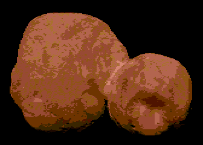](https://github.com/ivop/rc-archive/raw/master/GravityWorm/GravityWorm_Arrokoth.xex)
[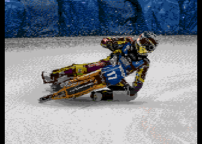](https://github.com/ivop/rc-archive/raw/master/GravityWorm/GravityWorm_bike01.xex)
[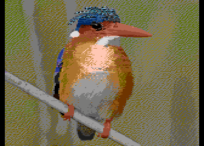](https://github.com/ivop/rc-archive/raw/master/GravityWorm/GravityWorm_bird01.xex)
[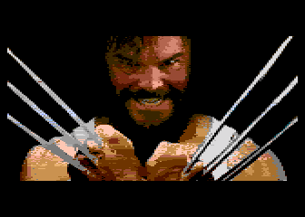](https://github.com/ivop/rc-archive/raw/master/GravityWorm/GravityWorm_BlackJack.xex)
[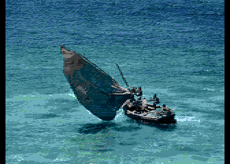](https://github.com/ivop/rc-archive/raw/master/GravityWorm/GravityWorm_boat01.xex)
[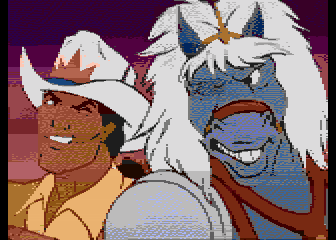](https://github.com/ivop/rc-archive/raw/master/GravityWorm/GravityWorm_BraveStarr01.xex)
[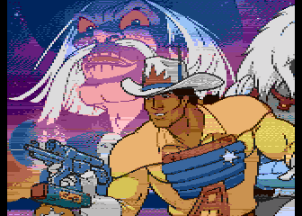](https://github.com/ivop/rc-archive/raw/master/GravityWorm/GravityWormBS_01.xex)
[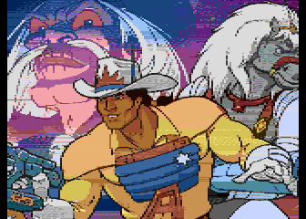](https://github.com/ivop/rc-archive/raw/master/GravityWorm/GravityWormBS_02.xex)
[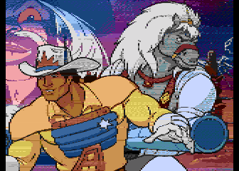](https://github.com/ivop/rc-archive/raw/master/GravityWorm/GravityWormBS_03.xex)
[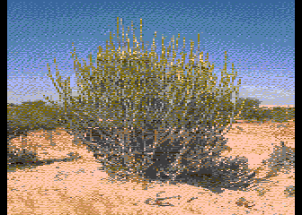](https://github.com/ivop/rc-archive/raw/master/GravityWorm/GravityWorm_bush01.xex)
[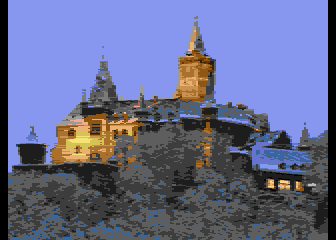](https://github.com/ivop/rc-archive/raw/master/GravityWorm/GravityWorm_castle01.xex)
[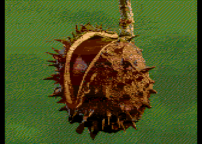](https://github.com/ivop/rc-archive/raw/master/GravityWorm/GravityWorm_chesnut01_drpeter_fixed.xex)
[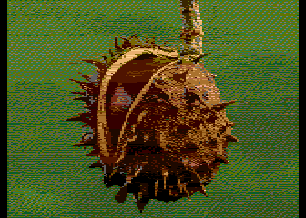](https://github.com/ivop/rc-archive/raw/master/GravityWorm/GravityWorm_chesnut01.xex)
[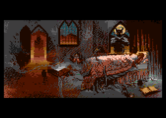](https://github.com/ivop/rc-archive/raw/master/GravityWorm/GravityWorm_DIO01.xex)
[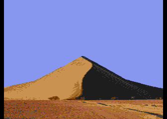](https://github.com/ivop/rc-archive/raw/master/GravityWorm/GravityWorm_dune01.xex)
[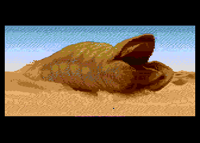](https://github.com/ivop/rc-archive/raw/master/GravityWorm/GravityWormDuneWorm.xex)
[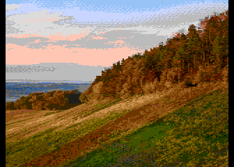](https://github.com/ivop/rc-archive/raw/master/GravityWorm/GravityWorm_Field01.xex)
[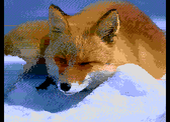](https://github.com/ivop/rc-archive/raw/master/GravityWorm/GravityWorm_fox01.xex)
[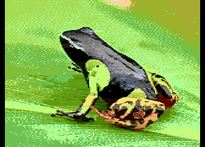](https://github.com/ivop/rc-archive/raw/master/GravityWorm/GravityWorm_Frog.xex)
[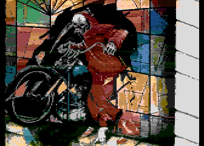](https://github.com/ivop/rc-archive/raw/master/GravityWorm/GravityWorm_GR01.xex)
[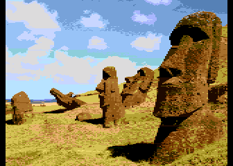](https://github.com/ivop/rc-archive/raw/master/GravityWorm/GravityWorm_head.xex)
[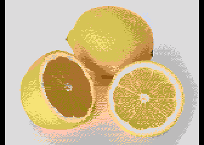](https://github.com/ivop/rc-archive/raw/master/GravityWorm/GravityWorm_lemon01.xex)
[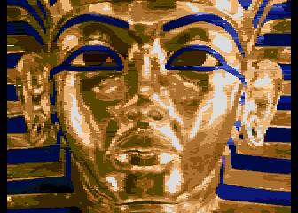](https://github.com/ivop/rc-archive/raw/master/GravityWorm/GravityWorm_mask01.xex)
[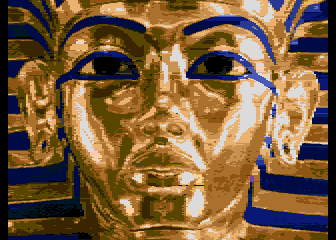](https://github.com/ivop/rc-archive/raw/master/GravityWorm/GravityWorm_mask_beta_output.xex)
[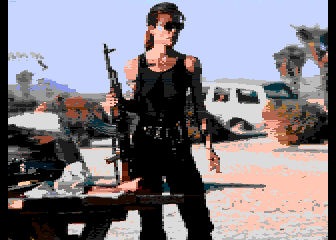](https://github.com/ivop/rc-archive/raw/master/GravityWorm/GravityWorm_mask_T2_01.xex)

[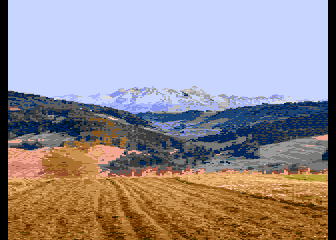](https://github.com/ivop/rc-archive/raw/master/GravityWorm/GravityWorm_moutains01.xex)
[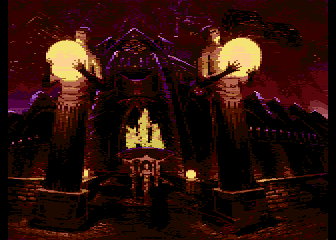](https://github.com/ivop/rc-archive/raw/master/GravityWorm/GravityWorm_Noctropolis01.xex)
[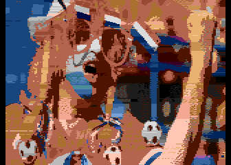](https://github.com/ivop/rc-archive/raw/master/GravityWorm/GravityWorm_Oranje01.xex)
[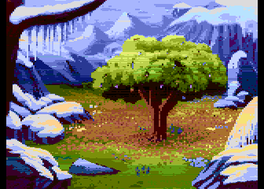](https://github.com/ivop/rc-archive/raw/master/GravityWorm/GravityWorm_QFG01.xex)
[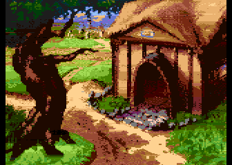](https://github.com/ivop/rc-archive/raw/master/GravityWorm/GravityWorm_QFG02.xex)
[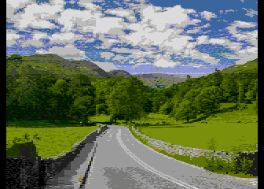](https://github.com/ivop/rc-archive/raw/master/GravityWorm/GravityWorm_Road01.xex)
[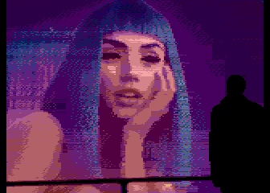](https://github.com/ivop/rc-archive/raw/master/GravityWorm/GravityWorm_second_Blade_runner001.xex)
[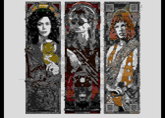](https://github.com/ivop/rc-archive/raw/master/GravityWorm/GravityWorm_Space01.xex)
[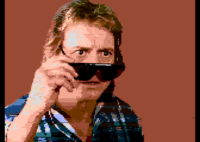](https://github.com/ivop/rc-archive/raw/master/GravityWorm/GravityWorm_TheyLive.xex)
[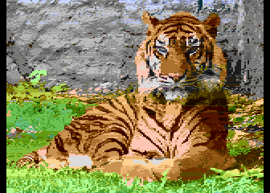](https://github.com/ivop/rc-archive/raw/master/GravityWorm/GravityWorm_tiger01.xex)
[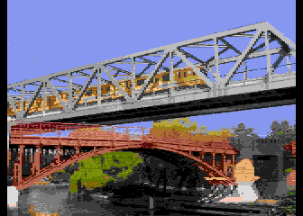](https://github.com/ivop/rc-archive/raw/master/GravityWorm/GravityWorm_train01.xex)
[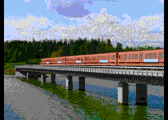](https://github.com/ivop/rc-archive/raw/master/GravityWorm/GravityWorm_train02.xex)
[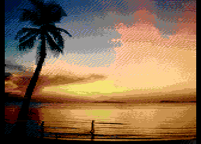](https://github.com/ivop/rc-archive/raw/master/GravityWorm/GravityWorm_tropic01.xex)
[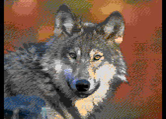](https://github.com/ivop/rc-archive/raw/master/GravityWorm/GravityWorm_wilddoge01.xex)
