[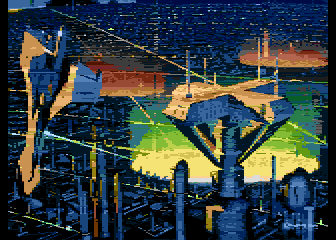](https://github.com/ivop/rc-archive/raw/master/Gunstar/GS_AboveTrantor.xex)
[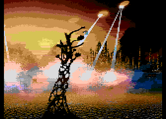](https://github.com/ivop/rc-archive/raw/master/Gunstar/GS_AlienTree2.xex)
[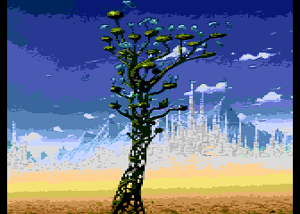](https://github.com/ivop/rc-archive/raw/master/Gunstar/GS_AlienTree.xex)
[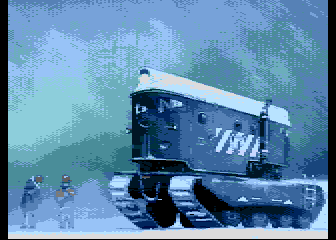](https://github.com/ivop/rc-archive/raw/master/Gunstar/GS_ArcticTreader.xex)
[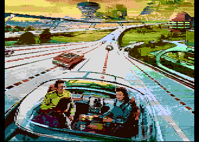](https://github.com/ivop/rc-archive/raw/master/Gunstar/GS_AutoWay.xex)
[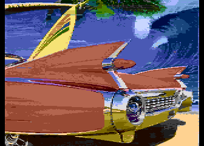](https://github.com/ivop/rc-archive/raw/master/Gunstar/GS_BigSurf.xex)
[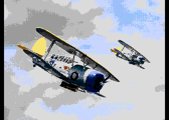](https://github.com/ivop/rc-archive/raw/master/Gunstar/GS_Bi-wings.xex)
[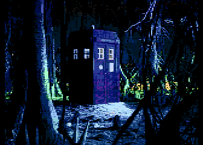](https://github.com/ivop/rc-archive/raw/master/Gunstar/GS_BlueBoxInWoods.xex)
[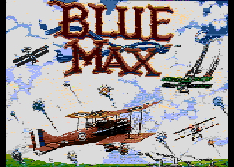](https://github.com/ivop/rc-archive/raw/master/Gunstar/GS_BlueMax.xex)
[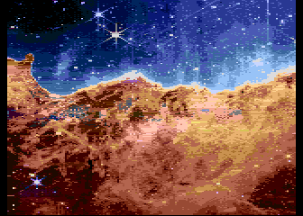](https://github.com/ivop/rc-archive/raw/master/Gunstar/GS_CarinaCliffs.xex)
[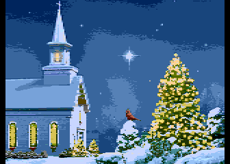](https://github.com/ivop/rc-archive/raw/master/Gunstar/GS_ChristmasChurch.xex)
[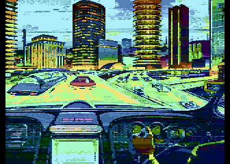](https://github.com/ivop/rc-archive/raw/master/Gunstar/GS_CityLights.xex)
[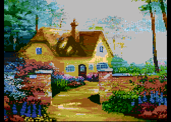](https://github.com/ivop/rc-archive/raw/master/Gunstar/GS_Cottage.xex)
[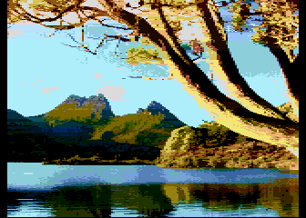](https://github.com/ivop/rc-archive/raw/master/Gunstar/GS_CradleMtNPTasmania.xex)
[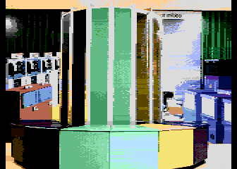](https://github.com/ivop/rc-archive/raw/master/Gunstar/GS_Cray1S.xex)
[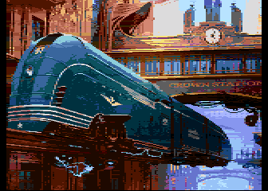](https://github.com/ivop/rc-archive/raw/master/Gunstar/GS_CrownStation.xex)
[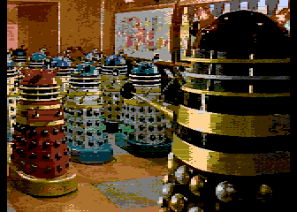](https://github.com/ivop/rc-archive/raw/master/Gunstar/GS_DailekSeminar.xex)
[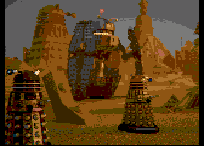](https://github.com/ivop/rc-archive/raw/master/Gunstar/GS_DalekDesertCorp.xex)
[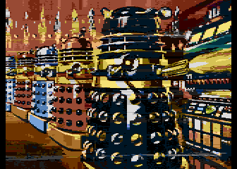](https://github.com/ivop/rc-archive/raw/master/Gunstar/GS_DaleksAgain.xex)
[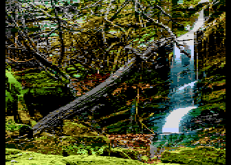](https://github.com/ivop/rc-archive/raw/master/Gunstar/GS_DecemberFalls.xex)
[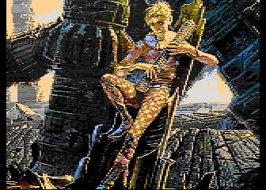](https://github.com/ivop/rc-archive/raw/master/Gunstar/GS_DirgeToAncientTrantor.xex)
[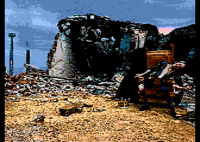](https://github.com/ivop/rc-archive/raw/master/Gunstar/GS_FarewelltoKings.xex)
[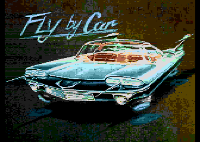](https://github.com/ivop/rc-archive/raw/master/Gunstar/GS_FlyByCar.xex)
[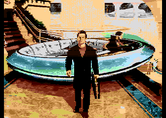](https://github.com/ivop/rc-archive/raw/master/Gunstar/GS_ForwardFoundation.xex)
[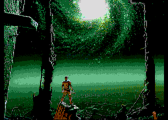](https://github.com/ivop/rc-archive/raw/master/Gunstar/GS_FoundationsEdge_1.xex)
[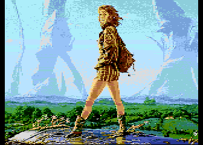](https://github.com/ivop/rc-archive/raw/master/Gunstar/GS_FoundationsEdge.xex)
[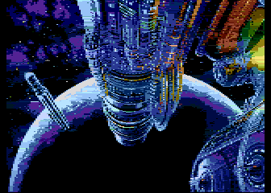](https://github.com/ivop/rc-archive/raw/master/Gunstar/GS_FoundationTrilogy.xex)
[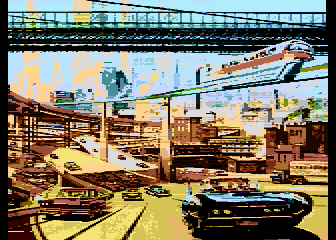](https://github.com/ivop/rc-archive/raw/master/Gunstar/GS_future1960.xex)
[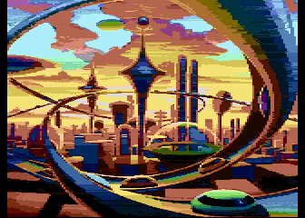](https://github.com/ivop/rc-archive/raw/master/Gunstar/GS_FutureDawn.xex)
[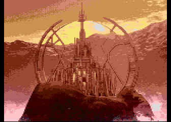](https://github.com/ivop/rc-archive/raw/master/Gunstar/GS_Gallifrey.xex)
[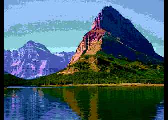](https://github.com/ivop/rc-archive/raw/master/Gunstar/GS_GlacierLakeNP_drpeter_fix.xex)
[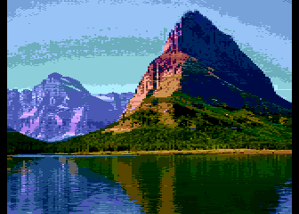](https://github.com/ivop/rc-archive/raw/master/Gunstar/GS_GlacierLakeNP.xex)
[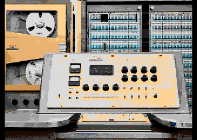](https://github.com/ivop/rc-archive/raw/master/Gunstar/GS_HarvardMark1.xex)
[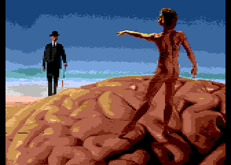](https://github.com/ivop/rc-archive/raw/master/Gunstar/GS_Hemispheres.xex)
[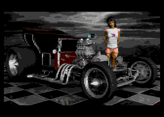](https://github.com/ivop/rc-archive/raw/master/Gunstar/GS_HotRodBeast_centered.xex)
[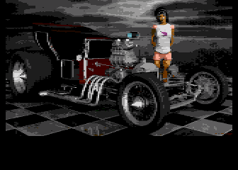](https://github.com/ivop/rc-archive/raw/master/Gunstar/GS_HotRodBeast.xex)
[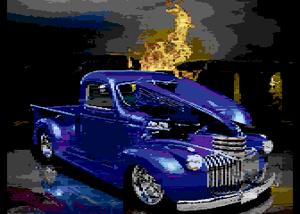](https://github.com/ivop/rc-archive/raw/master/Gunstar/GS_HotrodRoyalty.xex)
[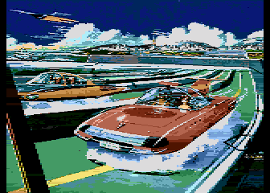](https://github.com/ivop/rc-archive/raw/master/Gunstar/GS_Hydrocar.xex)
[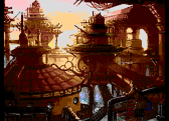](https://github.com/ivop/rc-archive/raw/master/Gunstar/GS_IndustryPlanet.xex)
[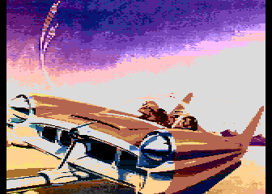](https://github.com/ivop/rc-archive/raw/master/Gunstar/GS_JetCar.xex)
[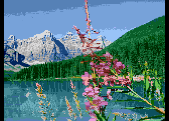](https://github.com/ivop/rc-archive/raw/master/Gunstar/GS_LakeMoraineBanffNPCanada.xex)
[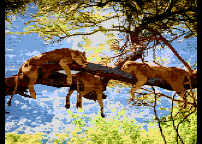](https://github.com/ivop/rc-archive/raw/master/Gunstar/GS_LazyLions.xex)
[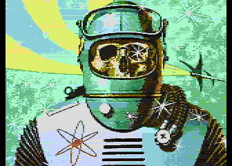](https://github.com/ivop/rc-archive/raw/master/Gunstar/GS_MadMutineer.xex)
[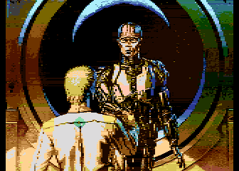](https://github.com/ivop/rc-archive/raw/master/Gunstar/GS_ManMeetRobot.xex)
[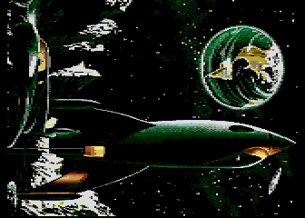](https://github.com/ivop/rc-archive/raw/master/Gunstar/GS_MoonFrontier.xex)
[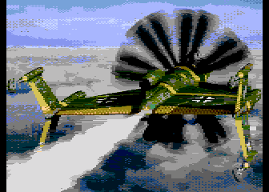](https://github.com/ivop/rc-archive/raw/master/Gunstar/GS_Nazipropjet.xex)
[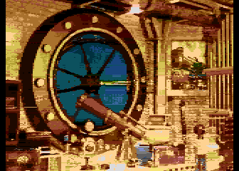](https://github.com/ivop/rc-archive/raw/master/Gunstar/GS_Observatorium.xex)
[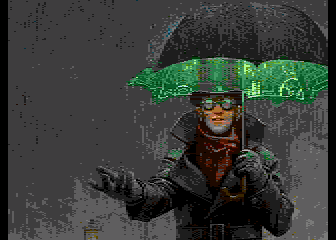](https://github.com/ivop/rc-archive/raw/master/Gunstar/GS_PeculiarIlluminations.xex)
[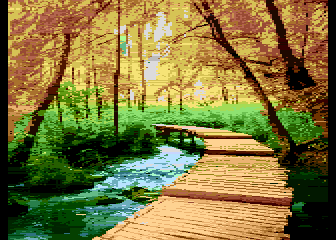](https://github.com/ivop/rc-archive/raw/master/Gunstar/GS_PlitviceNPCroatia2.xex)
[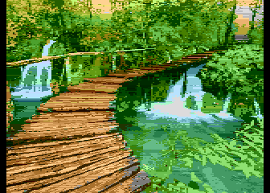](https://github.com/ivop/rc-archive/raw/master/Gunstar/GS_PlitviceNPCroatia.xex)
[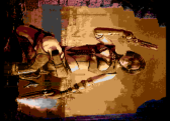](https://github.com/ivop/rc-archive/raw/master/Gunstar/GS_PrettyDeadlyIIa.xex)
[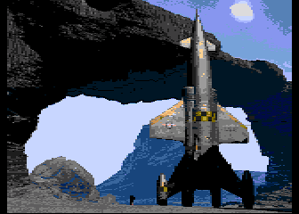](https://github.com/ivop/rc-archive/raw/master/Gunstar/GS_RocketshipCygnusX-1.xex)
[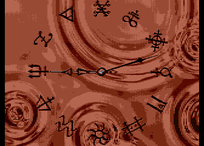](https://github.com/ivop/rc-archive/raw/master/Gunstar/GS_RUSHclockworkangels.xex)
[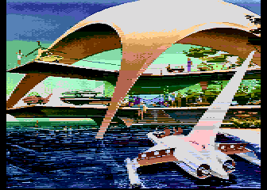](https://github.com/ivop/rc-archive/raw/master/Gunstar/GS_SeaHouse.xex)
[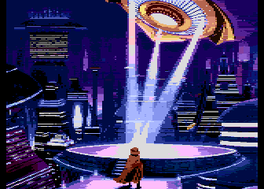](https://github.com/ivop/rc-archive/raw/master/Gunstar/GS_SecondFoundation.xex)
[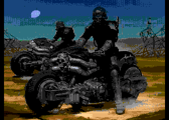](https://github.com/ivop/rc-archive/raw/master/Gunstar/GS_SkullraiderScouts.xex)

[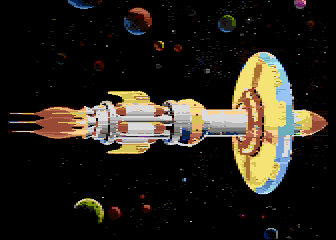](https://github.com/ivop/rc-archive/raw/master/Gunstar/GS_SpaceGypsies.xex)
[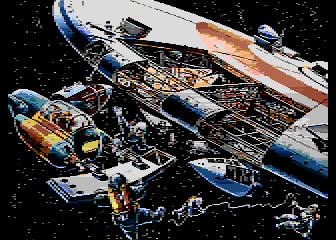](https://github.com/ivop/rc-archive/raw/master/Gunstar/GS_SpaceStationChaos-1.xex)
[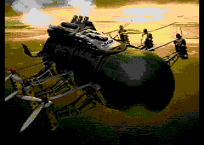](https://github.com/ivop/rc-archive/raw/master/Gunstar/GS_SteampunkDirigible.xex)
[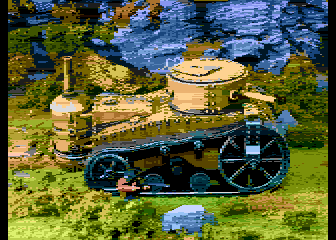](https://github.com/ivop/rc-archive/raw/master/Gunstar/GS_Steamtank.xex)
[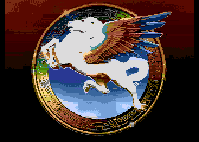](https://github.com/ivop/rc-archive/raw/master/Gunstar/GS_SteveMillerBand.xex)
[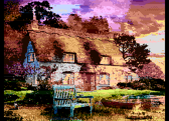](https://github.com/ivop/rc-archive/raw/master/Gunstar/GS_SunsetCottage.xex)
[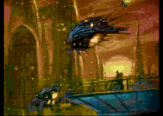](https://github.com/ivop/rc-archive/raw/master/Gunstar/GS_SunsetOnHariSeldon.xex)
[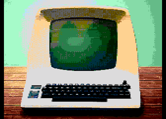](https://github.com/ivop/rc-archive/raw/master/Gunstar/GS_TerminallyObsolete.xex)
[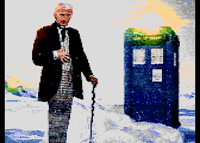](https://github.com/ivop/rc-archive/raw/master/Gunstar/GS_TheDoctor.xex)
[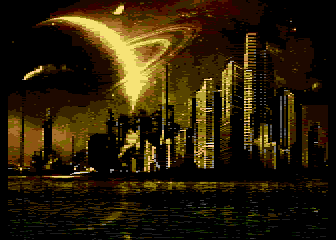](https://github.com/ivop/rc-archive/raw/master/Gunstar/GS_TitanCity.xex)
[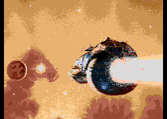](https://github.com/ivop/rc-archive/raw/master/Gunstar/GS_TraderStarship.xex)
[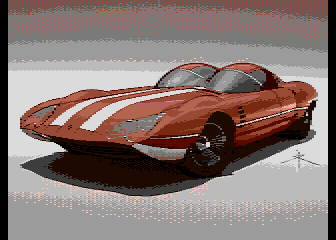](https://github.com/ivop/rc-archive/raw/master/Gunstar/GS_TwinCockpitSuperCar.xex)
[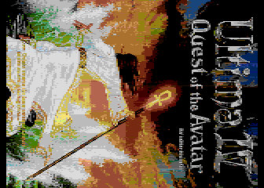](https://github.com/ivop/rc-archive/raw/master/Gunstar/GS_U4Avatar.xex)
[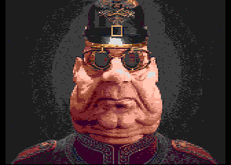](https://github.com/ivop/rc-archive/raw/master/Gunstar/GS_UbergewichtigFeldmarshall.xex)
[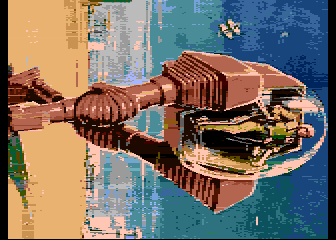](https://github.com/ivop/rc-archive/raw/master/Gunstar/GS_WalkThisWay.xex)
[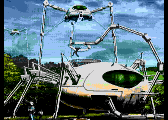](https://github.com/ivop/rc-archive/raw/master/Gunstar/GS_WarOTWorlds.xex)
[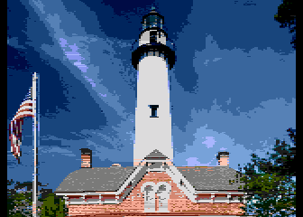](https://github.com/ivop/rc-archive/raw/master/Gunstar/GS_YankeeLighthouse.xex)
[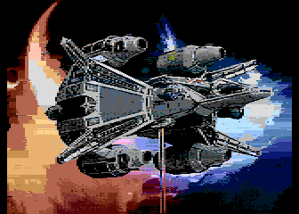](https://github.com/ivop/rc-archive/raw/master/Gunstar/Gunstar.xex)
