

[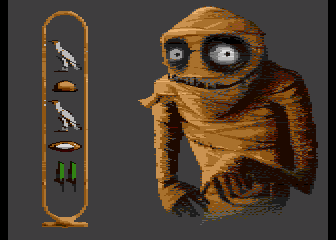](https://github.com/ivop/rc-archive/raw/master/Mario130XE/Mario130XE_Atari-glyph.xex)
[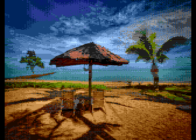](https://github.com/ivop/rc-archive/raw/master/Mario130XE/MARIO130XE_BEACH.xex)
[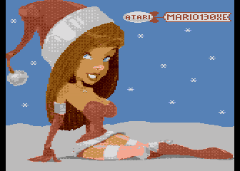](https://github.com/ivop/rc-archive/raw/master/Mario130XE/Mario130xe_ChristmasElf2016.xex)
[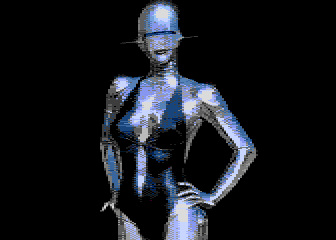](https://github.com/ivop/rc-archive/raw/master/Mario130XE/Mario130XE_Chromebabe.xex)
[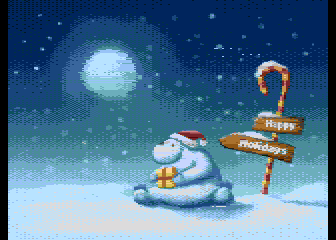](https://github.com/ivop/rc-archive/raw/master/Mario130XE/MARIO130XE_HAPPY_HOLIDAY.xex)

[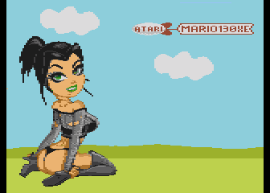](https://github.com/ivop/rc-archive/raw/master/Mario130XE/Mario130xe_HOTPUNKv2.xex)
[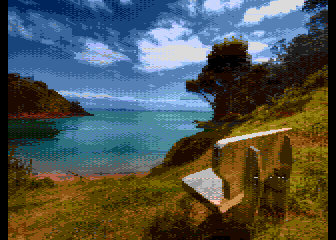](https://github.com/ivop/rc-archive/raw/master/Mario130XE/MARIO130XE_NATURE01.xex)
[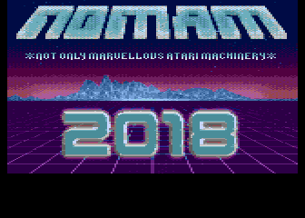](https://github.com/ivop/rc-archive/raw/master/Mario130XE/Mario130xe_NOMAM18.xex)
[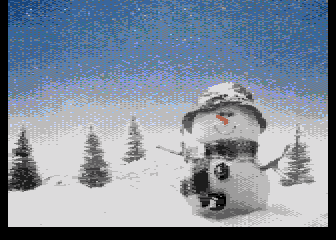](https://github.com/ivop/rc-archive/raw/master/Mario130XE/Mario130xe_one_more_Snowman_full.xex)
[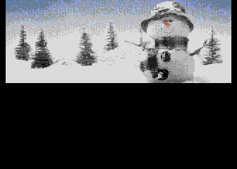](https://github.com/ivop/rc-archive/raw/master/Mario130XE/Mario130xe_one_more_Snowman.xex)
[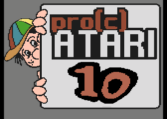](https://github.com/ivop/rc-archive/raw/master/Mario130XE/Mario130XE_Proc10Title.xex)
[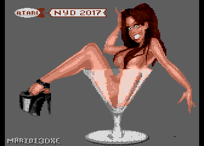](https://github.com/ivop/rc-archive/raw/master/Mario130XE/Mario130xe_PROSIT2017.xex)
[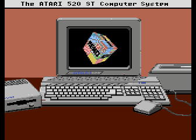](https://github.com/ivop/rc-archive/raw/master/Mario130XE/Mario130XE_RENO520ST.xex)
[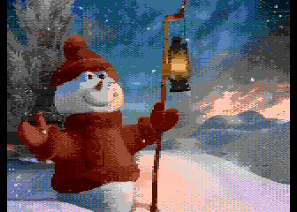](https://github.com/ivop/rc-archive/raw/master/Mario130XE/MARIO130XE_SNOWMAN.xex)
[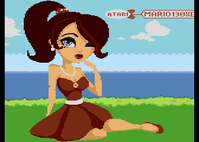](https://github.com/ivop/rc-archive/raw/master/Mario130XE/Mario130XE_Summergirl.xex)
[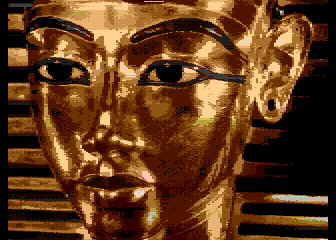](https://github.com/ivop/rc-archive/raw/master/Mario130XE/Mario130XE_Tutankhamon.xex)
[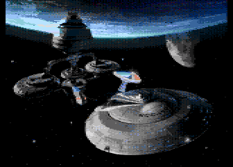](https://github.com/ivop/rc-archive/raw/master/Mario130XE/Mario130XE_USS.xex)
[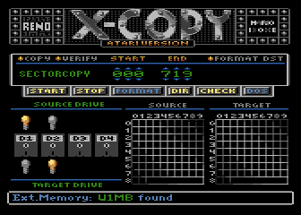](https://github.com/ivop/rc-archive/raw/master/Mario130XE/Mario130xe_XCOPY.xex)
[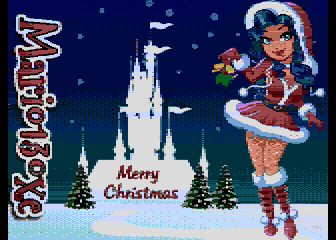](https://github.com/ivop/rc-archive/raw/master/Mario130XE/MARIO130XE_XmasGirl.xex)
[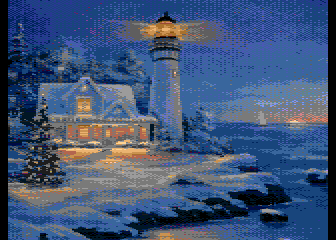](https://github.com/ivop/rc-archive/raw/master/Mario130XE/Mario130xe_XMAS-Lighthouse.xex)
[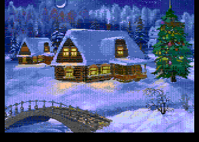](https://github.com/ivop/rc-archive/raw/master/Mario130XE/Mario130XE_XMAS_NTSC.xex)
