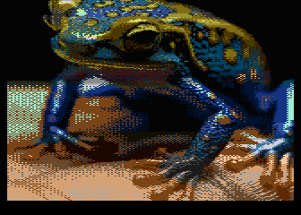

[.png)](https://github.com/ivop/rc-archive/raw/master/MrFish/mrfish,%20hamfrog2,%20ntsc%20(orange-red%20skin).xex)
[.png)](https://github.com/ivop/rc-archive/raw/master/MrFish/mrfish,%20hamfrog2,%20ntsc%20(red%20skin).xex)

