[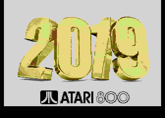](https://github.com/ivop/rc-archive/raw/master/Philsan/Philsan_2019_NTSC.xex)
[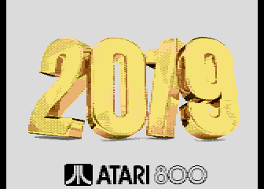](https://github.com/ivop/rc-archive/raw/master/Philsan/Philsan_2019_PAL.xex)
[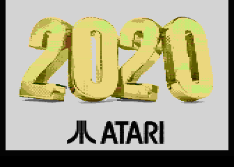](https://github.com/ivop/rc-archive/raw/master/Philsan/Philsan_2020_NTSC.xex)
[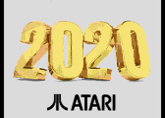](https://github.com/ivop/rc-archive/raw/master/Philsan/Philsan_2020_PAL.xex)
[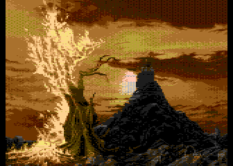](https://github.com/ivop/rc-archive/raw/master/Philsan/Philsan_Agony_4.xex)
[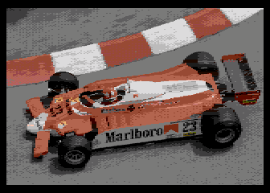](https://github.com/ivop/rc-archive/raw/master/Philsan/Philsan_AlfaRomeo_1980_2.xex)
[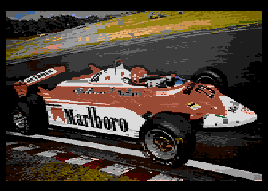](https://github.com/ivop/rc-archive/raw/master/Philsan/Philsan_AlfaRomeo_1980_3.xex)
[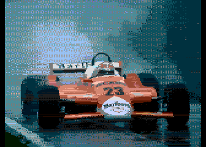](https://github.com/ivop/rc-archive/raw/master/Philsan/Philsan_AlfaRomeo_1980.xex)
[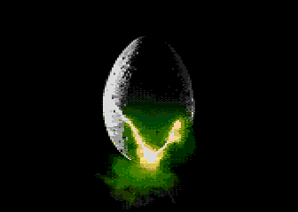](https://github.com/ivop/rc-archive/raw/master/Philsan/Philsan_Alien_Egg.xex)
[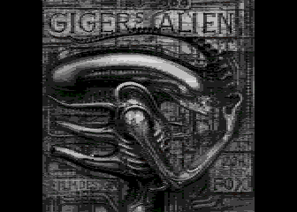](https://github.com/ivop/rc-archive/raw/master/Philsan/Philsan_Alien.xex)
[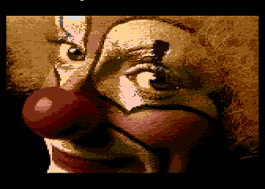](https://github.com/ivop/rc-archive/raw/master/Philsan/Philsan_Amiga_Clown.xex)
[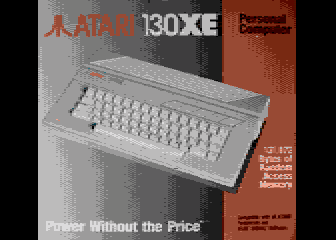](https://github.com/ivop/rc-archive/raw/master/Philsan/Philsan_Atari130XEBox.xex)
[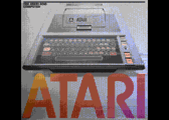](https://github.com/ivop/rc-archive/raw/master/Philsan/Philsan_Atari400Box.xex)

[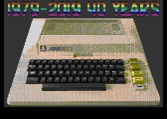](https://github.com/ivop/rc-archive/raw/master/Philsan/Philsan_Atari800_40years_2_NTSC.xex)
[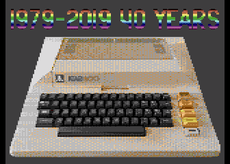](https://github.com/ivop/rc-archive/raw/master/Philsan/Philsan_Atari800_40years_2_PAL.xex)
[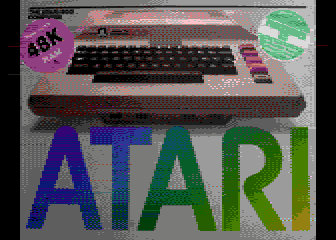](https://github.com/ivop/rc-archive/raw/master/Philsan/Philsan_Atari800Box_OlivierN.xex)
[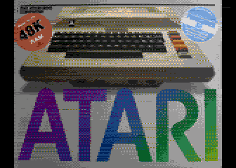](https://github.com/ivop/rc-archive/raw/master/Philsan/Philsan_Atari800Box.xex)
[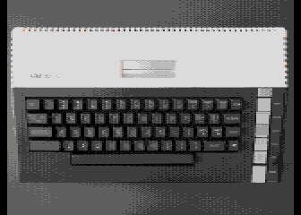](https://github.com/ivop/rc-archive/raw/master/Philsan/Philsan_Atari800XL_2.xex)
[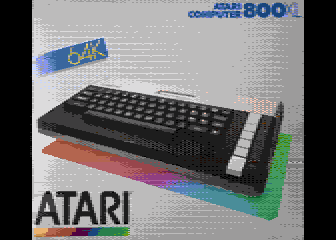](https://github.com/ivop/rc-archive/raw/master/Philsan/Philsan_Atari800XLBox_1.xex)
[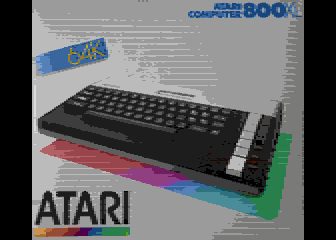](https://github.com/ivop/rc-archive/raw/master/Philsan/Philsan_Atari800XLBox.xex)
[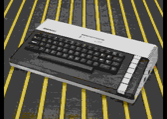](https://github.com/ivop/rc-archive/raw/master/Philsan/Philsan_Atari800XL.xex)
[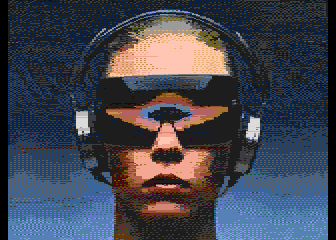](https://github.com/ivop/rc-archive/raw/master/Philsan/Philsan_AtariVideoMusicAd.xex)
[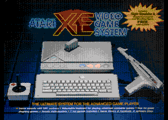](https://github.com/ivop/rc-archive/raw/master/Philsan/Philsan_AtariXEGSBox.xex)
[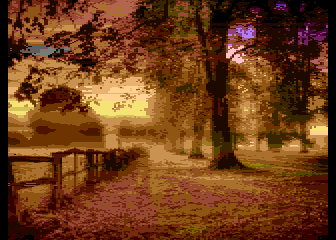](https://github.com/ivop/rc-archive/raw/master/Philsan/Philsan_Autumn.xex)
[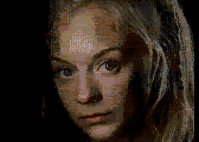](https://github.com/ivop/rc-archive/raw/master/Philsan/Philsan_BethGreene.xex)
[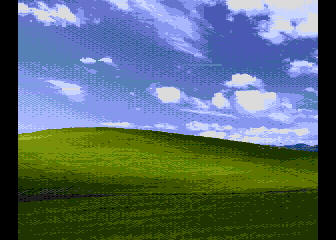](https://github.com/ivop/rc-archive/raw/master/Philsan/Philsan_BlissXP.xex)
[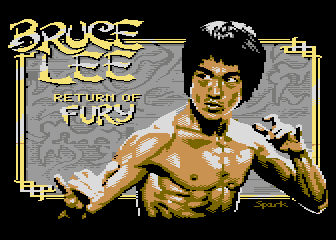](https://github.com/ivop/rc-archive/raw/master/Philsan/Philsan_BLRoF.xex)
[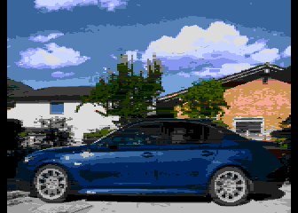](https://github.com/ivop/rc-archive/raw/master/Philsan/Philsan_BMW550iM.xex)
[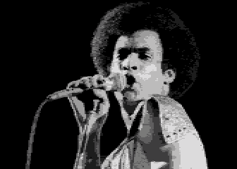](https://github.com/ivop/rc-archive/raw/master/Philsan/Philsan_BobbyFarrell.xex)
[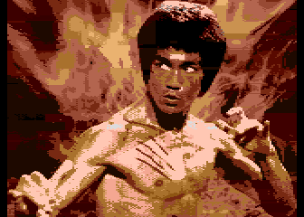](https://github.com/ivop/rc-archive/raw/master/Philsan/Philsan_BruceLee_2.xex)
[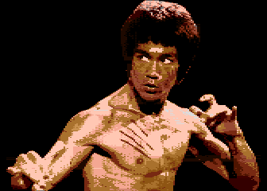](https://github.com/ivop/rc-archive/raw/master/Philsan/Philsan_BruceLee_3.xex)
[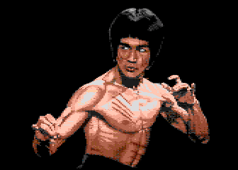](https://github.com/ivop/rc-archive/raw/master/Philsan/Philsan_BruceLee_4.xex)
[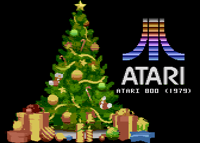](https://github.com/ivop/rc-archive/raw/master/Philsan/Philsan_ChristmasTree.xex)

[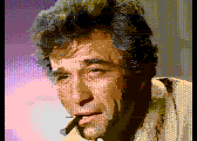](https://github.com/ivop/rc-archive/raw/master/Philsan/Philsan_Columbo.xex)

[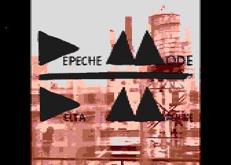](https://github.com/ivop/rc-archive/raw/master/Philsan/Philsan_DM_DeltaMachine.xex)
[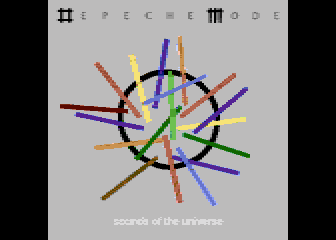](https://github.com/ivop/rc-archive/raw/master/Philsan/Philsan_DM_SoundsOfTheUniverse.xex)
[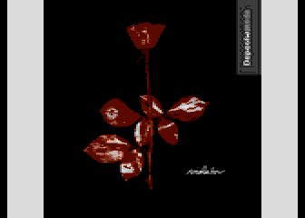](https://github.com/ivop/rc-archive/raw/master/Philsan/Philsan_DM_Violator.xex)
[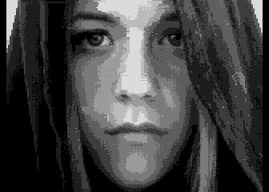](https://github.com/ivop/rc-archive/raw/master/Philsan/Philsan_Dominatrix_CoverMe_Girl.xex)
[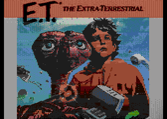](https://github.com/ivop/rc-archive/raw/master/Philsan/Philsan_ET.xex)

[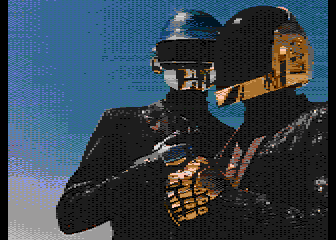](https://github.com/ivop/rc-archive/raw/master/Philsan/Philsan_GetLucky.xex)
[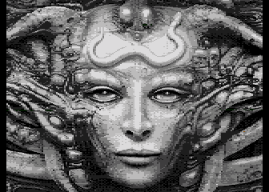](https://github.com/ivop/rc-archive/raw/master/Philsan/Philsan_Giger.xex)
[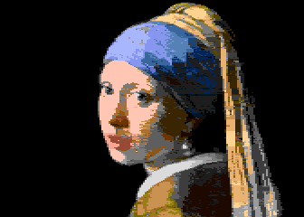](https://github.com/ivop/rc-archive/raw/master/Philsan/Philsan_GirlWithAPearlEarring_nodithering.xex)
[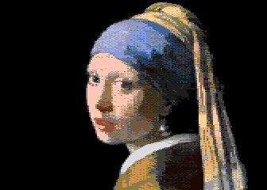](https://github.com/ivop/rc-archive/raw/master/Philsan/Philsan_GirlWithAPearlEarring.xex)
[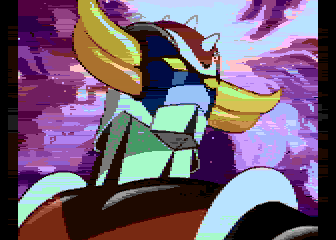](https://github.com/ivop/rc-archive/raw/master/Philsan/Philsan_Goldrake.xex)
[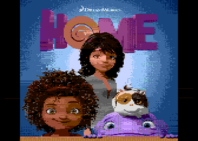](https://github.com/ivop/rc-archive/raw/master/Philsan/Philsan_Home.xex)
[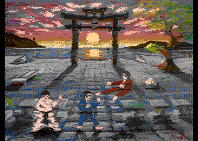](https://github.com/ivop/rc-archive/raw/master/Philsan/Philsan_IK+_2_RobertRamsay.xex)
[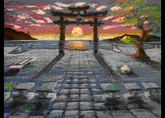](https://github.com/ivop/rc-archive/raw/master/Philsan/Philsan_IK+_RobertRamsay.xex)
[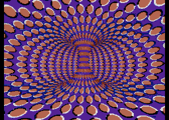](https://github.com/ivop/rc-archive/raw/master/Philsan/Philsan_Illusion_2.xex)
[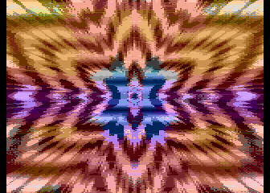](https://github.com/ivop/rc-archive/raw/master/Philsan/Philsan_Illusion_3.xex)
[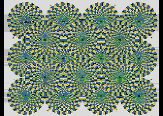](https://github.com/ivop/rc-archive/raw/master/Philsan/Philsan_Illusion.xex)
[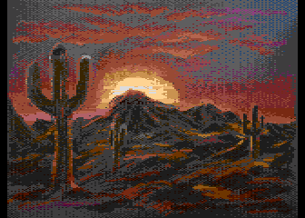](https://github.com/ivop/rc-archive/raw/master/Philsan/Philsan_It_Came_from_the_Desert_Robert_Ramsay.xex)
[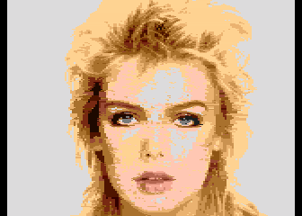](https://github.com/ivop/rc-archive/raw/master/Philsan/Philsan_Kim_Wilde.xex)
[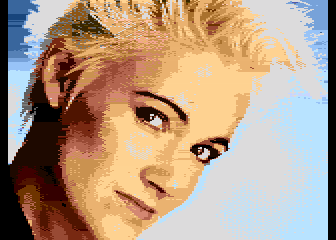](https://github.com/ivop/rc-archive/raw/master/Philsan/Philsan_Marie.xex)
[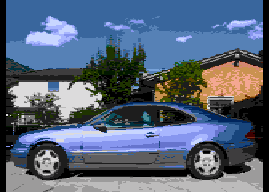](https://github.com/ivop/rc-archive/raw/master/Philsan/Philsan_MercedesCLK230Kompressor.xex)
[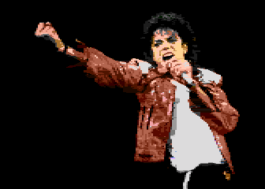](https://github.com/ivop/rc-archive/raw/master/Philsan/Philsan_Michael_Jackson.xex)
[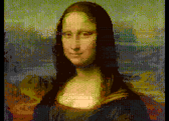](https://github.com/ivop/rc-archive/raw/master/Philsan/Philsan_MonaLisa.xex)
[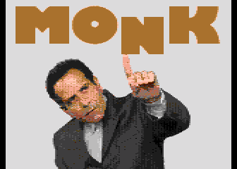](https://github.com/ivop/rc-archive/raw/master/Philsan/Philsan_Monk.xex)
[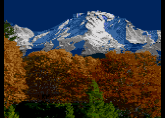](https://github.com/ivop/rc-archive/raw/master/Philsan/Philsan_Mountains.xex)
[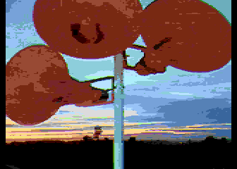](https://github.com/ivop/rc-archive/raw/master/Philsan/Philsan_MusicForTheMasses.xex)
[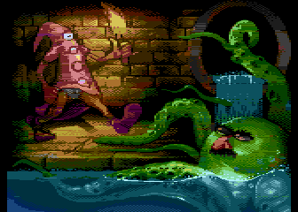](https://github.com/ivop/rc-archive/raw/master/Philsan/Philsan_OneZackAndHisCracken.xex)
[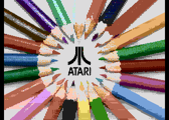](https://github.com/ivop/rc-archive/raw/master/Philsan/Philsan_Pencils_3.xex)

[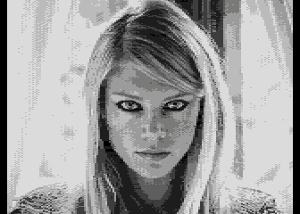](https://github.com/ivop/rc-archive/raw/master/Philsan/Philsan_Peta_Wilson_2.xex)
[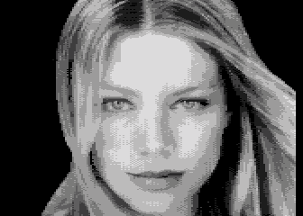](https://github.com/ivop/rc-archive/raw/master/Philsan/Philsan_Peta_Wilson.xex)
[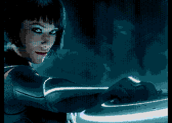](https://github.com/ivop/rc-archive/raw/master/Philsan/Philsan_Quorra_2.xex)
[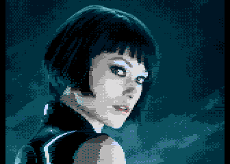](https://github.com/ivop/rc-archive/raw/master/Philsan/Philsan_Quorra.xex)
[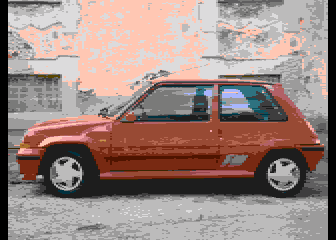](https://github.com/ivop/rc-archive/raw/master/Philsan/Philsan_Renault5GTturbo.xex)
[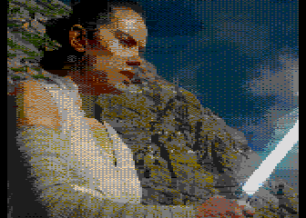](https://github.com/ivop/rc-archive/raw/master/Philsan/Philsan_Rey.xex)
[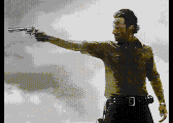](https://github.com/ivop/rc-archive/raw/master/Philsan/Philsan_RickGrimes.xex)

[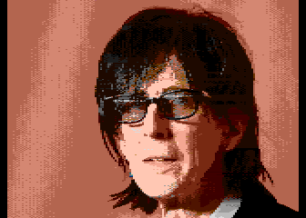](https://github.com/ivop/rc-archive/raw/master/Philsan/Philsan_RicOcasek_2.xex)
[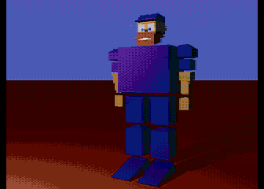](https://github.com/ivop/rc-archive/raw/master/Philsan/Philsan_Robot.xex)

[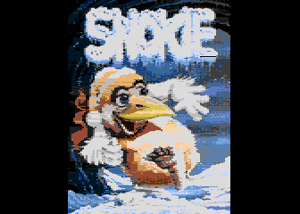](https://github.com/ivop/rc-archive/raw/master/Philsan/Philsan_Snokie_2.xex)
[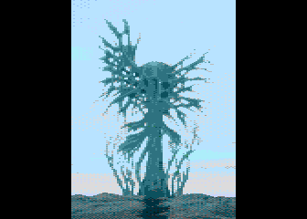](https://github.com/ivop/rc-archive/raw/master/Philsan/Philsan_Solaris_Asymmetriad.xex)
[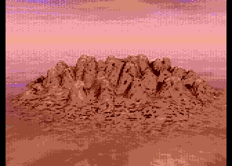](https://github.com/ivop/rc-archive/raw/master/Philsan/Philsan_Solaris_Mimoid.xex)
[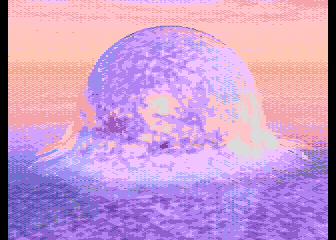](https://github.com/ivop/rc-archive/raw/master/Philsan/Philsan_Solaris_Symmetriad_1.xex)
[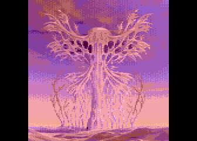](https://github.com/ivop/rc-archive/raw/master/Philsan/Philsan_Solaris_Symmetriad_2.xex)
[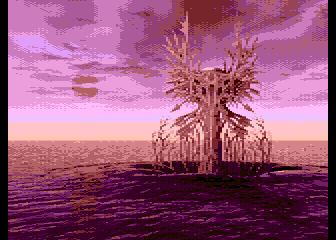](https://github.com/ivop/rc-archive/raw/master/Philsan/Philsan_Solaris_Symmetriad_5.xex)

[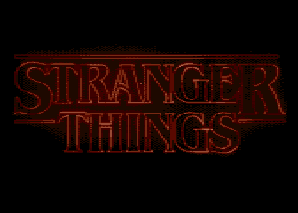](https://github.com/ivop/rc-archive/raw/master/Philsan/Philsan_StrangerThings_1.xex)

[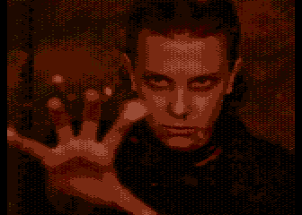](https://github.com/ivop/rc-archive/raw/master/Philsan/Philsan_StrangerThings_3.xex)
[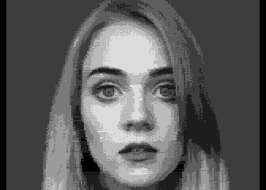](https://github.com/ivop/rc-archive/raw/master/Philsan/Philsan_Swedish_Girl_BW.xex)
[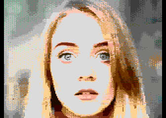](https://github.com/ivop/rc-archive/raw/master/Philsan/Philsan_Swedish_Girl.xex)
[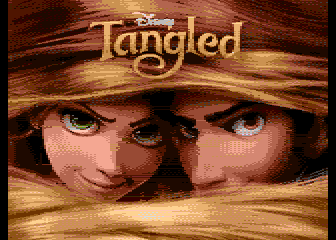](https://github.com/ivop/rc-archive/raw/master/Philsan/Philsan_Tangled_1.xex)
[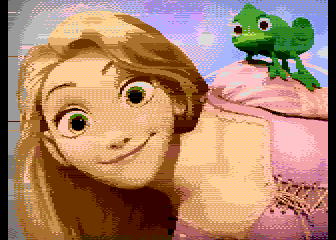](https://github.com/ivop/rc-archive/raw/master/Philsan/Philsan_Tangled_2.xex)
[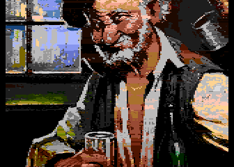](https://github.com/ivop/rc-archive/raw/master/Philsan/Philsan_Teomondo_Scrofalo.xex)
[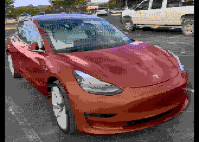](https://github.com/ivop/rc-archive/raw/master/Philsan/Philsan_Tesla_1.xex)
[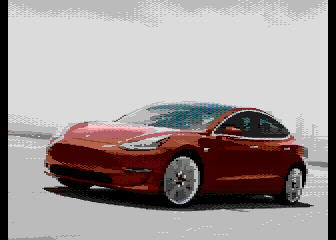](https://github.com/ivop/rc-archive/raw/master/Philsan/Philsan_Tesla_2.xex)
[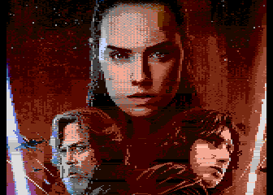](https://github.com/ivop/rc-archive/raw/master/Philsan/Philsan_TheLastJedi.xex)

[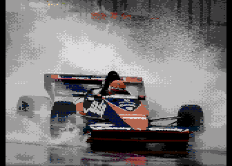](https://github.com/ivop/rc-archive/raw/master/Philsan/Philsan_Toleman_1983.xex)
[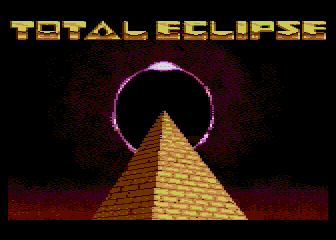](https://github.com/ivop/rc-archive/raw/master/Philsan/Philsan_TotalEclipse.xex)
[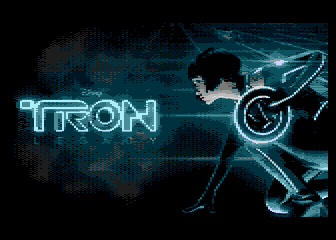](https://github.com/ivop/rc-archive/raw/master/Philsan/Philsan_TronLegacy.xex)
[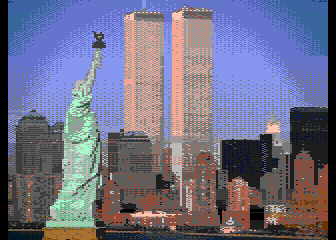](https://github.com/ivop/rc-archive/raw/master/Philsan/Philsan_TwinTowers.xex)
[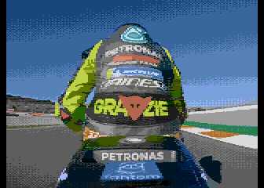](https://github.com/ivop/rc-archive/raw/master/Philsan/Philsan_ValentinoRossi.xex)

[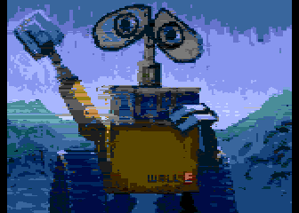](https://github.com/ivop/rc-archive/raw/master/Philsan/Philsan_WALL-E.xex)
[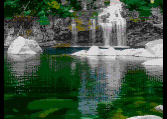](https://github.com/ivop/rc-archive/raw/master/Philsan/Philsan_Waterfall.xex)
[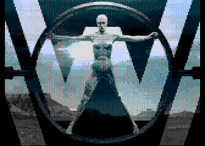](https://github.com/ivop/rc-archive/raw/master/Philsan/Philsan_Westworld.xex)
[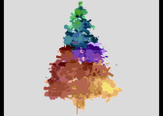](https://github.com/ivop/rc-archive/raw/master/Philsan/Philsan_XmasTree.xex)
