[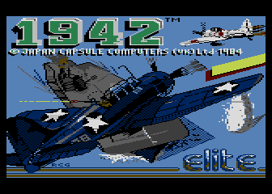](https://github.com/ivop/rc-archive/raw/master/StaxX/StaxX_1942.xex)
[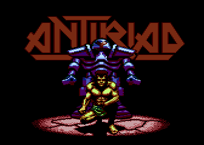](https://github.com/ivop/rc-archive/raw/master/StaxX/StaxX_Antiriad.xex)
[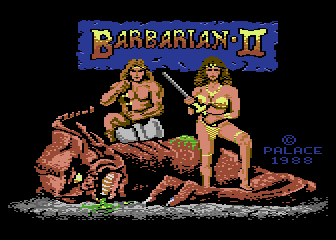](https://github.com/ivop/rc-archive/raw/master/StaxX/StaxX_Barbarian2.xex)
[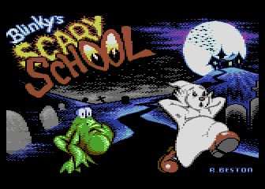](https://github.com/ivop/rc-archive/raw/master/StaxX/StaxX_BlinkysScarySchool.xex)
[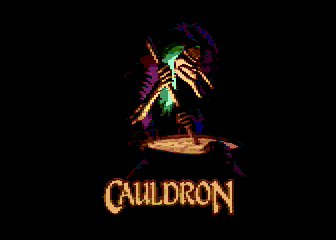](https://github.com/ivop/rc-archive/raw/master/StaxX/StaxX_Cauldron.xex)
[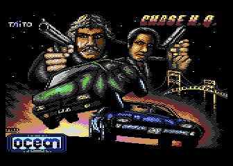](https://github.com/ivop/rc-archive/raw/master/StaxX/StaxX_ChaseHQ.xex)
[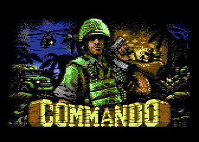](https://github.com/ivop/rc-archive/raw/master/StaxX/StaxX_Commando.xex)

[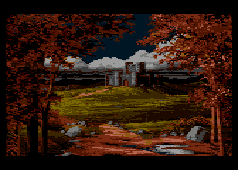](https://github.com/ivop/rc-archive/raw/master/StaxX/StaxX_DOTC_Castle1.xex)
[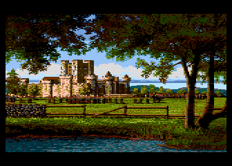](https://github.com/ivop/rc-archive/raw/master/StaxX/StaxX_DOTC_Castle2.xex)
[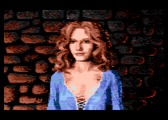](https://github.com/ivop/rc-archive/raw/master/StaxX/StaxX_DOTC_Princess.xex)
[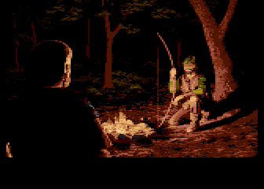](https://github.com/ivop/rc-archive/raw/master/StaxX/StaxX_DOTC_Robin.xex)
[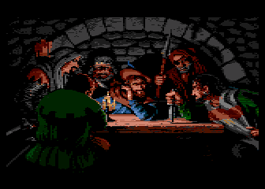](https://github.com/ivop/rc-archive/raw/master/StaxX/StaxX_DOTC_tavern.xex)
[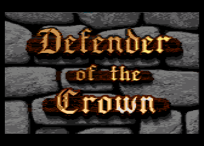](https://github.com/ivop/rc-archive/raw/master/StaxX/StaxX_DOTC__Title.xex)
[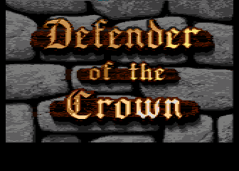](https://github.com/ivop/rc-archive/raw/master/StaxX/StaxX_DOTC_Title.xex)
[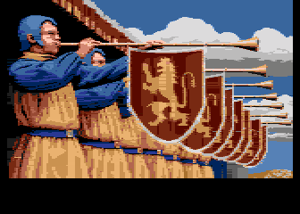](https://github.com/ivop/rc-archive/raw/master/StaxX/StaxX_DOTC_Turnament8.xex)
[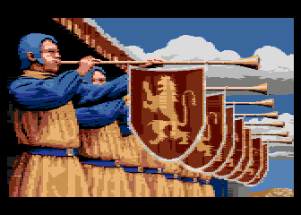](https://github.com/ivop/rc-archive/raw/master/StaxX/StaxX_DOTC_Turnament.xex)
[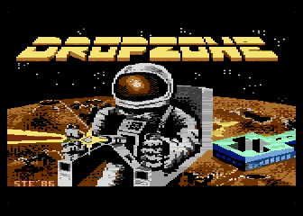](https://github.com/ivop/rc-archive/raw/master/StaxX/StaxX_DropZone.xex)
[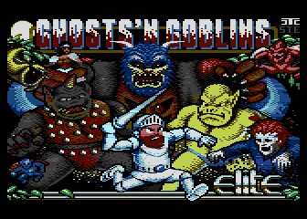](https://github.com/ivop/rc-archive/raw/master/StaxX/StaxX_GnG.xex)
[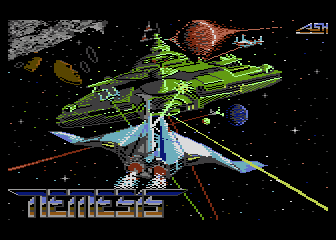](https://github.com/ivop/rc-archive/raw/master/StaxX/StaxX_Nemesis.xex)
[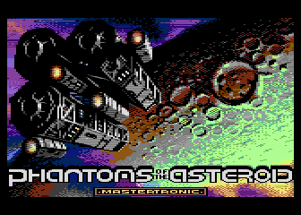](https://github.com/ivop/rc-archive/raw/master/StaxX/StaxX_PhantomsOfTheAsteroid.xex)
[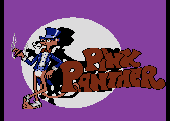](https://github.com/ivop/rc-archive/raw/master/StaxX/StaxX_PinkPanther.xex)
[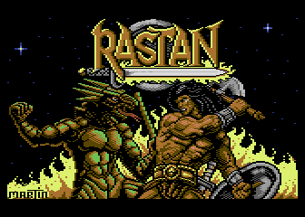](https://github.com/ivop/rc-archive/raw/master/StaxX/StaxX_Rastan.xex)
[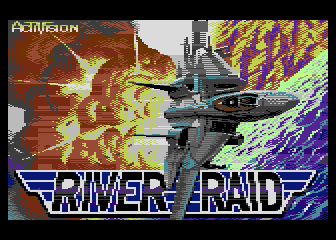](https://github.com/ivop/rc-archive/raw/master/StaxX/StaxX_RiverRaid.xex)
[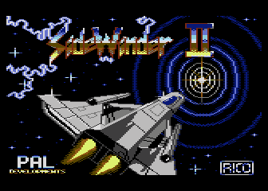](https://github.com/ivop/rc-archive/raw/master/StaxX/StaxX_SidewinderII.xex)

[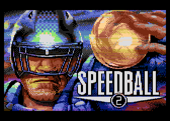](https://github.com/ivop/rc-archive/raw/master/StaxX/StaxX_Speedball2.xex)
[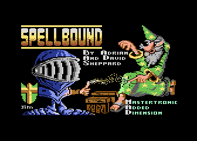](https://github.com/ivop/rc-archive/raw/master/StaxX/StaxX_SpellBound.xex)
[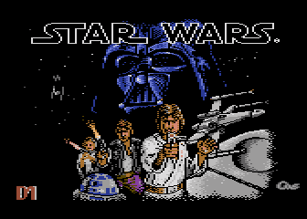](https://github.com/ivop/rc-archive/raw/master/StaxX/StaxX_StarWars.xex)
[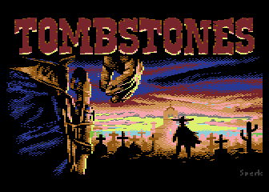](https://github.com/ivop/rc-archive/raw/master/StaxX/StaxX_Tombstones.xex)
[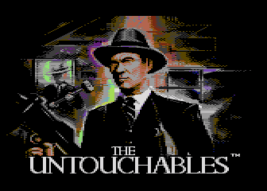](https://github.com/ivop/rc-archive/raw/master/StaxX/StaxX_Untouchables.xex)
[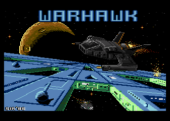](https://github.com/ivop/rc-archive/raw/master/StaxX/StaxX_Warhawk.xex)

[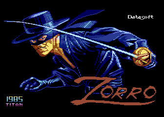](https://github.com/ivop/rc-archive/raw/master/StaxX/StaxX_Zorro.xex)
