[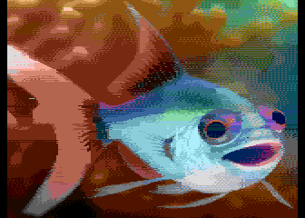](https://github.com/ivop/rc-archive/raw/master/Stephen/Stephen_AI_Neon_sm_1500Million.xex)
[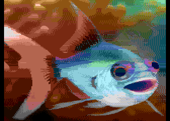](https://github.com/ivop/rc-archive/raw/master/Stephen/Stephen_AI_Neon_sm_500Million.xex)
[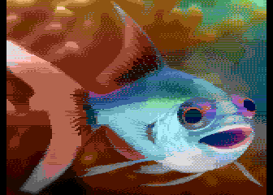](https://github.com/ivop/rc-archive/raw/master/Stephen/Stephen_AI_Neon.xex)
[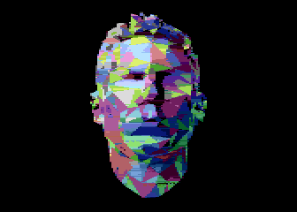](https://github.com/ivop/rc-archive/raw/master/Stephen/Stephen_album.xex)
[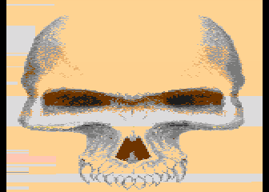](https://github.com/ivop/rc-archive/raw/master/Stephen/Stephen_AmigaSkull_Green.xex)
[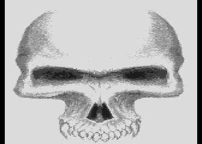](https://github.com/ivop/rc-archive/raw/master/Stephen/Stephen_AmigaSkull.xex)
[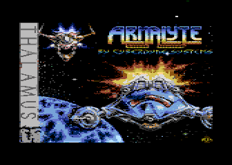](https://github.com/ivop/rc-archive/raw/master/Stephen/Stephen-Armalyte1.xex)
[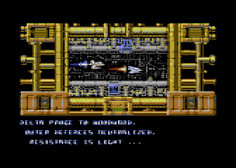](https://github.com/ivop/rc-archive/raw/master/Stephen/Stephen-Armalyte2.xex)
[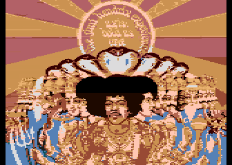](https://github.com/ivop/rc-archive/raw/master/Stephen/Stephen-Axis1.xex)
[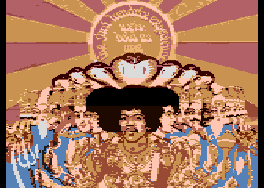](https://github.com/ivop/rc-archive/raw/master/Stephen/Stephen_AxisBold.xex)
[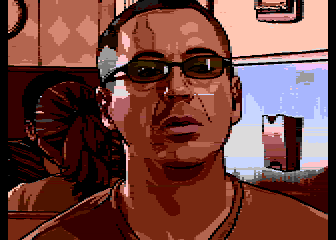](https://github.com/ivop/rc-archive/raw/master/Stephen/Stephen_barris.xex)
[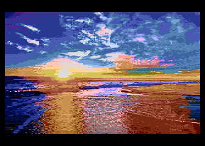](https://github.com/ivop/rc-archive/raw/master/Stephen/Stephen_beach.xex)
[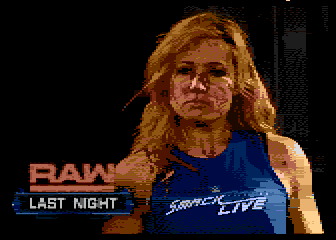](https://github.com/ivop/rc-archive/raw/master/Stephen/Stephen_BeckyLynchBustedFace.xex)
[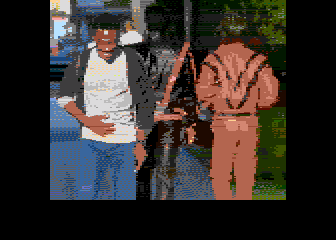](https://github.com/ivop/rc-archive/raw/master/Stephen/Stephen_BeverlyHillsCop1.xex)
[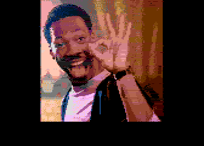](https://github.com/ivop/rc-archive/raw/master/Stephen/Stephen_BeverlyHillsCop_2.xex)
[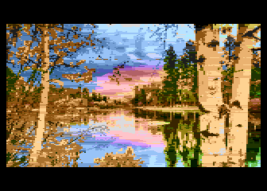](https://github.com/ivop/rc-archive/raw/master/Stephen/Stephen_birch.xex)
[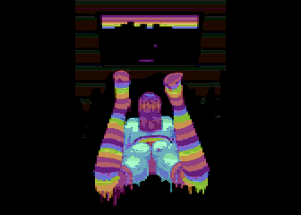](https://github.com/ivop/rc-archive/raw/master/Stephen/Stephen_breakout.xex)
[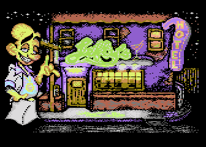](https://github.com/ivop/rc-archive/raw/master/Stephen/Stephen_C64_LoungeLizard.xex)
[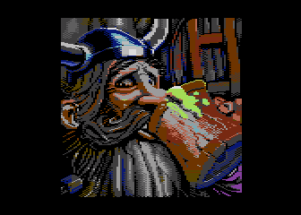](https://github.com/ivop/rc-archive/raw/master/Stephen/Stephen_C64Viking.xex)
[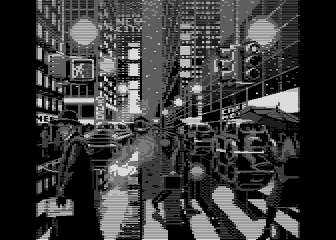](https://github.com/ivop/rc-archive/raw/master/Stephen/Stephen_C64Xenium.xex)
[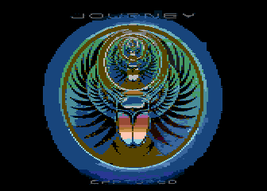](https://github.com/ivop/rc-archive/raw/master/Stephen/Stephen_Captured2.xex)
[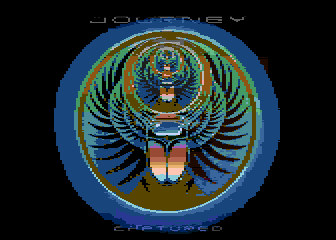](https://github.com/ivop/rc-archive/raw/master/Stephen/Stephen_Captured3.xex)
[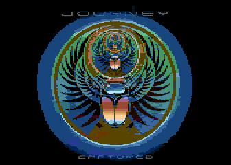](https://github.com/ivop/rc-archive/raw/master/Stephen/Stephen_Captured4.xex)
[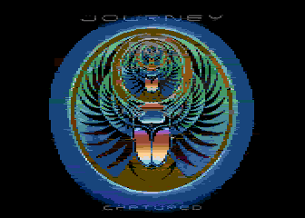](https://github.com/ivop/rc-archive/raw/master/Stephen/Stephen_Captured.xex)
[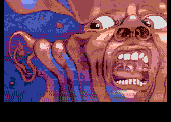](https://github.com/ivop/rc-archive/raw/master/Stephen/Stephen_ck.xex)
[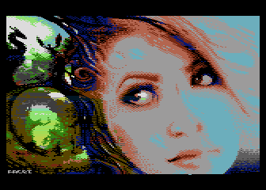](https://github.com/ivop/rc-archive/raw/master/Stephen/Stephen_CommodoreGirl.xex)
[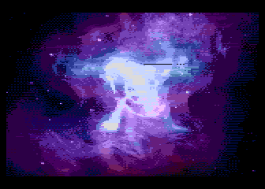](https://github.com/ivop/rc-archive/raw/master/Stephen/Stephen_CrabNebula.xex)
[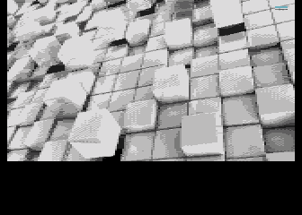](https://github.com/ivop/rc-archive/raw/master/Stephen/Stephen_cubes.xex)
[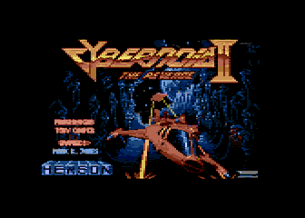](https://github.com/ivop/rc-archive/raw/master/Stephen/Stephen_Cybernoid2.xex)
[.png)](https://github.com/ivop/rc-archive/raw/master/Stephen/Stephen_Cygnus_Final%20(1).xex)
[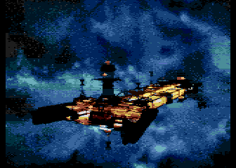](https://github.com/ivop/rc-archive/raw/master/Stephen/Stephen_Cygnus_Final.xex)
[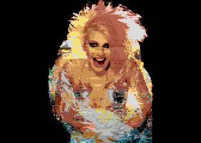](https://github.com/ivop/rc-archive/raw/master/Stephen/Stephen_dale.xex)
[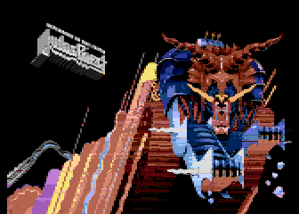](https://github.com/ivop/rc-archive/raw/master/Stephen/Stephen_DefenderOfTheFaith.xex)
[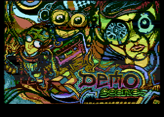](https://github.com/ivop/rc-archive/raw/master/Stephen/Stephen_demoscene.xex)
[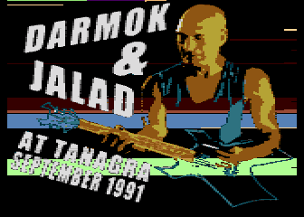](https://github.com/ivop/rc-archive/raw/master/Stephen/Stephen_DJT.xex)
[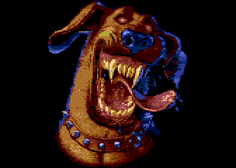](https://github.com/ivop/rc-archive/raw/master/Stephen/Stephen_dog.xex)
[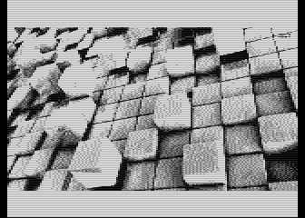](https://github.com/ivop/rc-archive/raw/master/Stephen/Stephen_done2.xex)
[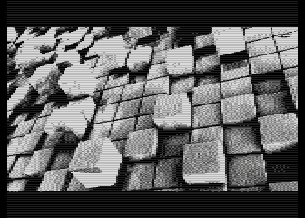](https://github.com/ivop/rc-archive/raw/master/Stephen/Stephen_done.xex)
[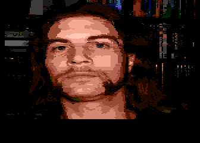](https://github.com/ivop/rc-archive/raw/master/Stephen/Stephen_douchebag.xex)
[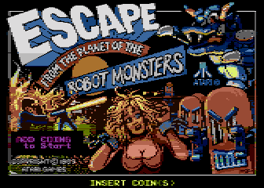](https://github.com/ivop/rc-archive/raw/master/Stephen/Stephen_Escape.xex)

[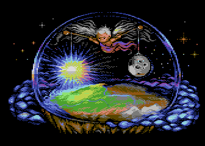](https://github.com/ivop/rc-archive/raw/master/Stephen/Stephen_FlatCountry_C64.xex)

[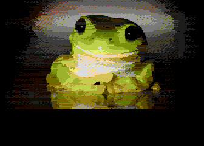](https://github.com/ivop/rc-archive/raw/master/Stephen/Stephen_frog.xex)
[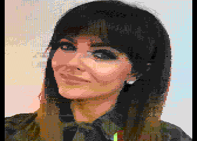](https://github.com/ivop/rc-archive/raw/master/Stephen/Stephen_g83.xex)
[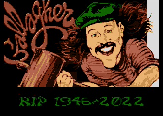](https://github.com/ivop/rc-archive/raw/master/Stephen/Stephen_Gallagher_RIP.xex)
[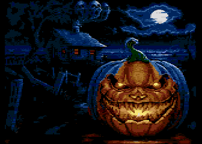](https://github.com/ivop/rc-archive/raw/master/Stephen/Stephen_GiantPumpkin.xex)
[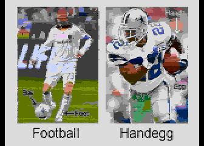](https://github.com/ivop/rc-archive/raw/master/Stephen/Stephen_Handegg.xex)
[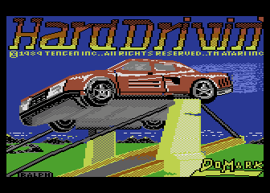](https://github.com/ivop/rc-archive/raw/master/Stephen/stephen-HardDrivin.xex)

[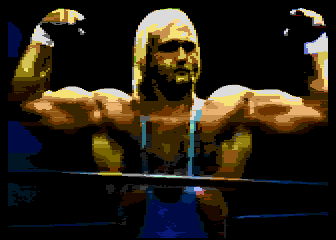](https://github.com/ivop/rc-archive/raw/master/Stephen/Stephen_HulkHogan1979.xex)
[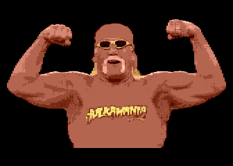](https://github.com/ivop/rc-archive/raw/master/Stephen/Stephen_HulkHogan2019_New.xex)

[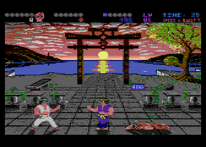](https://github.com/ivop/rc-archive/raw/master/Stephen/Stephen_IK.xex)
[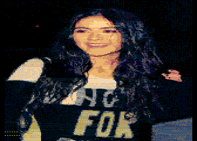](https://github.com/ivop/rc-archive/raw/master/Stephen/Stephen_isabelle-alt.xex)

[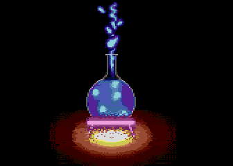](https://github.com/ivop/rc-archive/raw/master/Stephen/Stephen_Lamp.xex)
[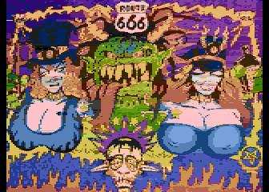](https://github.com/ivop/rc-archive/raw/master/Stephen/Stephen_LaSexorcisto.xex)
[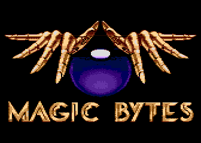](https://github.com/ivop/rc-archive/raw/master/Stephen/Stephen_MagicBytes.xex)
[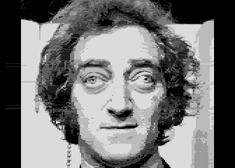](https://github.com/ivop/rc-archive/raw/master/Stephen/Stephen_MartyFeldman.xex)
[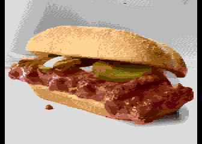](https://github.com/ivop/rc-archive/raw/master/Stephen/Stephen_McRib.xex)
[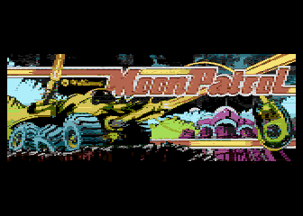](https://github.com/ivop/rc-archive/raw/master/Stephen/stephen_MoonPatrol.xex)
[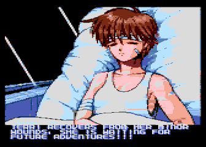](https://github.com/ivop/rc-archive/raw/master/Stephen/stephen-musha.xex)
[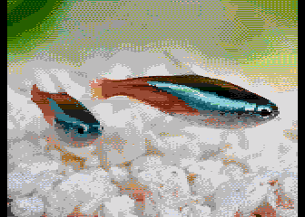](https://github.com/ivop/rc-archive/raw/master/Stephen/Stephen_NeonTetras.xex)
[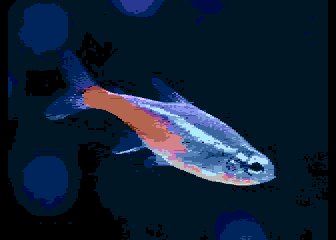](https://github.com/ivop/rc-archive/raw/master/Stephen/Stephen_NeonTetra.xex)

[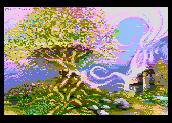](https://github.com/ivop/rc-archive/raw/master/Stephen/Stephen_Piesu_Wonderland.xex)
[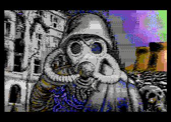](https://github.com/ivop/rc-archive/raw/master/Stephen/Stephen_Pollution2045.xex)
[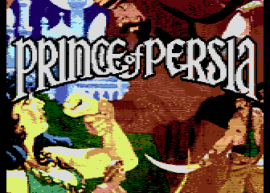](https://github.com/ivop/rc-archive/raw/master/Stephen/Stephen_PopTitle.xex)
[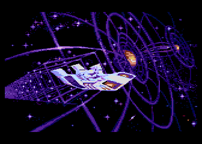](https://github.com/ivop/rc-archive/raw/master/Stephen/Stephen_Purple.xex)
[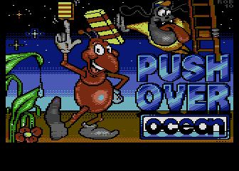](https://github.com/ivop/rc-archive/raw/master/Stephen/Stephen_PushOver.xex)
[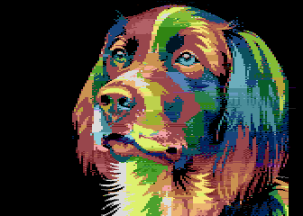](https://github.com/ivop/rc-archive/raw/master/Stephen/Stephen_Rainbow_Dog_Dither.xex)
[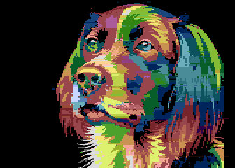](https://github.com/ivop/rc-archive/raw/master/Stephen/Stephen_Rainbow_Lab_NoDither.xex)
[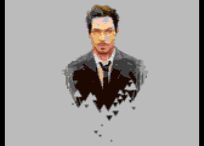](https://github.com/ivop/rc-archive/raw/master/Stephen/Stephen_RDJr.xex)
[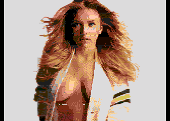](https://github.com/ivop/rc-archive/raw/master/Stephen/Stephen_Scarlette_SecondConversion.xex)
[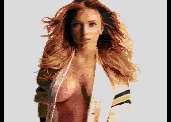](https://github.com/ivop/rc-archive/raw/master/Stephen/Stephen_scarlette.xex)
[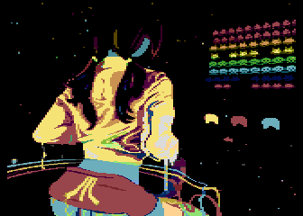](https://github.com/ivop/rc-archive/raw/master/Stephen/Stephen_SI.xex)
[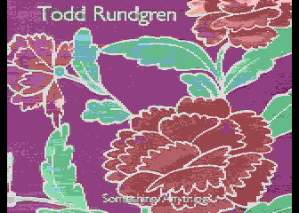](https://github.com/ivop/rc-archive/raw/master/Stephen/Stephen_SomethingAnything.xex)
[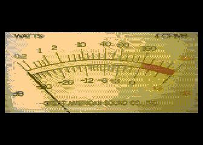](https://github.com/ivop/rc-archive/raw/master/Stephen/Stephen_SonOfAmpzilla.xex)
[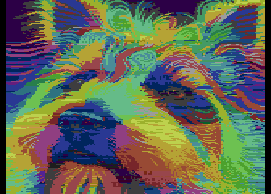](https://github.com/ivop/rc-archive/raw/master/Stephen/Stephen_Stanley_16Colours.xex)
[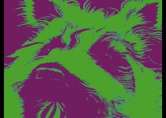](https://github.com/ivop/rc-archive/raw/master/Stephen/Stephen_Stanley_2Colours.xex)
[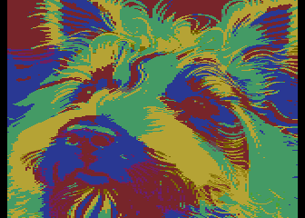](https://github.com/ivop/rc-archive/raw/master/Stephen/Stephen_Stanley_4Colours.xex)
[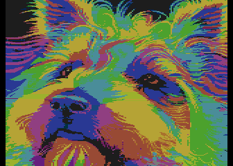](https://github.com/ivop/rc-archive/raw/master/Stephen/Stephen_Stanley_8Colours.xex)
[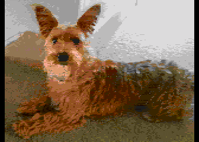](https://github.com/ivop/rc-archive/raw/master/Stephen/Stephen_stanley.xex)
[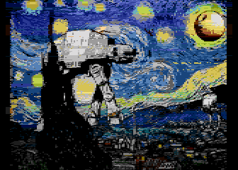](https://github.com/ivop/rc-archive/raw/master/Stephen/Stephen_StarryEmpire.xex)
[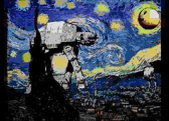](https://github.com/ivop/rc-archive/raw/master/Stephen/Stephen_StarryNight.xex)
[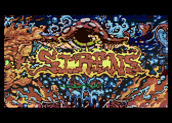](https://github.com/ivop/rc-archive/raw/master/Stephen/Stephen_Sublime_Sirens.xex)
[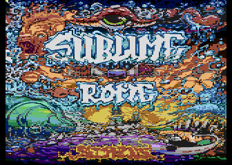](https://github.com/ivop/rc-archive/raw/master/Stephen/Stephen_Sublime.xex)
[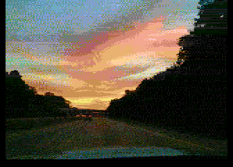](https://github.com/ivop/rc-archive/raw/master/Stephen/Stephen_sunset.xex)

[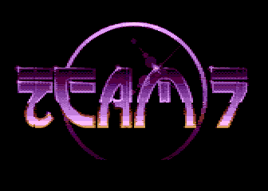](https://github.com/ivop/rc-archive/raw/master/Stephen/Stephen_Team7.xex)
[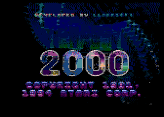](https://github.com/ivop/rc-archive/raw/master/Stephen/Stephen_Tempest2000.xex)
[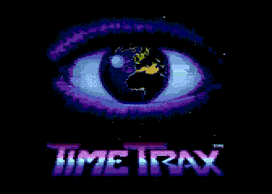](https://github.com/ivop/rc-archive/raw/master/Stephen/Stephen_TimeTrax_PAL.xex)
[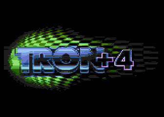](https://github.com/ivop/rc-archive/raw/master/Stephen/Stephen_Tron+4.xex)
[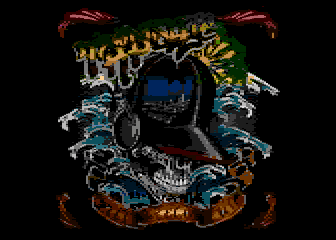](https://github.com/ivop/rc-archive/raw/master/Stephen/Stephen_Tropidelic.xex)

[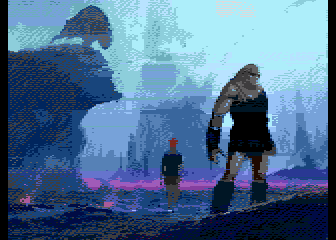](https://github.com/ivop/rc-archive/raw/master/Stephen/Stephen_World2.xex)
[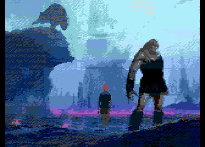](https://github.com/ivop/rc-archive/raw/master/Stephen/Stephen_World.xex)
[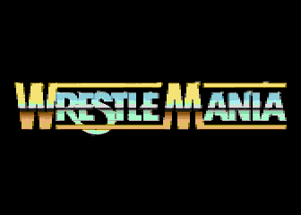](https://github.com/ivop/rc-archive/raw/master/Stephen/Stephen_Wrestlemania.xex)
[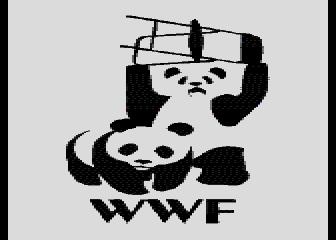](https://github.com/ivop/rc-archive/raw/master/Stephen/Stephen_WWF.xex)
[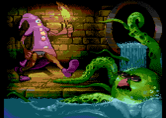](https://github.com/ivop/rc-archive/raw/master/Stephen/Stephen-YankenMyCranken.xex)

[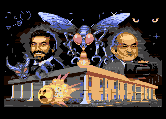](https://github.com/ivop/rc-archive/raw/master/Stephen/Stephen_Yar.xex)
[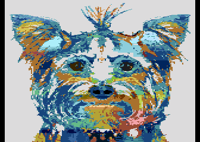](https://github.com/ivop/rc-archive/raw/master/Stephen/Stephen_Yorkie.xex)
[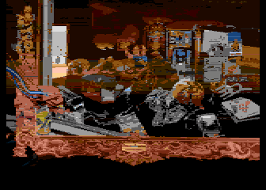](https://github.com/ivop/rc-archive/raw/master/Stephen/Stephen_zappa.xex)
