[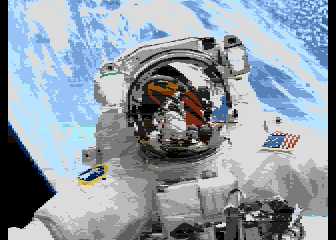](https://github.com/ivop/rc-archive/raw/master/amarok/amarok_astronaut.xex)
[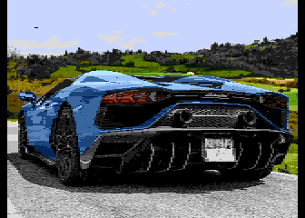](https://github.com/ivop/rc-archive/raw/master/amarok/amarok_aventador.xex)
[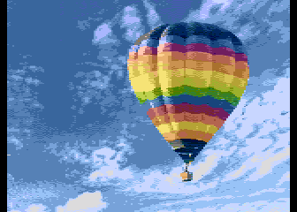](https://github.com/ivop/rc-archive/raw/master/amarok/amarok_balloon.xex)
[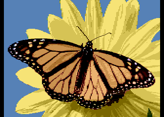](https://github.com/ivop/rc-archive/raw/master/amarok/amarok_butterfly.xex)
[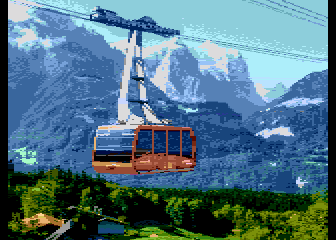](https://github.com/ivop/rc-archive/raw/master/amarok/amarok_cable_car.xex)
[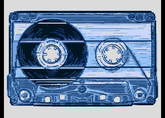](https://github.com/ivop/rc-archive/raw/master/amarok/amarok_cassette.xex)

[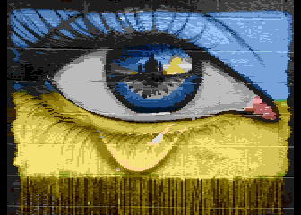](https://github.com/ivop/rc-archive/raw/master/amarok/amarok_crying_eye.xex)
[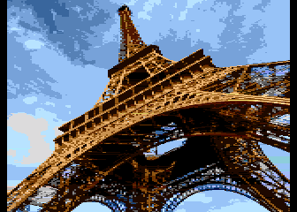](https://github.com/ivop/rc-archive/raw/master/amarok/amarok_eiffel_tower.xex)

[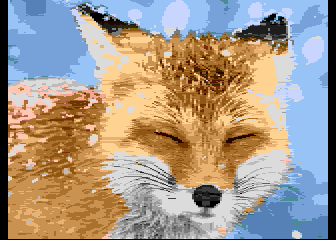](https://github.com/ivop/rc-archive/raw/master/amarok/amarok_fox.xex)
[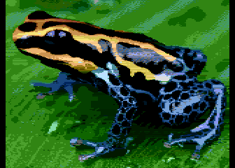](https://github.com/ivop/rc-archive/raw/master/amarok/amarok_frog.xex)
[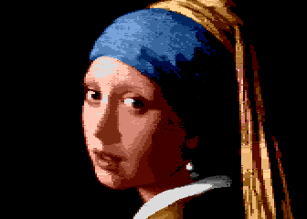](https://github.com/ivop/rc-archive/raw/master/amarok/amarok_girl_pearl.xex)
[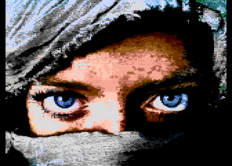](https://github.com/ivop/rc-archive/raw/master/amarok/amarok_girl.xex)
[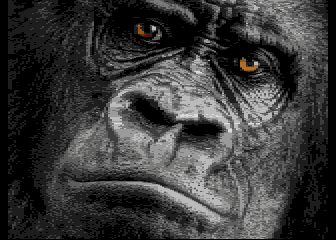](https://github.com/ivop/rc-archive/raw/master/amarok/amarok_gorilla.xex)
[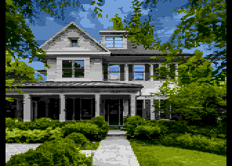](https://github.com/ivop/rc-archive/raw/master/amarok/amarok_house.xex)
[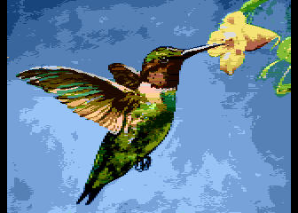](https://github.com/ivop/rc-archive/raw/master/amarok/amarok_hummingbird.xex)
[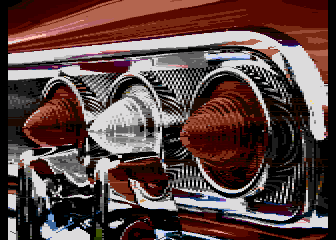](https://github.com/ivop/rc-archive/raw/master/amarok/amarok_impala_rear.xex)
[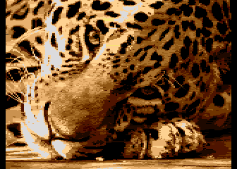](https://github.com/ivop/rc-archive/raw/master/amarok/amarok_jaguar.xex)
[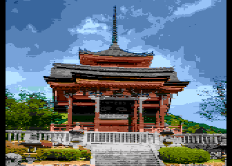](https://github.com/ivop/rc-archive/raw/master/amarok/amarok_kyoto.xex)
[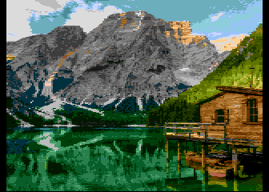](https://github.com/ivop/rc-archive/raw/master/amarok/amarok-lake.xex)
[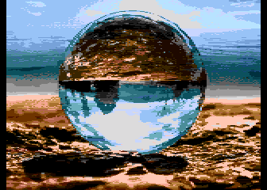](https://github.com/ivop/rc-archive/raw/master/amarok/amarok_lensball.xex)
[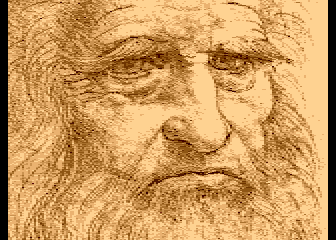](https://github.com/ivop/rc-archive/raw/master/amarok/amarok_leonardo.xex)
[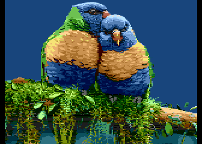](https://github.com/ivop/rc-archive/raw/master/amarok/amarok_lorikeets_v2.xex)
[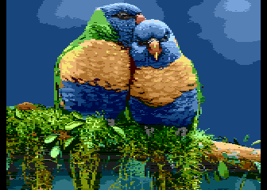](https://github.com/ivop/rc-archive/raw/master/amarok/amarok_lorikeets.xex)
[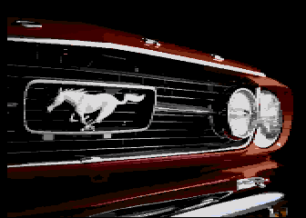](https://github.com/ivop/rc-archive/raw/master/amarok/amarok_mustang.xex)

[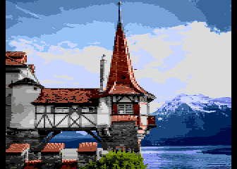](https://github.com/ivop/rc-archive/raw/master/amarok/amarok_oberhofen.xex)
[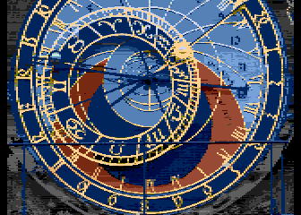](https://github.com/ivop/rc-archive/raw/master/amarok/amarok_orloj.xex)
[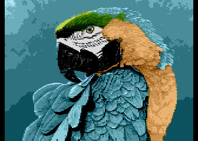](https://github.com/ivop/rc-archive/raw/master/amarok/amarok_parrot.xex)
[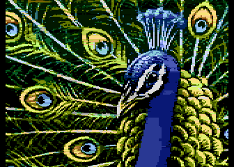](https://github.com/ivop/rc-archive/raw/master/amarok/amarok_peacock.xex)
[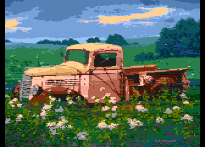](https://github.com/ivop/rc-archive/raw/master/amarok/amarok_pickup.xex)

[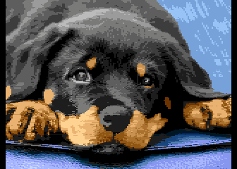](https://github.com/ivop/rc-archive/raw/master/amarok/amarok_puppy.xex)
[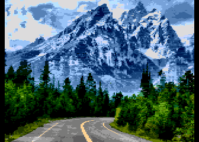](https://github.com/ivop/rc-archive/raw/master/amarok/amarok_road.xex)
[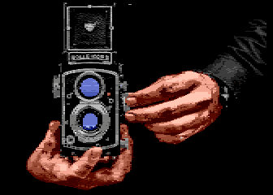](https://github.com/ivop/rc-archive/raw/master/amarok/amarok_rolleicord.xex)
[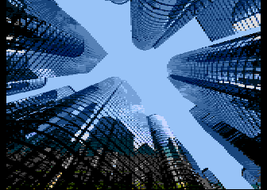](https://github.com/ivop/rc-archive/raw/master/amarok/amarok_skyscrapers.xex)
[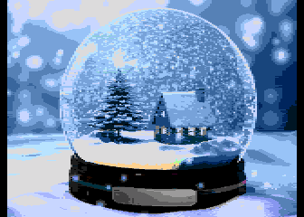](https://github.com/ivop/rc-archive/raw/master/amarok/amarok_snow_globe.xex)
[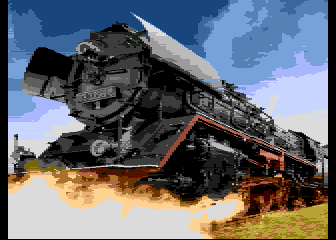](https://github.com/ivop/rc-archive/raw/master/amarok/amarok-steam-locomotive.xex)
[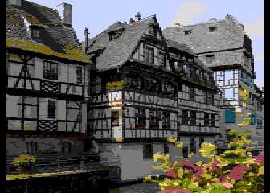](https://github.com/ivop/rc-archive/raw/master/amarok/amarok_strasbourg.xex)
[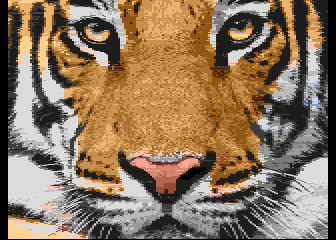](https://github.com/ivop/rc-archive/raw/master/amarok/amarok-tiger.xex)
[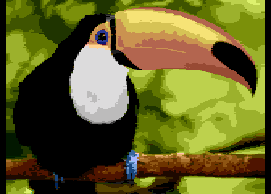](https://github.com/ivop/rc-archive/raw/master/amarok/amarok_toucan.xex)
[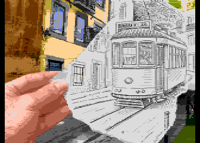](https://github.com/ivop/rc-archive/raw/master/amarok/amarok_tram_sketch.xex)
[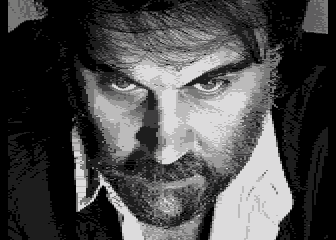](https://github.com/ivop/rc-archive/raw/master/amarok/amarok_vangelis.xex)
[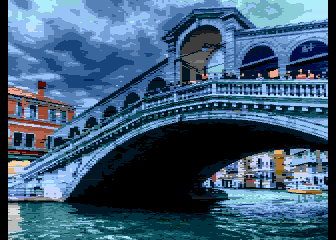](https://github.com/ivop/rc-archive/raw/master/amarok/amarok_venice.xex)

[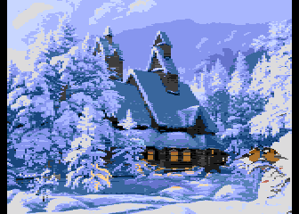](https://github.com/ivop/rc-archive/raw/master/amarok/amarok_winter.xex)
