[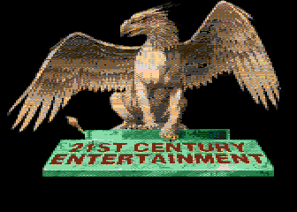](https://github.com/ivop/rc-archive/raw/master/emkay/emkay_21C330.xex)
[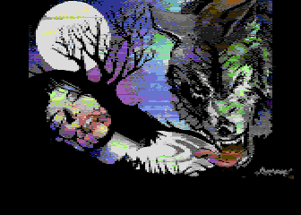](https://github.com/ivop/rc-archive/raw/master/emkay/emkay-aaaten2000.xex)
[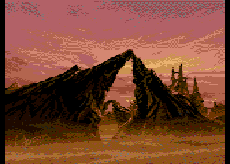](https://github.com/ivop/rc-archive/raw/master/emkay/emkay-agone.xex)
[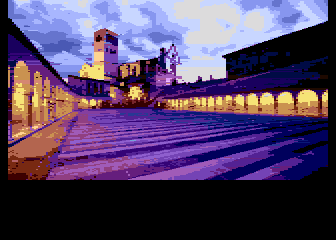](https://github.com/ivop/rc-archive/raw/master/emkay/emkay_basilika_err.xex)

[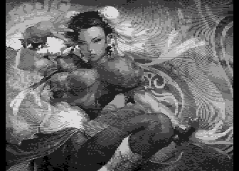](https://github.com/ivop/rc-archive/raw/master/emkay/emkay_chun_bw.xex)
[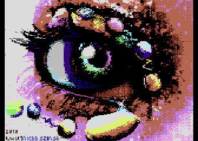](https://github.com/ivop/rc-archive/raw/master/emkay/emkay-colours250.xex)
[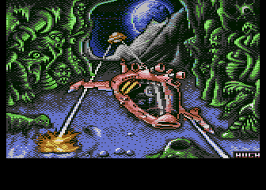](https://github.com/ivop/rc-archive/raw/master/emkay/emkay_cyb450.xex)
[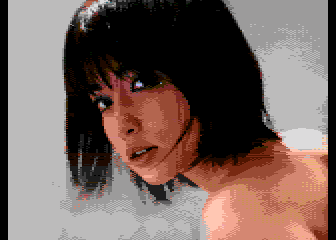](https://github.com/ivop/rc-archive/raw/master/emkay/emkay-demo100.xex)
[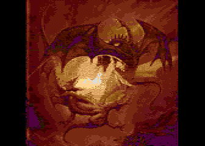](https://github.com/ivop/rc-archive/raw/master/emkay/emkay_dragons100.xex)
[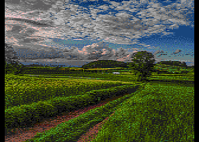](https://github.com/ivop/rc-archive/raw/master/emkay/emkay_gadither.xex)
[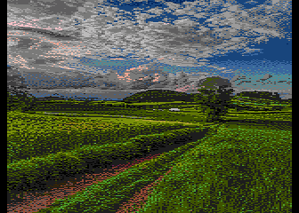](https://github.com/ivop/rc-archive/raw/master/emkay/emkay_green_acres_edit.xex)
[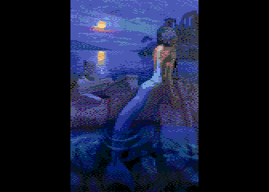](https://github.com/ivop/rc-archive/raw/master/emkay/emkay_maid.xex)
[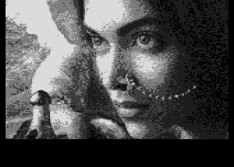](https://github.com/ivop/rc-archive/raw/master/emkay/emkay_mastani.xex)
[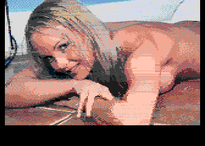](https://github.com/ivop/rc-archive/raw/master/emkay/emkay-output-28M.xex)
[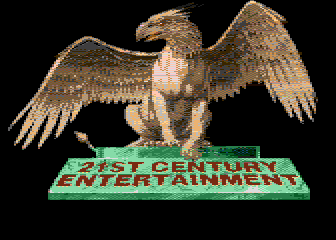](https://github.com/ivop/rc-archive/raw/master/emkay/emkay-PDv5-570.xex)

[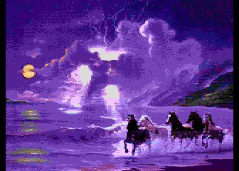](https://github.com/ivop/rc-archive/raw/master/emkay/EMKAY-SHIFT500m.xex)
[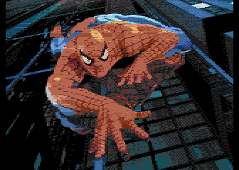](https://github.com/ivop/rc-archive/raw/master/emkay/emkay-spidiv5-550.xex)
[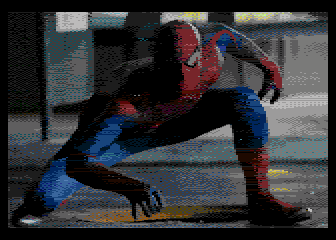](https://github.com/ivop/rc-archive/raw/master/emkay/emkay-spinnev5-860.xex)
[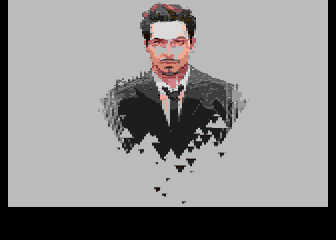](https://github.com/ivop/rc-archive/raw/master/emkay/emkay-suit.xex)

[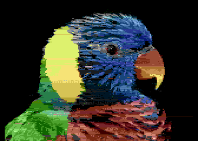](https://github.com/ivop/rc-archive/raw/master/emkay/emkay_vogel800.xex)
[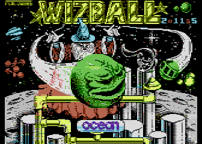](https://github.com/ivop/rc-archive/raw/master/emkay/emkay-wiz50.xex)
[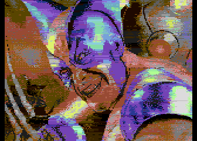](https://github.com/ivop/rc-archive/raw/master/emkay/emkay_wolv2000.xex)

[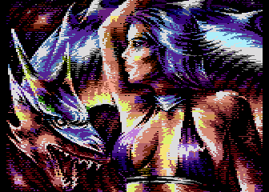](https://github.com/ivop/rc-archive/raw/master/emkay/emkay-zx450.xex)
