[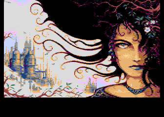](https://github.com/ivop/rc-archive/raw/master/ilmenit/ilmenit_20castle.xex)
[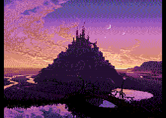](https://github.com/ivop/rc-archive/raw/master/ilmenit/ilmenit-aftermath.xex)
[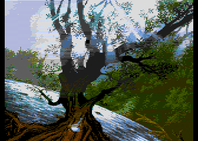](https://github.com/ivop/rc-archive/raw/master/ilmenit/ilmenit-agony-loader-3.xex)
[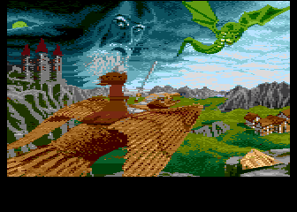](https://github.com/ivop/rc-archive/raw/master/ilmenit/ilmenit_amberstar.xex)
[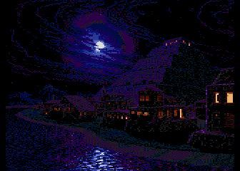](https://github.com/ivop/rc-archive/raw/master/ilmenit/ilmenit-ancient.xex)
[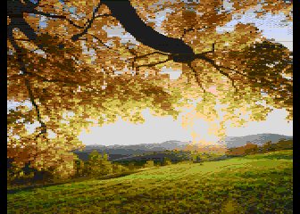](https://github.com/ivop/rc-archive/raw/master/ilmenit/ilmenit-autumn-new.xex)
[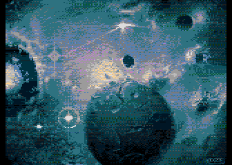](https://github.com/ivop/rc-archive/raw/master/ilmenit/ilmenit_avenger.xex)
[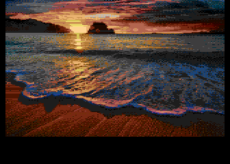](https://github.com/ivop/rc-archive/raw/master/ilmenit/ilmenit_beach.xex)
[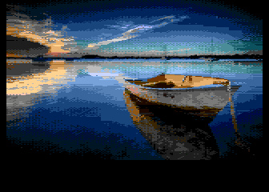](https://github.com/ivop/rc-archive/raw/master/ilmenit/ilmenit_boat.xex)

[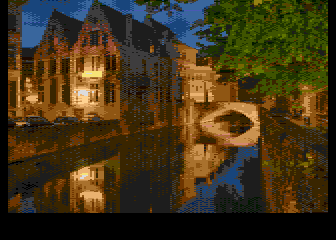](https://github.com/ivop/rc-archive/raw/master/ilmenit/ilmenit_brugia.xex)
[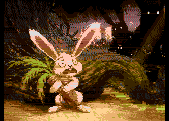](https://github.com/ivop/rc-archive/raw/master/ilmenit/ilmenit-bunny.xex)
[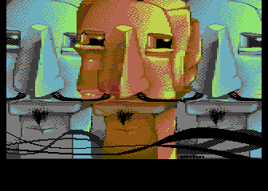](https://github.com/ivop/rc-archive/raw/master/ilmenit/ilmenit_carrion-face.xex)
[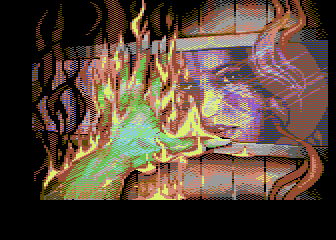](https://github.com/ivop/rc-archive/raw/master/ilmenit/ilmenit_carrion-fire.xex)

[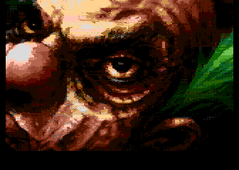](https://github.com/ivop/rc-archive/raw/master/ilmenit/ilmenit_clown.xex)
[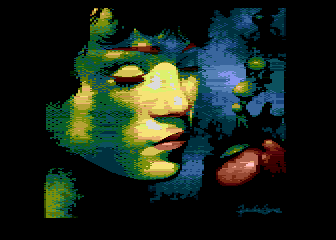](https://github.com/ivop/rc-archive/raw/master/ilmenit/ilmenit_colours.xex)
[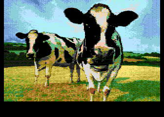](https://github.com/ivop/rc-archive/raw/master/ilmenit/ilmenit_cows.xex)
[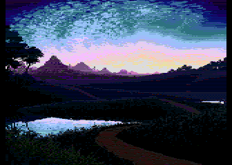](https://github.com/ivop/rc-archive/raw/master/ilmenit/ilmenit-dawn-scanlines.xex)

[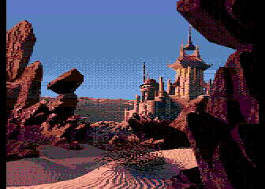](https://github.com/ivop/rc-archive/raw/master/ilmenit/ilmenit-desert.xex)
[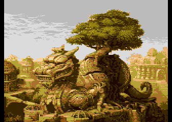](https://github.com/ivop/rc-archive/raw/master/ilmenit/ilmenit_dragon_rider.xex)
[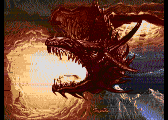](https://github.com/ivop/rc-archive/raw/master/ilmenit/ilmenit-dragon.xex)
[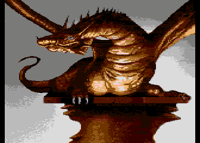](https://github.com/ivop/rc-archive/raw/master/ilmenit/ilmenit_dragon.xex)
[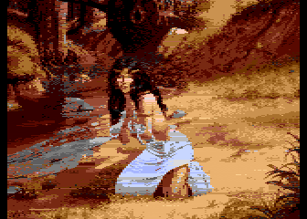](https://github.com/ivop/rc-archive/raw/master/ilmenit/ilmenit-elmore.xex)
[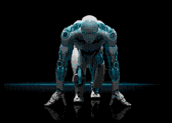](https://github.com/ivop/rc-archive/raw/master/ilmenit/ilmenit_eset2.xex)
[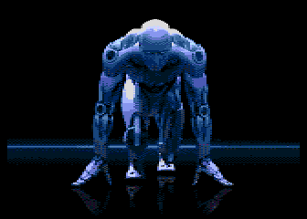](https://github.com/ivop/rc-archive/raw/master/ilmenit/ilmenit_ESET_41M.xex)
[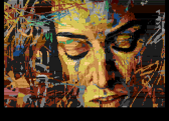](https://github.com/ivop/rc-archive/raw/master/ilmenit/ilmenit_face_dw.xex)
[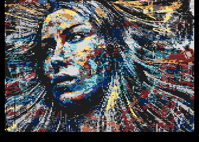](https://github.com/ivop/rc-archive/raw/master/ilmenit/ilmenit_face_sa.xex)
[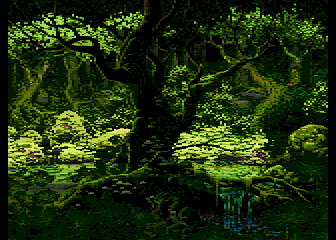](https://github.com/ivop/rc-archive/raw/master/ilmenit/ilmenit-fairey_wood.xex)
[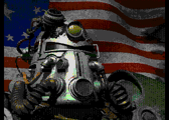](https://github.com/ivop/rc-archive/raw/master/ilmenit/ilmenit_fallout.xex)
[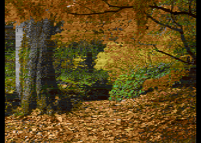](https://github.com/ivop/rc-archive/raw/master/ilmenit/ilmenit-fall.xex)
[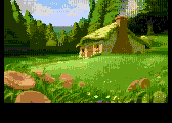](https://github.com/ivop/rc-archive/raw/master/ilmenit/ilmenit_fantasy_house.xex)
[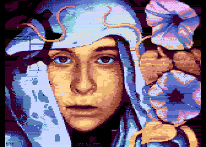](https://github.com/ivop/rc-archive/raw/master/ilmenit/ilmenit_frost.xex)
[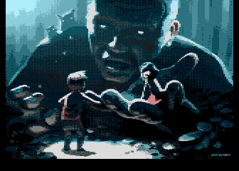](https://github.com/ivop/rc-archive/raw/master/ilmenit/ilmenit_giant.xex)
[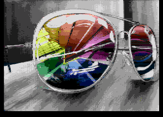](https://github.com/ivop/rc-archive/raw/master/ilmenit/ilmenit_glasses.xex)
[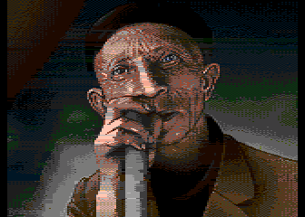](https://github.com/ivop/rc-archive/raw/master/ilmenit/ilmenit-goater.xex)
[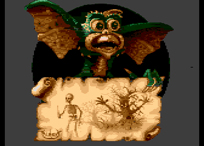](https://github.com/ivop/rc-archive/raw/master/ilmenit/ilmenit_gremlin.xex)
[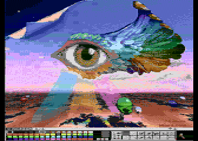](https://github.com/ivop/rc-archive/raw/master/ilmenit/ilmenit_ham6.xex)
[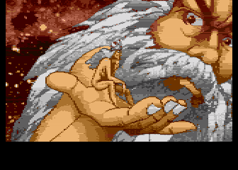](https://github.com/ivop/rc-archive/raw/master/ilmenit/ilmenit_heimdall.xex)
[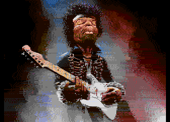](https://github.com/ivop/rc-archive/raw/master/ilmenit/ilmenit-hendrix.xex)

[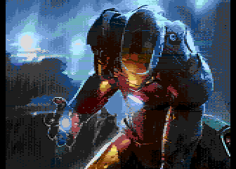](https://github.com/ivop/rc-archive/raw/master/ilmenit/ilmenit_iron_man.xex)
[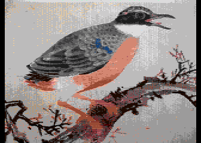](https://github.com/ivop/rc-archive/raw/master/ilmenit/ilmenit_japanbird.xex)
[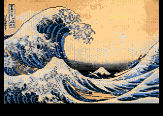](https://github.com/ivop/rc-archive/raw/master/ilmenit/ilmenit_kanagawa.xex)

[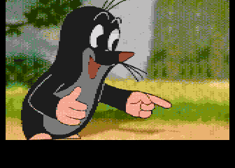](https://github.com/ivop/rc-archive/raw/master/ilmenit/ilmenit_kretik.xex)
[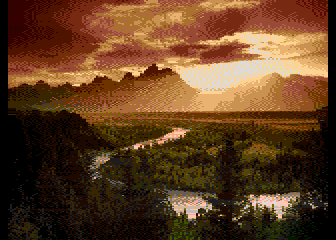](https://github.com/ivop/rc-archive/raw/master/ilmenit/ilmenit-landscape.xex)
[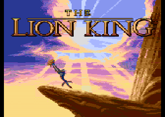](https://github.com/ivop/rc-archive/raw/master/ilmenit/ilmenit_lionking.xex)
[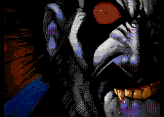](https://github.com/ivop/rc-archive/raw/master/ilmenit/ilmenit_lobo.xex)
[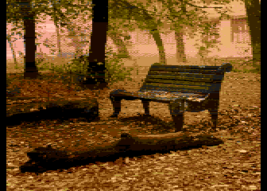](https://github.com/ivop/rc-archive/raw/master/ilmenit/ilmenit-lonely-new.xex)
[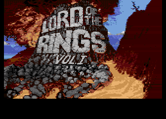](https://github.com/ivop/rc-archive/raw/master/ilmenit/ilmenit_lotr1.xex)
[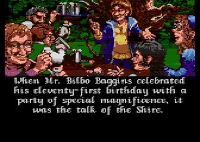](https://github.com/ivop/rc-archive/raw/master/ilmenit/ilmenit_lotr2.xex)
[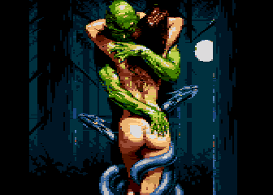](https://github.com/ivop/rc-archive/raw/master/ilmenit/ilmenit_love.xex)
[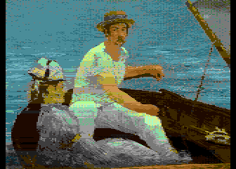](https://github.com/ivop/rc-archive/raw/master/ilmenit/ilmenit_manet.xex)

[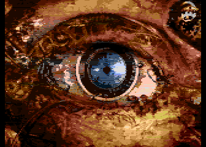](https://github.com/ivop/rc-archive/raw/master/ilmenit/ilmenit_mech_eye.xex)
[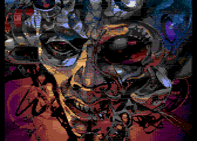](https://github.com/ivop/rc-archive/raw/master/ilmenit/ilmenit-metal.xex)
[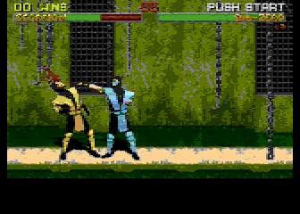](https://github.com/ivop/rc-archive/raw/master/ilmenit/ilmenit_mk.xex)
[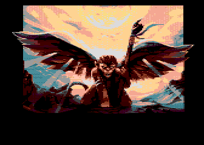](https://github.com/ivop/rc-archive/raw/master/ilmenit/ilmenit_monkey.xex)
[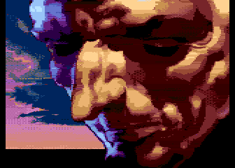](https://github.com/ivop/rc-archive/raw/master/ilmenit/ilmenit_mystery.xex)
[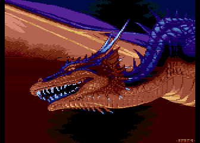](https://github.com/ivop/rc-archive/raw/master/ilmenit/ilmenit_neverliked.xex)
[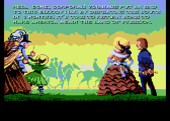](https://github.com/ivop/rc-archive/raw/master/ilmenit/ilmenit_north_and_south.xex)
[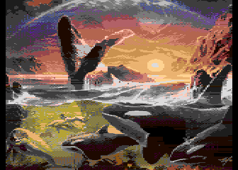](https://github.com/ivop/rc-archive/raw/master/ilmenit/ilmenit_orca.xex)
[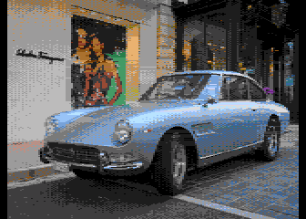](https://github.com/ivop/rc-archive/raw/master/ilmenit/ilmenit_porsche.xex)
[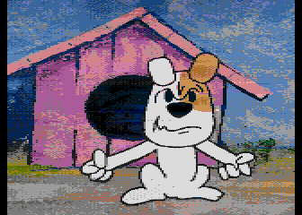](https://github.com/ivop/rc-archive/raw/master/ilmenit/ilmenit_reksio.xex)
[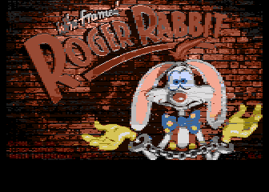](https://github.com/ivop/rc-archive/raw/master/ilmenit/ilmenit_roger.xex)
[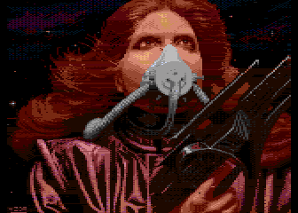](https://github.com/ivop/rc-archive/raw/master/ilmenit/ilmenit_rudzielec.xex)
[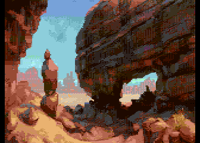](https://github.com/ivop/rc-archive/raw/master/ilmenit/ilmenit_shade.xex)
[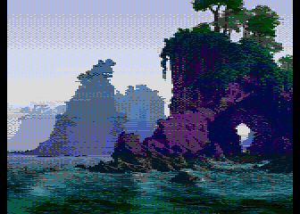](https://github.com/ivop/rc-archive/raw/master/ilmenit/ilmenit-smugglers.xex)
[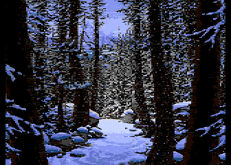](https://github.com/ivop/rc-archive/raw/master/ilmenit/ilmenit-snow_woods.xex)
[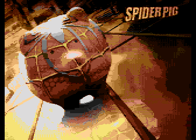](https://github.com/ivop/rc-archive/raw/master/ilmenit/ilmenit_spiderpig.xex)
[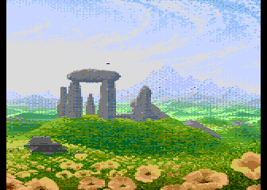](https://github.com/ivop/rc-archive/raw/master/ilmenit/ilmenit-stones.xex)
[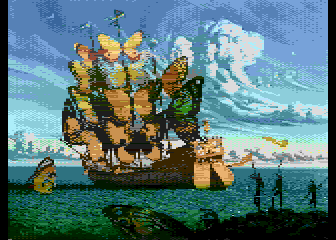](https://github.com/ivop/rc-archive/raw/master/ilmenit/ilmenit_surreal1.xex)
[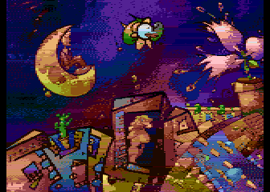](https://github.com/ivop/rc-archive/raw/master/ilmenit/ilmenit_surreal2.xex)
[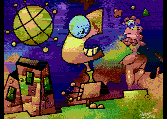](https://github.com/ivop/rc-archive/raw/master/ilmenit/ilmenit_surreal3.xex)
[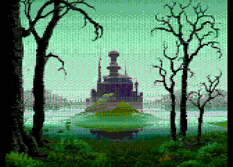](https://github.com/ivop/rc-archive/raw/master/ilmenit/ilmenit-swamp_castle.xex)
[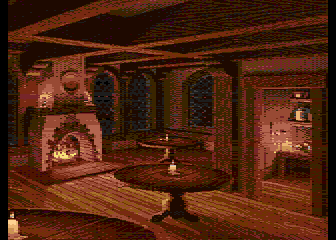](https://github.com/ivop/rc-archive/raw/master/ilmenit/ilmenit-tavern.xex)
[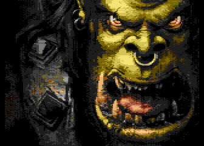](https://github.com/ivop/rc-archive/raw/master/ilmenit/ilmenit_warcraft.xex)
[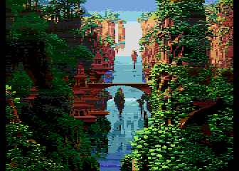](https://github.com/ivop/rc-archive/raw/master/ilmenit/ilmenit-waterfall.xex)
[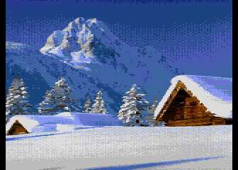](https://github.com/ivop/rc-archive/raw/master/ilmenit/ilmenit-winter2.xex)
[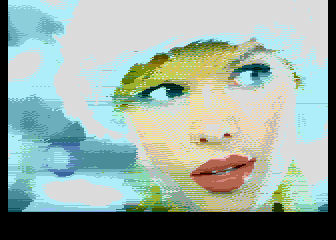](https://github.com/ivop/rc-archive/raw/master/ilmenit/ilmenit-winter-beauty.xex)
[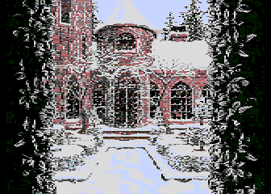](https://github.com/ivop/rc-archive/raw/master/ilmenit/ilmenit-winter_castle.xex)
[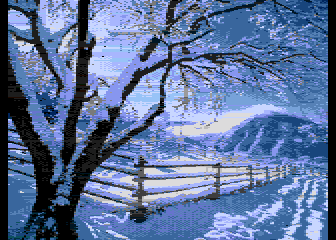](https://github.com/ivop/rc-archive/raw/master/ilmenit/ilmenit-winter.xex)
[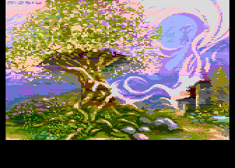](https://github.com/ivop/rc-archive/raw/master/ilmenit/ilmenit_wonderland_by_piesiu.xex)
