[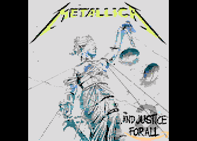](https://github.com/ivop/rc-archive/raw/master/ivop/ivop_ajfa.xex)
[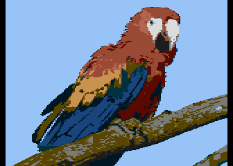](https://github.com/ivop/rc-archive/raw/master/ivop/ivop_ara.xex)
[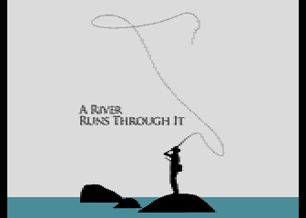](https://github.com/ivop/rc-archive/raw/master/ivop/ivop_a-river-runs-through-it.xex)

[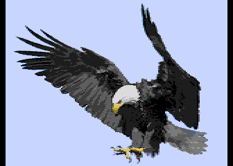](https://github.com/ivop/rc-archive/raw/master/ivop/ivop_bald-eagle.xex)

[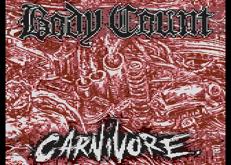](https://github.com/ivop/rc-archive/raw/master/ivop/ivop_bc_carnivore.xex)

[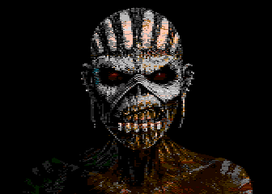](https://github.com/ivop/rc-archive/raw/master/ivop/ivop-book_of_souls.xex)

[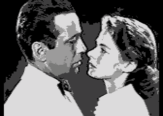](https://github.com/ivop/rc-archive/raw/master/ivop/ivop_casablanca.xex)

[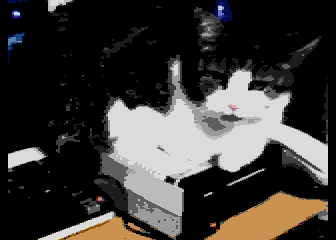](https://github.com/ivop/rc-archive/raw/master/ivop/ivop_cat-on-1050.xex)
[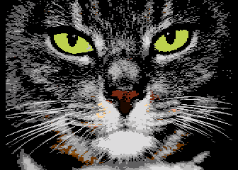](https://github.com/ivop/rc-archive/raw/master/ivop/ivop_cat-ziggy.xex)

[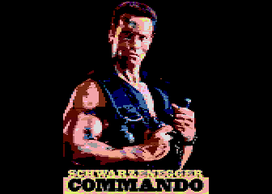](https://github.com/ivop/rc-archive/raw/master/ivop/ivop_commando.xex)

[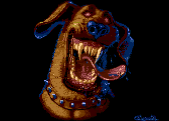](https://github.com/ivop/rc-archive/raw/master/ivop/ivop-cougar-hairdog.xex)
[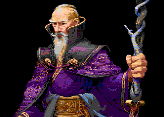](https://github.com/ivop/rc-archive/raw/master/ivop/ivop-delfador.xex)
[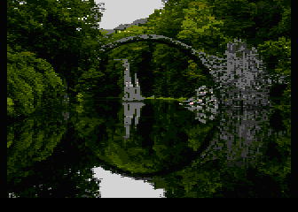](https://github.com/ivop/rc-archive/raw/master/ivop/ivop_devils-bridge-ntsc.xex)
[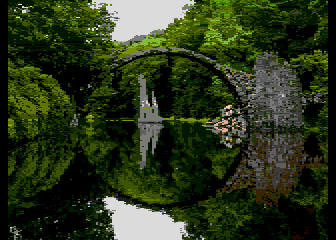](https://github.com/ivop/rc-archive/raw/master/ivop/ivop_devils-bridge.xex)

[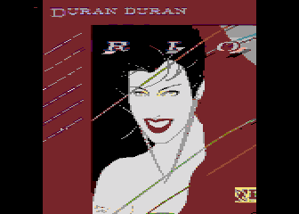](https://github.com/ivop/rc-archive/raw/master/ivop/ivop_duran-duran-rio.xex)

[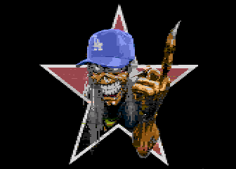](https://github.com/ivop/rc-archive/raw/master/ivop/ivop-eddie.xex)

[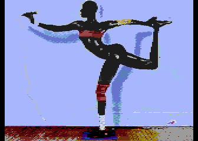](https://github.com/ivop/rc-archive/raw/master/ivop/ivop_grace-jones-island-life.xex)

[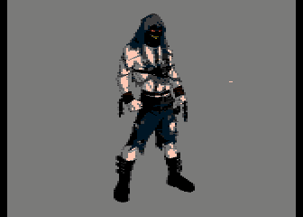](https://github.com/ivop/rc-archive/raw/master/ivop/ivop-guy2.xex)

[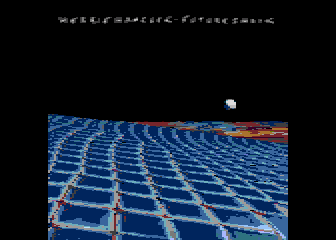](https://github.com/ivop/rc-archive/raw/master/ivop/ivop_herbie.xex)

[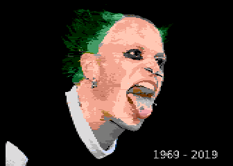](https://github.com/ivop/rc-archive/raw/master/ivop/ivop-keith_flint.xex)
[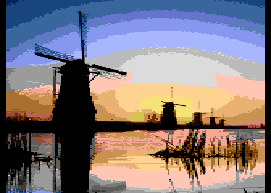](https://github.com/ivop/rc-archive/raw/master/ivop/ivop-kinderdijk.xex)

[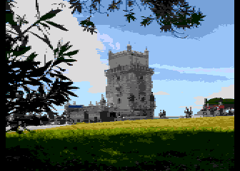](https://github.com/ivop/rc-archive/raw/master/ivop/ivop-lisboa.xex)

[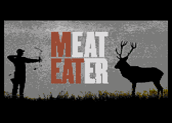](https://github.com/ivop/rc-archive/raw/master/ivop/ivop_meateater.xex)

[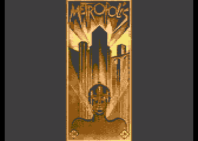](https://github.com/ivop/rc-archive/raw/master/ivop/ivop_metropolis.xex)

[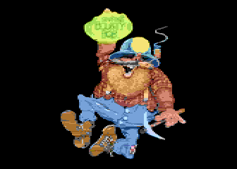](https://github.com/ivop/rc-archive/raw/master/ivop/ivop_miner2049er.xex)

[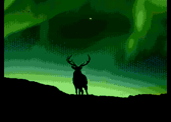](https://github.com/ivop/rc-archive/raw/master/ivop/ivop_northern-lights.xex)
[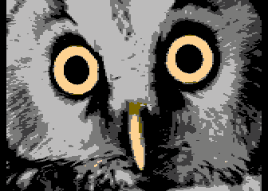](https://github.com/ivop/rc-archive/raw/master/ivop/ivop_owl.xex)
[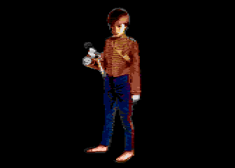](https://github.com/ivop/rc-archive/raw/master/ivop/ivop-pal-misplaced_childhood.xex)

[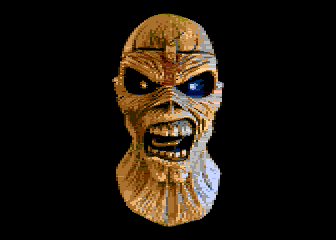](https://github.com/ivop/rc-archive/raw/master/ivop/ivop-piece_of_mind.xex)
[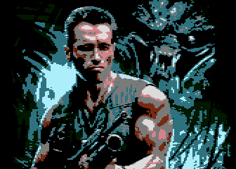](https://github.com/ivop/rc-archive/raw/master/ivop/ivop_predator.xex)
[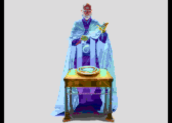](https://github.com/ivop/rc-archive/raw/master/ivop/ivop-priest.xex)
[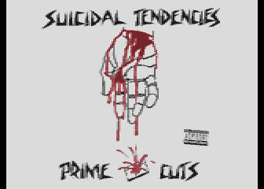](https://github.com/ivop/rc-archive/raw/master/ivop/ivop_prime-cuts.xex)
[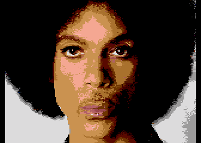](https://github.com/ivop/rc-archive/raw/master/ivop/ivop_prince_passport-20160211.xex)

[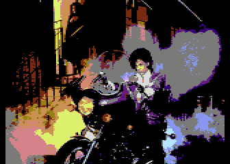](https://github.com/ivop/rc-archive/raw/master/ivop/ivop_purple-rain.xex)

[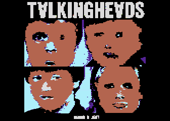](https://github.com/ivop/rc-archive/raw/master/ivop/ivop_remain_in_light.xex)
[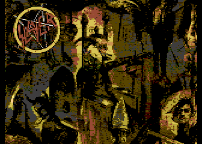](https://github.com/ivop/rc-archive/raw/master/ivop/ivop_rib.xex)
[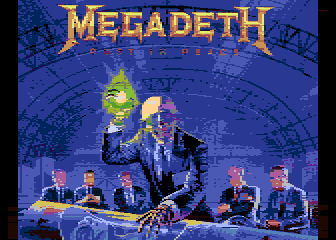](https://github.com/ivop/rc-archive/raw/master/ivop/ivop_rip.xex)
[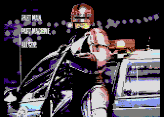](https://github.com/ivop/rc-archive/raw/master/ivop/ivop_robocop.xex)
[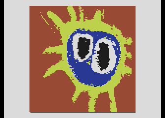](https://github.com/ivop/rc-archive/raw/master/ivop/ivop_screamadelica.xex)

[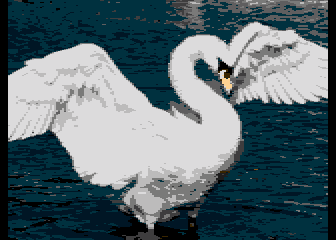](https://github.com/ivop/rc-archive/raw/master/ivop/ivop_swan.xex)
[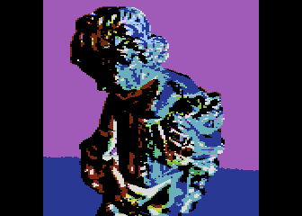](https://github.com/ivop/rc-archive/raw/master/ivop/ivop_technique.xex)

[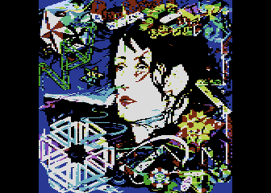](https://github.com/ivop/rc-archive/raw/master/ivop/ivop_todd.xex)

[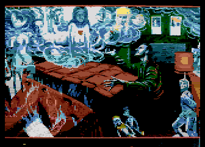](https://github.com/ivop/rc-archive/raw/master/ivop/ivop_tomorrow-wendy.xex)

[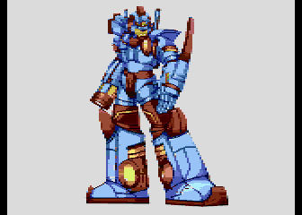](https://github.com/ivop/rc-archive/raw/master/ivop/ivop-turrican.xex)
[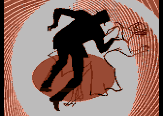](https://github.com/ivop/rc-archive/raw/master/ivop/ivop_vertigo.xex)
[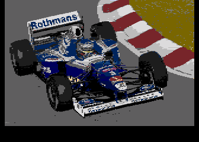](https://github.com/ivop/rc-archive/raw/master/ivop/ivop_villeneuve.xex)
[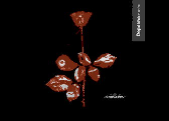](https://github.com/ivop/rc-archive/raw/master/ivop/ivop_violator.xex)

[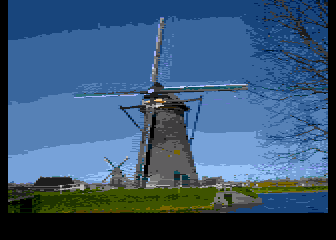](https://github.com/ivop/rc-archive/raw/master/ivop/ivop-windmill.xex)

