
[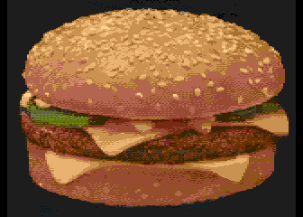](https://github.com/ivop/rc-archive/raw/master/mrnukem/mr_nukem_burger.xex)
[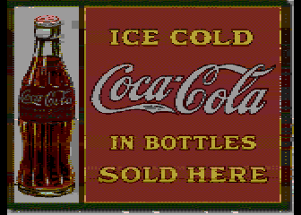](https://github.com/ivop/rc-archive/raw/master/mrnukem/mrnukem_coke1.xex)

[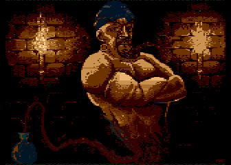](https://github.com/ivop/rc-archive/raw/master/mrnukem/mr_nukem_djin.xex)
[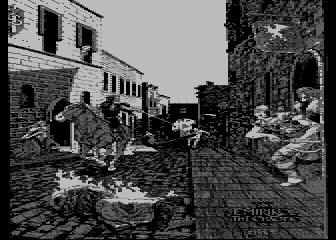](https://github.com/ivop/rc-archive/raw/master/mrnukem/mrnukem_dmguide-art.xex)
[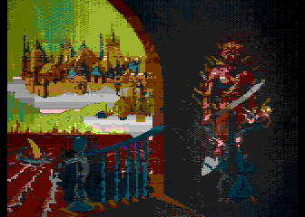](https://github.com/ivop/rc-archive/raw/master/mrnukem/mrnukem_dmguide.xex)

[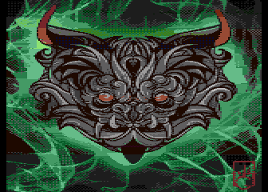](https://github.com/ivop/rc-archive/raw/master/mrnukem/mrnukem_foo_dog.xex)
[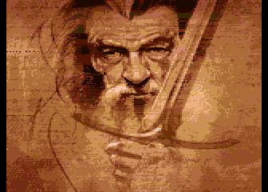](https://github.com/ivop/rc-archive/raw/master/mrnukem/mr_nukem_gandalf.xex)
[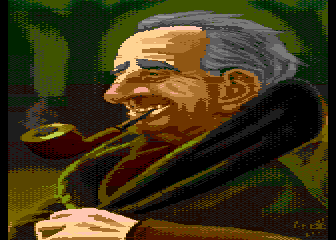](https://github.com/ivop/rc-archive/raw/master/mrnukem/mrnukem_jrrtolkien.xex)
[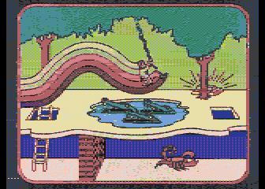](https://github.com/ivop/rc-archive/raw/master/mrnukem/mrnukem-pitfall.xex)
[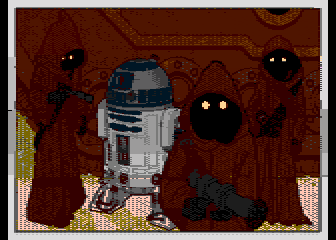](https://github.com/ivop/rc-archive/raw/master/mrnukem/mrnukem_r2.xex)
[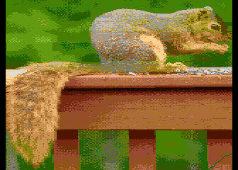](https://github.com/ivop/rc-archive/raw/master/mrnukem/mrnukem_squirrel.xex)

[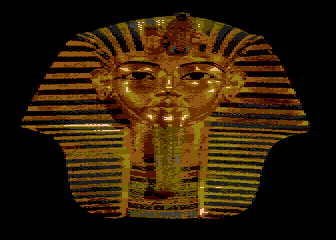](https://github.com/ivop/rc-archive/raw/master/mrnukem/mrnukem_tut.xex)
[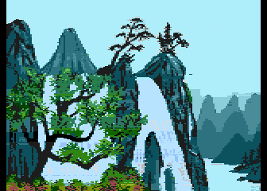](https://github.com/ivop/rc-archive/raw/master/mrnukem/mr_nukem_wfall.xex)
[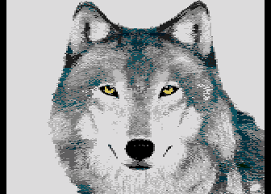](https://github.com/ivop/rc-archive/raw/master/mrnukem/mrnukem_wolf.xex)
[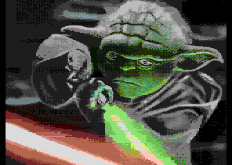](https://github.com/ivop/rc-archive/raw/master/mrnukem/mrnukem_yoda.xex)
[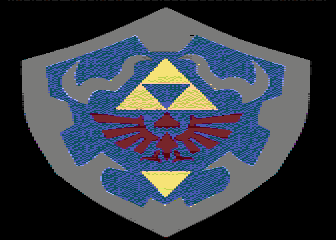](https://github.com/ivop/rc-archive/raw/master/mrnukem/mrnukem_zeldashld.xex)
