[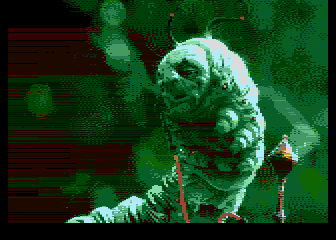](https://github.com/ivop/rc-archive/raw/master/sheddy/sheddy_alice_blue_caterpillar.xex)
[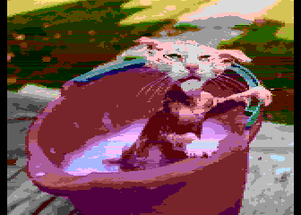](https://github.com/ivop/rc-archive/raw/master/sheddy/sheddy_bucket_water_cat.xex)
[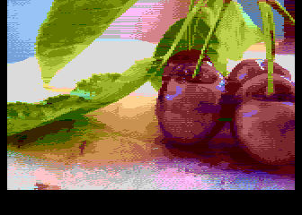](https://github.com/ivop/rc-archive/raw/master/sheddy/sheddy_cherries.xex)
[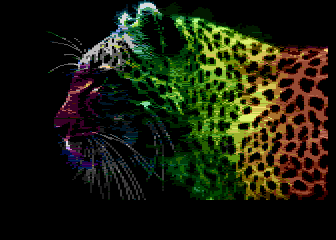](https://github.com/ivop/rc-archive/raw/master/sheddy/sheddy_colorful_leopard.xex)
[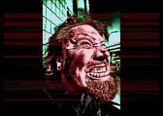](https://github.com/ivop/rc-archive/raw/master/sheddy/sheddy_crazy_face.xex)
[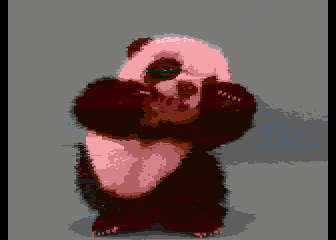](https://github.com/ivop/rc-archive/raw/master/sheddy/sheddy_cute_panda.xex)
[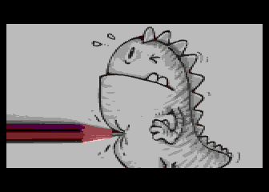](https://github.com/ivop/rc-archive/raw/master/sheddy/sheddy_dino_pencilprod.xex)
[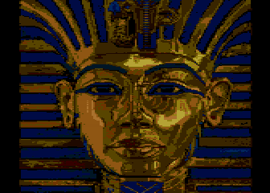](https://github.com/ivop/rc-archive/raw/master/sheddy/sheddy-dpaintkingtut.xex)
[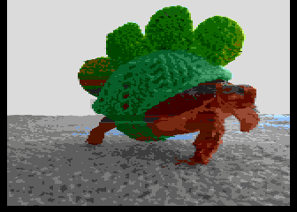](https://github.com/ivop/rc-archive/raw/master/sheddy/sheddy_fancydress_tortoise!.xex)
[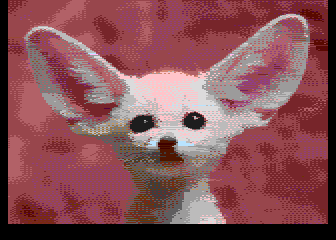](https://github.com/ivop/rc-archive/raw/master/sheddy/sheddy_fennec_fox.xex)
[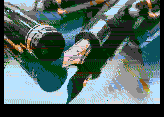](https://github.com/ivop/rc-archive/raw/master/sheddy/sheddy_fountain_pen.xex)
[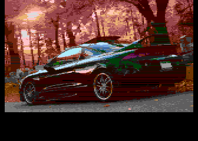](https://github.com/ivop/rc-archive/raw/master/sheddy/sheddy_graveyard_car_cropped.xex)
[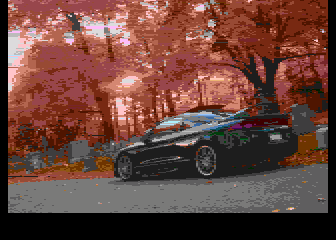](https://github.com/ivop/rc-archive/raw/master/sheddy/sheddy_graveyard_car.xex)
[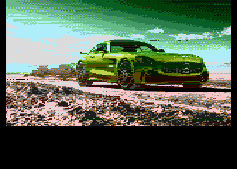](https://github.com/ivop/rc-archive/raw/master/sheddy/sheddy_green_merc.xex)
[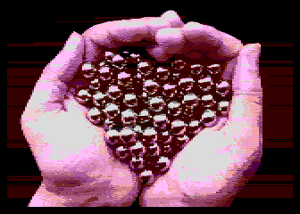](https://github.com/ivop/rc-archive/raw/master/sheddy/sheddy_handsfull.xex)
[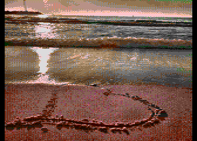](https://github.com/ivop/rc-archive/raw/master/sheddy/sheddy_heart_in_sand.xex)
[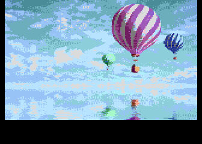](https://github.com/ivop/rc-archive/raw/master/sheddy/sheddy_hot_air_balloons.xex)
[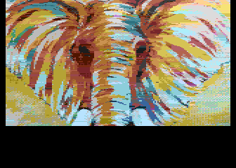](https://github.com/ivop/rc-archive/raw/master/sheddy/sheddy_ingrida_elephant.xex)
[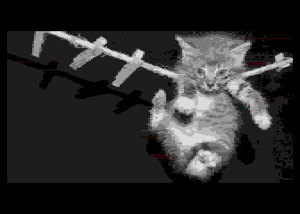](https://github.com/ivop/rc-archive/raw/master/sheddy/sheddy_line_pegs_cat.xex)
[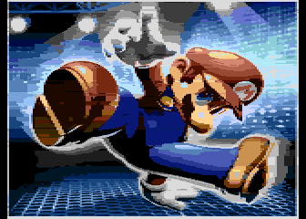](https://github.com/ivop/rc-archive/raw/master/sheddy/sheddy-mariodance.xex)
[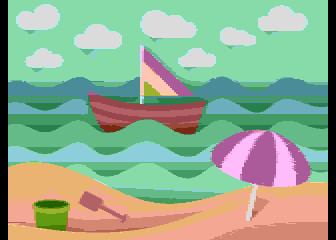](https://github.com/ivop/rc-archive/raw/master/sheddy/sheddy_paper_beach.xex)
[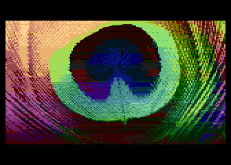](https://github.com/ivop/rc-archive/raw/master/sheddy/sheddy_peacock_feather.xex)
[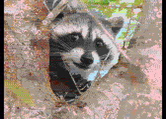](https://github.com/ivop/rc-archive/raw/master/sheddy/sheddy_peeking_racoon.xex)
[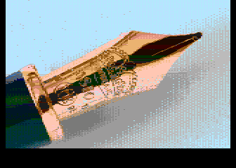](https://github.com/ivop/rc-archive/raw/master/sheddy/sheddy_pen_nib.xex)
[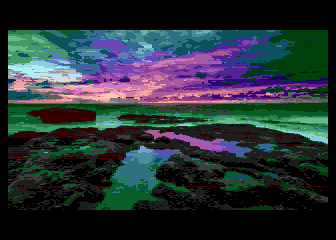](https://github.com/ivop/rc-archive/raw/master/sheddy/sheddy_rockpools.xex)
[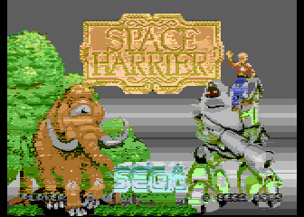](https://github.com/ivop/rc-archive/raw/master/sheddy/sheddy_spaceharrier.xex)
[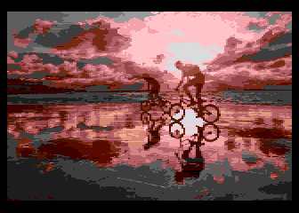](https://github.com/ivop/rc-archive/raw/master/sheddy/sheddy_sunset_riders.xex)
[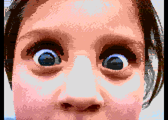](https://github.com/ivop/rc-archive/raw/master/sheddy/sheddy_surprise_me_PAL.xex)
[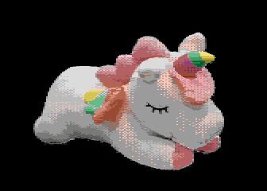](https://github.com/ivop/rc-archive/raw/master/sheddy/sheddy_the_beast_slumbers.xex)
[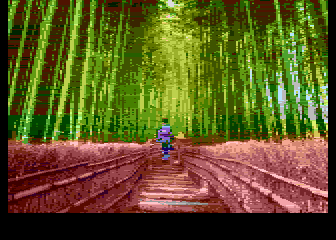](https://github.com/ivop/rc-archive/raw/master/sheddy/sheddy_through_the_bamboos.xex)
[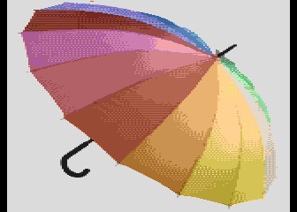](https://github.com/ivop/rc-archive/raw/master/sheddy/sheddy_umbrella.xex)
[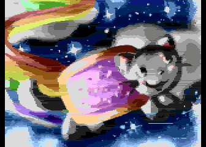](https://github.com/ivop/rc-archive/raw/master/sheddy/sheddy_vexcel_nyan_cat_PAL.xex)
[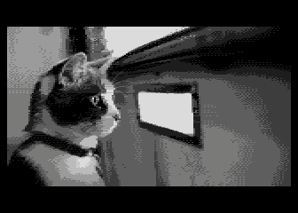](https://github.com/ivop/rc-archive/raw/master/sheddy/sheddy_waiting.xex)
[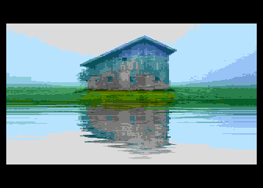](https://github.com/ivop/rc-archive/raw/master/sheddy/sheddy_waterside_barn.xex)
[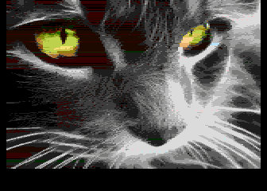](https://github.com/ivop/rc-archive/raw/master/sheddy/sheddy_wispy_catface.xex)
