[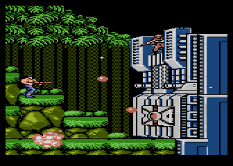](https://github.com/ivop/rc-archive/raw/master/srn/srn-contra01-pal.xex)
[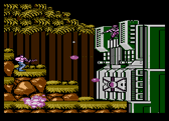](https://github.com/ivop/rc-archive/raw/master/srn/srn-contra01.xex)
[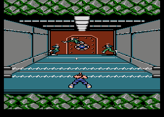](https://github.com/ivop/rc-archive/raw/master/srn/srn-contra02-pal.xex)
[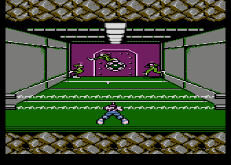](https://github.com/ivop/rc-archive/raw/master/srn/srn-contra02.xex)
[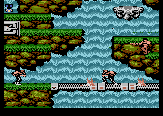](https://github.com/ivop/rc-archive/raw/master/srn/srn-contra03b-pal.xex)
[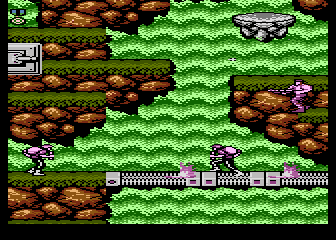](https://github.com/ivop/rc-archive/raw/master/srn/srn-contra03b.xex)

[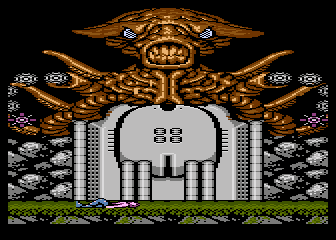](https://github.com/ivop/rc-archive/raw/master/srn/srn-contra03c.xex)
[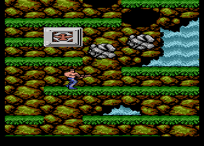](https://github.com/ivop/rc-archive/raw/master/srn/srn-contra03-pal.xex)
[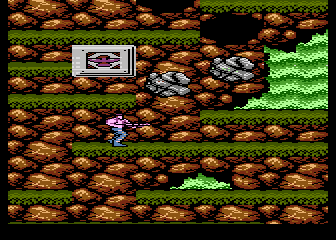](https://github.com/ivop/rc-archive/raw/master/srn/srn-contra03.xex)

[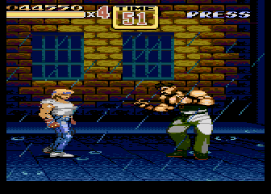](https://github.com/ivop/rc-archive/raw/master/srn/srn-sor2-10b-pal.xex)
[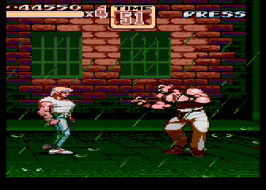](https://github.com/ivop/rc-archive/raw/master/srn/srn-sor2-10b.xex)
[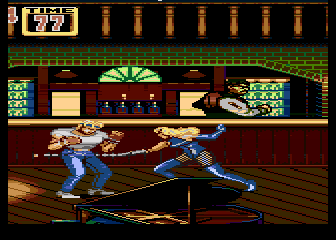](https://github.com/ivop/rc-archive/raw/master/srn/srn-sor2-12b-pal.xex)
[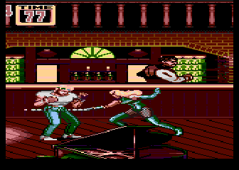](https://github.com/ivop/rc-archive/raw/master/srn/srn-sor2-12b.xex)
[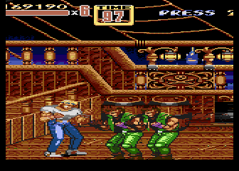](https://github.com/ivop/rc-archive/raw/master/srn/srn-sor2-5b-pal.xex)
[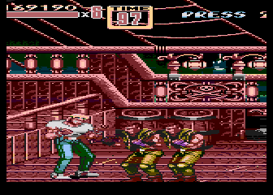](https://github.com/ivop/rc-archive/raw/master/srn/srn-sor2-5b.xex)
[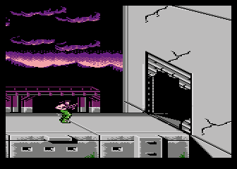](https://github.com/ivop/rc-archive/raw/master/srn/srn-superc01.xex)
[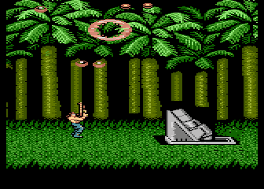](https://github.com/ivop/rc-archive/raw/master/srn/srn-superc03-pal.xex)
[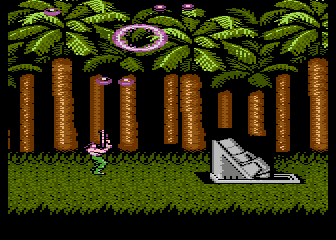](https://github.com/ivop/rc-archive/raw/master/srn/srn-superc03.xex)

[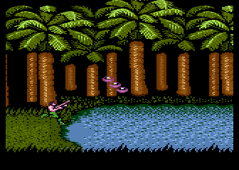](https://github.com/ivop/rc-archive/raw/master/srn/srn-superc04b.xex)
[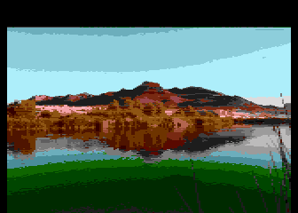](https://github.com/ivop/rc-archive/raw/master/srn/srn_vegas01.xex)

[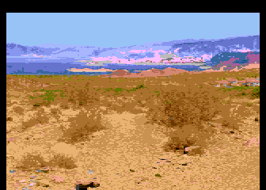](https://github.com/ivop/rc-archive/raw/master/srn/srn_vegas03pal.xex)
[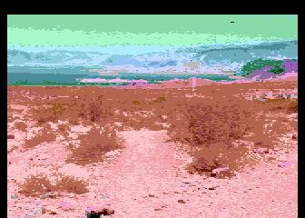](https://github.com/ivop/rc-archive/raw/master/srn/srn_vegas03.xex)
