[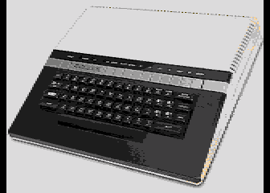](https://github.com/ivop/rc-archive/raw/master/0-9/1200XL.xex)
[.png)](https://github.com/ivop/rc-archive/raw/master/0-9/24c%20Curtis%20Jenny%20(2).xex)
[.png)](https://github.com/ivop/rc-archive/raw/master/0-9/24c%20Curtis%20Jenny%20NTSC%20(2).xex)
[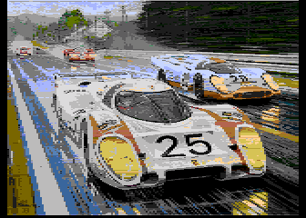](https://github.com/ivop/rc-archive/raw/master/0-9/24HeuresduMans.xex)
[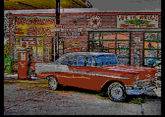](https://github.com/ivop/rc-archive/raw/master/0-9/57Chevy.xex)
[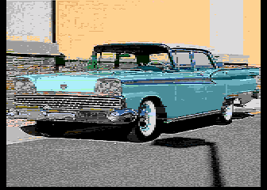](https://github.com/ivop/rc-archive/raw/master/0-9/59Galaxy500.xex)
[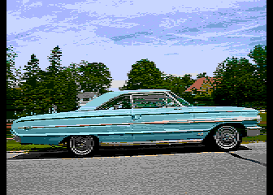](https://github.com/ivop/rc-archive/raw/master/0-9/64G500.xex)
[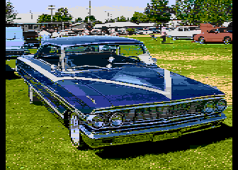](https://github.com/ivop/rc-archive/raw/master/0-9/64Galaxy500b.xex)

[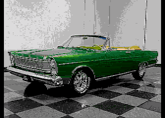](https://github.com/ivop/rc-archive/raw/master/0-9/65FG500g.xex)
[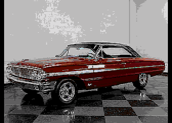](https://github.com/ivop/rc-archive/raw/master/0-9/65Galaxy500R.xex)
[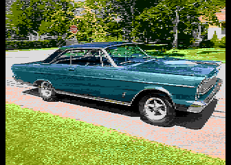](https://github.com/ivop/rc-archive/raw/master/0-9/65Galaxy500.xex)
[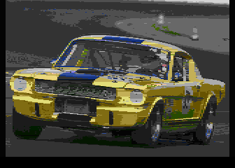](https://github.com/ivop/rc-archive/raw/master/0-9/66ShelbyGTNTSC.xex)
[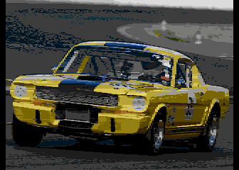](https://github.com/ivop/rc-archive/raw/master/0-9/66ShelbyGTPAL.xex)
[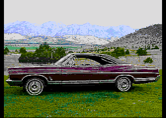](https://github.com/ivop/rc-archive/raw/master/0-9/67FG500maroon.xex)
[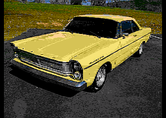](https://github.com/ivop/rc-archive/raw/master/0-9/67FGalaxy500y.xex)
[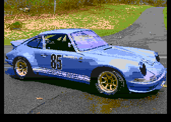](https://github.com/ivop/rc-archive/raw/master/0-9/67PorscheNTSC.xex)
[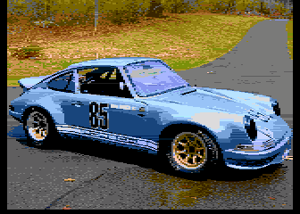](https://github.com/ivop/rc-archive/raw/master/0-9/67PorschePAL.xex)
[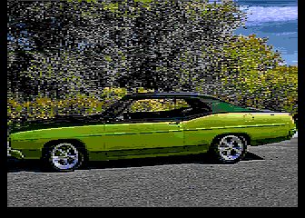](https://github.com/ivop/rc-archive/raw/master/0-9/69FG500fastback.xex)
[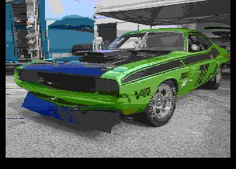](https://github.com/ivop/rc-archive/raw/master/0-9/70DodgeChallengerNTSC.xex)
[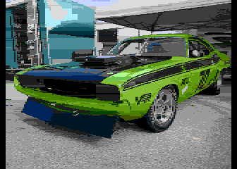](https://github.com/ivop/rc-archive/raw/master/0-9/70DodgeChallengerPAL.xex)
[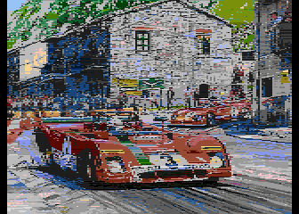](https://github.com/ivop/rc-archive/raw/master/0-9/72Ferrari.xex)
[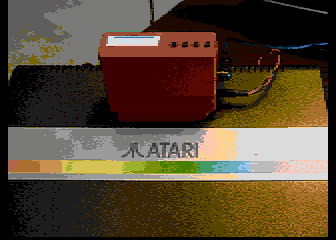](https://github.com/ivop/rc-archive/raw/master/0-9/7800Dragonfly.xex)
[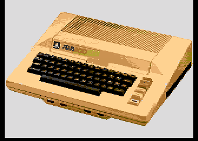](https://github.com/ivop/rc-archive/raw/master/0-9/800a.xex)
[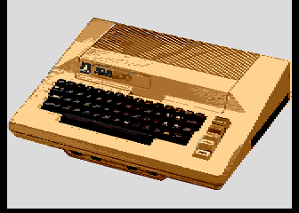](https://github.com/ivop/rc-archive/raw/master/0-9/800b.xex)
