[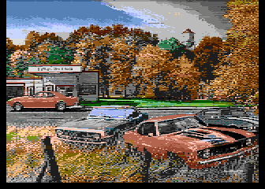](https://github.com/ivop/rc-archive/raw/master/A/AbandonedMuscle.xex)
[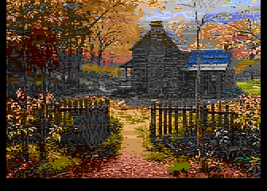](https://github.com/ivop/rc-archive/raw/master/A/Abandoned.xex)

[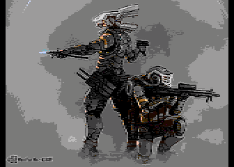](https://github.com/ivop/rc-archive/raw/master/A/ACS_AsOne.xex)
[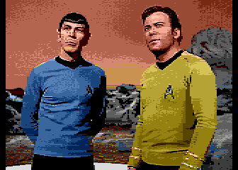](https://github.com/ivop/rc-archive/raw/master/A/AdmiringStratos.xex)
[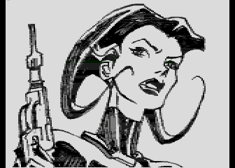](https://github.com/ivop/rc-archive/raw/master/A/AeonFlux-fanart-.xex)
[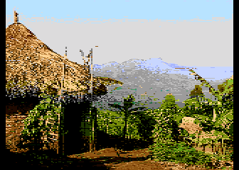](https://github.com/ivop/rc-archive/raw/master/A/AfricanHut.xex)
[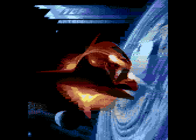](https://github.com/ivop/rc-archive/raw/master/A/Afterburner.xex)
[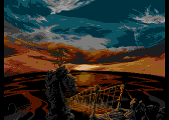](https://github.com/ivop/rc-archive/raw/master/A/Agon_24.xex)
[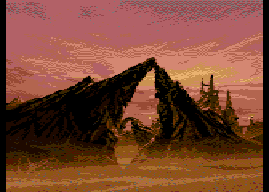](https://github.com/ivop/rc-archive/raw/master/A/agone.xex)
[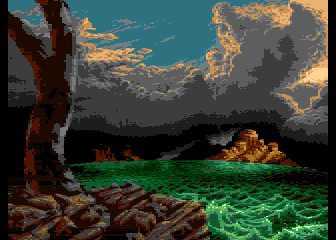](https://github.com/ivop/rc-archive/raw/master/A/Agony_04.xex)
[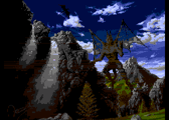](https://github.com/ivop/rc-archive/raw/master/A/Agony_14.xex)
[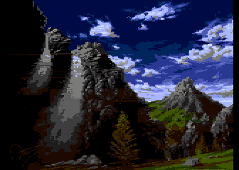](https://github.com/ivop/rc-archive/raw/master/A/Agony_Ending.xex)
[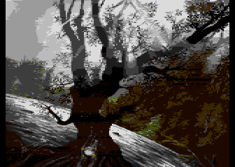](https://github.com/ivop/rc-archive/raw/master/A/Agony_Loader_3.xex)
[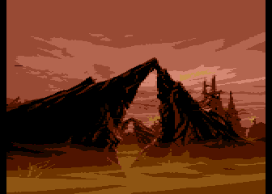](https://github.com/ivop/rc-archive/raw/master/A/Agony_Loader_5.xex)

[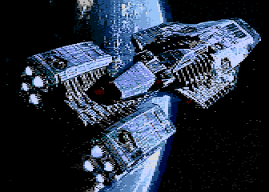](https://github.com/ivop/rc-archive/raw/master/A/AkulaHunterKiller.xex)
[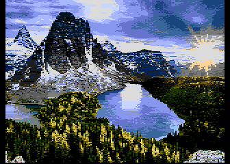](https://github.com/ivop/rc-archive/raw/master/A/AlaskanSunset.xex)
[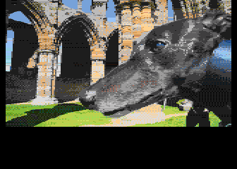](https://github.com/ivop/rc-archive/raw/master/A/AlegisDownport_Millie1.xex)
[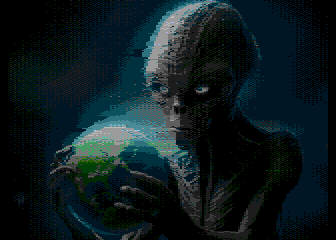](https://github.com/ivop/rc-archive/raw/master/A/alien1.xex)
[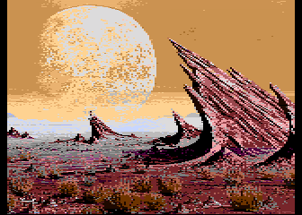](https://github.com/ivop/rc-archive/raw/master/A/AlienDesert54e.xex)
[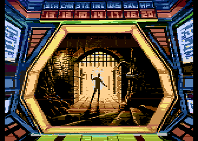](https://github.com/ivop/rc-archive/raw/master/A/AlienGateARD.xex)
[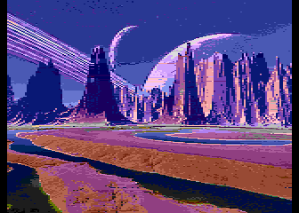](https://github.com/ivop/rc-archive/raw/master/A/AlienMoons.xex)
[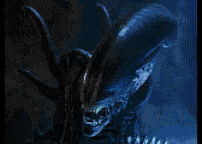](https://github.com/ivop/rc-archive/raw/master/A/alien.xex.xex)
[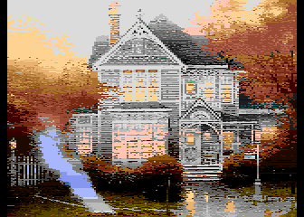](https://github.com/ivop/rc-archive/raw/master/A/AmberAfternoonKinkade.xex)
[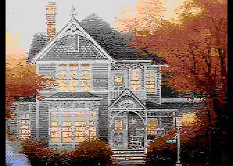](https://github.com/ivop/rc-archive/raw/master/A/Amberafternoon.xex)
[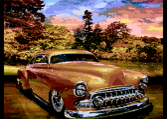](https://github.com/ivop/rc-archive/raw/master/A/AmberCruiser.xex)
[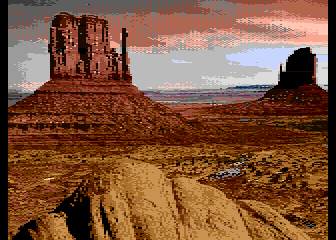](https://github.com/ivop/rc-archive/raw/master/A/AmericanDesert.xex)
[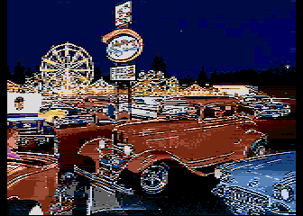](https://github.com/ivop/rc-archive/raw/master/A/AmericanHotrod.xex)
[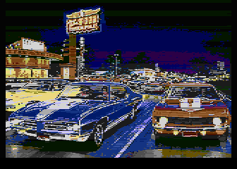](https://github.com/ivop/rc-archive/raw/master/A/AmericanMuscleNTSC.xex)
[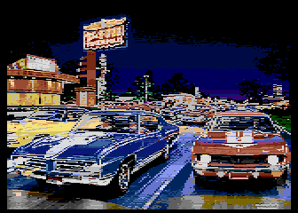](https://github.com/ivop/rc-archive/raw/master/A/AmericanMuscle.xex)
[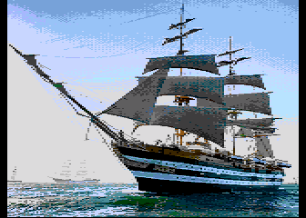](https://github.com/ivop/rc-archive/raw/master/A/AmerigoVespucci.xex)
[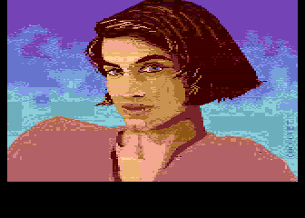](https://github.com/ivop/rc-archive/raw/master/A/Amiga-Brunette.xex)
[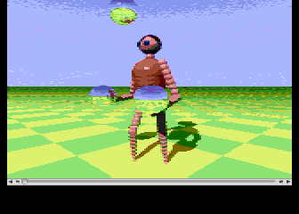](https://github.com/ivop/rc-archive/raw/master/A/Amiga-Juggler.xex)
[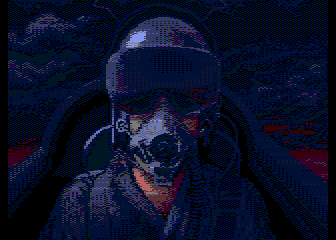](https://github.com/ivop/rc-archive/raw/master/A/Amiga_pilot.xex)
[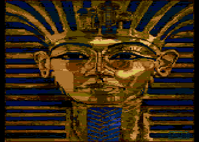](https://github.com/ivop/rc-archive/raw/master/A/Amiga-Tutankhamen.xex)
[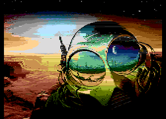](https://github.com/ivop/rc-archive/raw/master/A/AmIinYourWay.xex)
[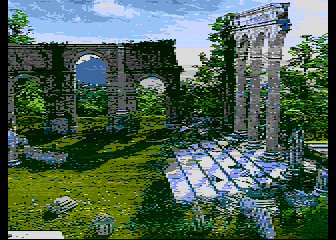](https://github.com/ivop/rc-archive/raw/master/A/AncientRuins.xex)
[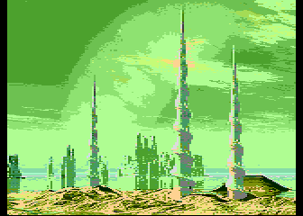](https://github.com/ivop/rc-archive/raw/master/A/AncientSpires.xex)
[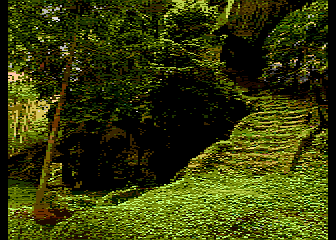](https://github.com/ivop/rc-archive/raw/master/A/AncientStairs.xex)
[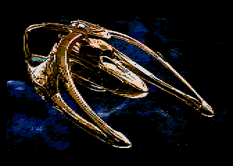](https://github.com/ivop/rc-archive/raw/master/A/Andromeda1.xex)
[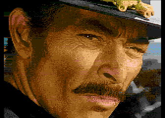](https://github.com/ivop/rc-archive/raw/master/A/AngelEyes.xex)
[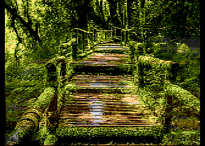](https://github.com/ivop/rc-archive/raw/master/A/Ang-KaNtnlPark.xex)
[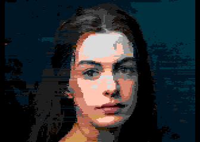](https://github.com/ivop/rc-archive/raw/master/A/AnneHathaway---.xex)
[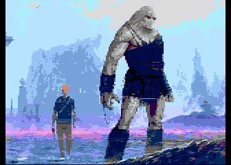](https://github.com/ivop/rc-archive/raw/master/A/AnotherWorld1.xex)
[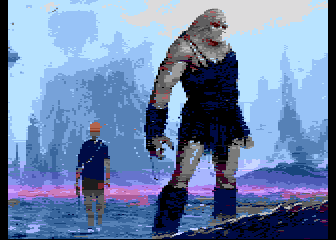](https://github.com/ivop/rc-archive/raw/master/A/AnotherWorld2.xex)
[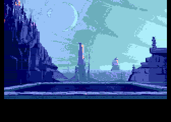](https://github.com/ivop/rc-archive/raw/master/A/Anotherworldbackdrop1strun.xex)
[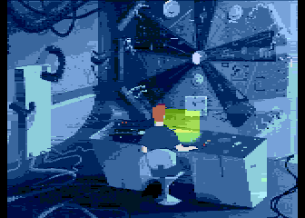](https://github.com/ivop/rc-archive/raw/master/A/AnotherworldLabsmcomplete2.xex)
[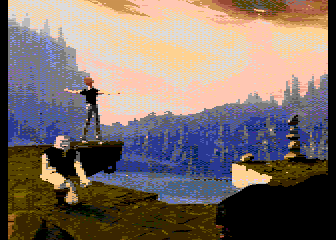](https://github.com/ivop/rc-archive/raw/master/A/anotherworld.xex)
[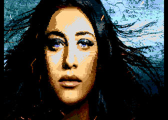](https://github.com/ivop/rc-archive/raw/master/A/anyachalotra1smnewincomplete4.xex)

[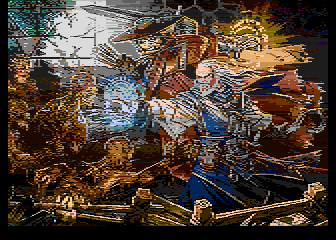](https://github.com/ivop/rc-archive/raw/master/A/Archmages.xex)
[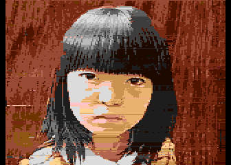](https://github.com/ivop/rc-archive/raw/master/A/Art-ChineseGirl-.xex)
[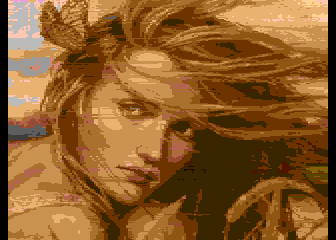](https://github.com/ivop/rc-archive/raw/master/A/Art-Girl--.xex)
[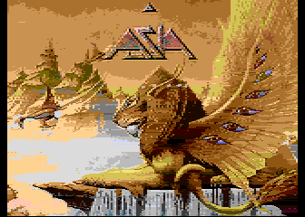](https://github.com/ivop/rc-archive/raw/master/A/AsiaArena.xex)
[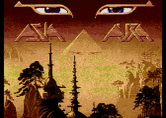](https://github.com/ivop/rc-archive/raw/master/A/Asia_Aura.xex)
[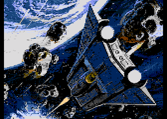](https://github.com/ivop/rc-archive/raw/master/A/Asteroids.xex)
[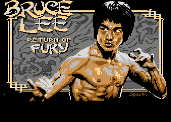](https://github.com/ivop/rc-archive/raw/master/A/atabrupal.xex)
[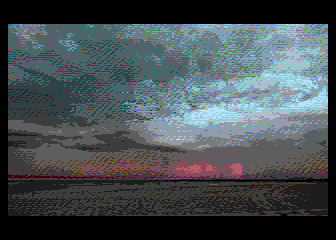](https://github.com/ivop/rc-archive/raw/master/A/atacama-1.xex)
[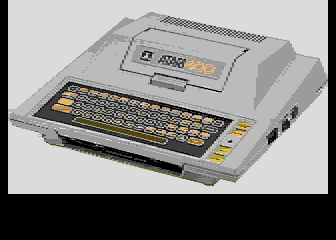](https://github.com/ivop/rc-archive/raw/master/A/Atari400.xex)
[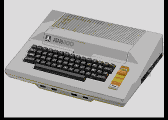](https://github.com/ivop/rc-archive/raw/master/A/Atari800.xex)
[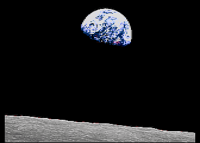](https://github.com/ivop/rc-archive/raw/master/A/Atari8Earthrise.xex)
[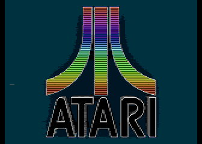](https://github.com/ivop/rc-archive/raw/master/A/AtariFuji.xex)
[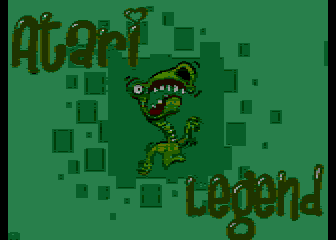](https://github.com/ivop/rc-archive/raw/master/A/atari_legend_intro_ssb.xex)
[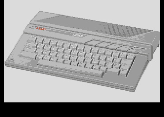](https://github.com/ivop/rc-archive/raw/master/A/AtariXE.xex)
[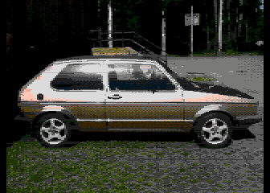](https://github.com/ivop/rc-archive/raw/master/A/atarixle_golf.xex)
[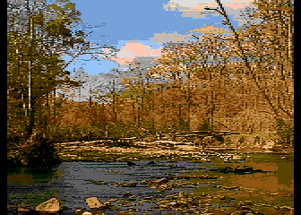](https://github.com/ivop/rc-archive/raw/master/A/AutumnStream.xex)
[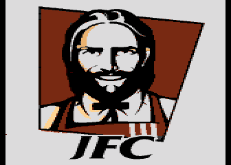](https://github.com/ivop/rc-archive/raw/master/A/avatar.xex)
[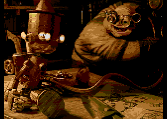](https://github.com/ivop/rc-archive/raw/master/A/Awakening.xex)
[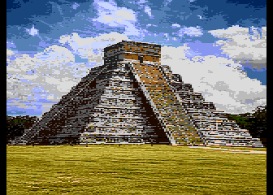](https://github.com/ivop/rc-archive/raw/master/A/AztecPyramid.xex)
