[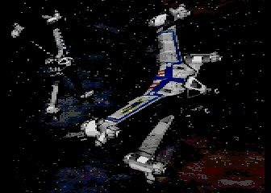](https://github.com/ivop/rc-archive/raw/master/B/B5StarFury.xex)
[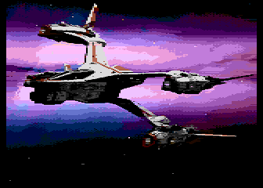](https://github.com/ivop/rc-archive/raw/master/B/B5Thunderbolt.xex)
[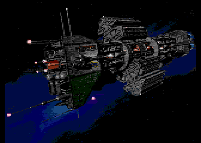](https://github.com/ivop/rc-archive/raw/master/B/B5TigerClaw.xex)
[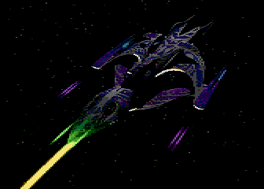](https://github.com/ivop/rc-archive/raw/master/B/B5WhiteStar.xex)
[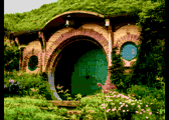](https://github.com/ivop/rc-archive/raw/master/B/Bagend2sm5thsave.xex)
[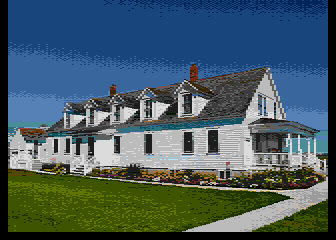](https://github.com/ivop/rc-archive/raw/master/B/BaggBonanza.xex)
[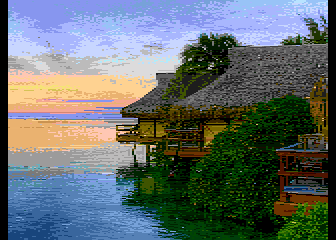](https://github.com/ivop/rc-archive/raw/master/B/BaliBungalow2.xex)
[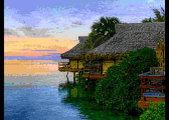](https://github.com/ivop/rc-archive/raw/master/B/BaliBungalow.xex)
[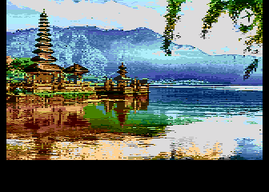](https://github.com/ivop/rc-archive/raw/master/B/Bali_Indonesia2smincomplete12.xex)
[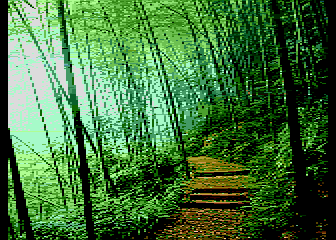](https://github.com/ivop/rc-archive/raw/master/B/BambooForest.xex)

[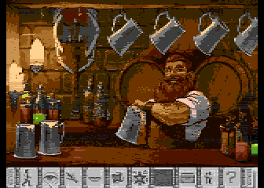](https://github.com/ivop/rc-archive/raw/master/B/barkeeprpgsmincomplete3.xex)
[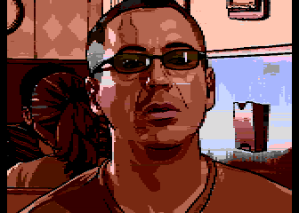](https://github.com/ivop/rc-archive/raw/master/B/barris.xex)
[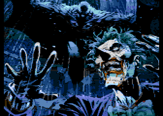](https://github.com/ivop/rc-archive/raw/master/B/batman.xex)
[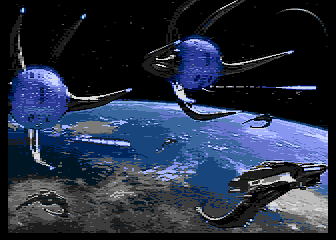](https://github.com/ivop/rc-archive/raw/master/B/BattleforSansara.xex)
[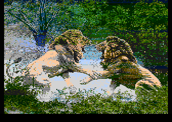](https://github.com/ivop/rc-archive/raw/master/B/BattleLionsNTSC.xex)
[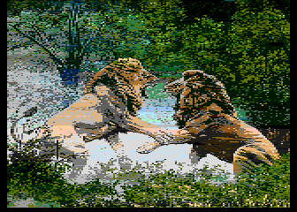](https://github.com/ivop/rc-archive/raw/master/B/BattleLionsPAL.xex)
[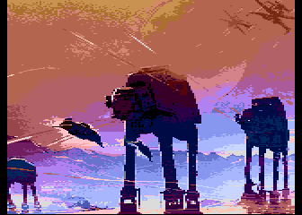](https://github.com/ivop/rc-archive/raw/master/B/BattleOfHoth.xex)
[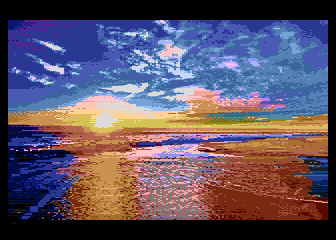](https://github.com/ivop/rc-archive/raw/master/B/beach.xex)
[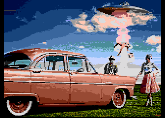](https://github.com/ivop/rc-archive/raw/master/B/beamMeUp.xex)
[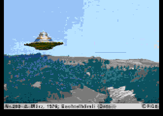](https://github.com/ivop/rc-archive/raw/master/B/Beamship-1975.xex)

[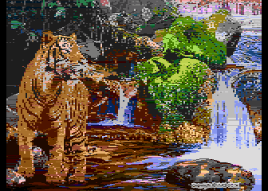](https://github.com/ivop/rc-archive/raw/master/B/BengalTiger.xex)
[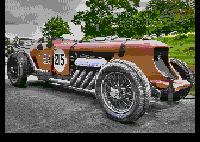](https://github.com/ivop/rc-archive/raw/master/B/BentlyNTSC.xex)
[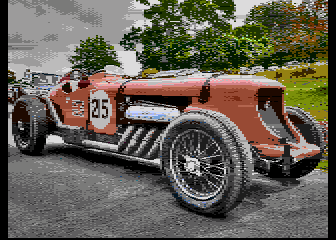](https://github.com/ivop/rc-archive/raw/master/B/BentlyPAL.xex)
[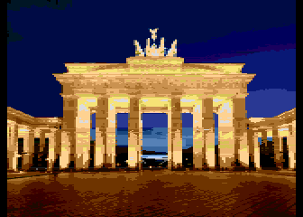](https://github.com/ivop/rc-archive/raw/master/B/berlin.xex)
[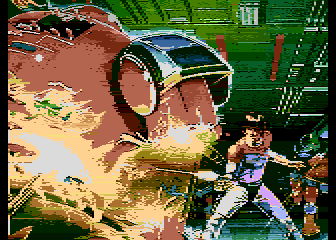](https://github.com/ivop/rc-archive/raw/master/B/Berserk.xex)
[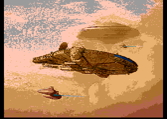](https://github.com/ivop/rc-archive/raw/master/B/Bespin.xex)
[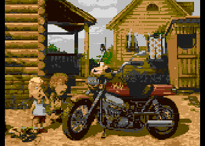](https://github.com/ivop/rc-archive/raw/master/B/bike.xex)
[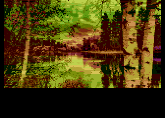](https://github.com/ivop/rc-archive/raw/master/B/birches.xex.xex)
[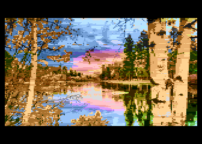](https://github.com/ivop/rc-archive/raw/master/B/birch.xex)
[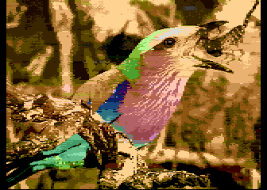](https://github.com/ivop/rc-archive/raw/master/B/Birdfood.xex)
[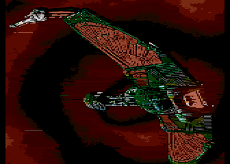](https://github.com/ivop/rc-archive/raw/master/B/BirdofPrey1.xex)
[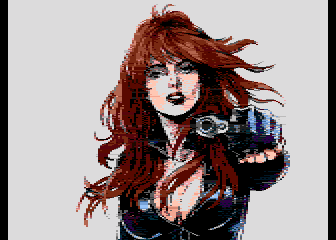](https://github.com/ivop/rc-archive/raw/master/B/blackwidow-pal.xex)

[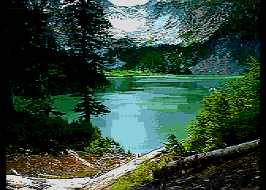](https://github.com/ivop/rc-archive/raw/master/B/BlancaLake.xex)

[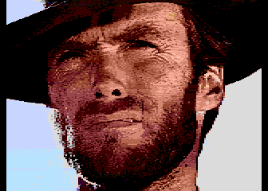](https://github.com/ivop/rc-archive/raw/master/B/Blondie.xex)
[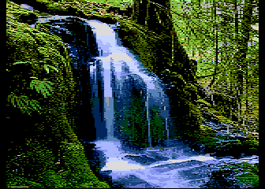](https://github.com/ivop/rc-archive/raw/master/B/BlueBrookFalls.xex)
[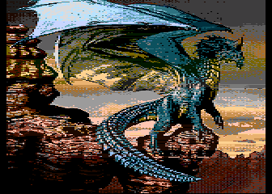](https://github.com/ivop/rc-archive/raw/master/B/BlueDragonD.xex)
[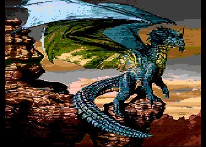](https://github.com/ivop/rc-archive/raw/master/B/BlueDragon.xex)
[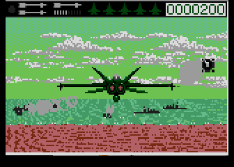](https://github.com/ivop/rc-archive/raw/master/B/BlueL02.xex)
[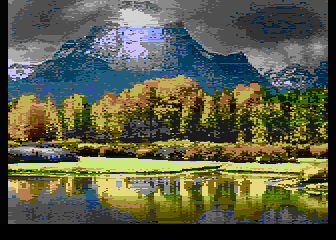](https://github.com/ivop/rc-archive/raw/master/B/BlueMountainNTSC.xex)
[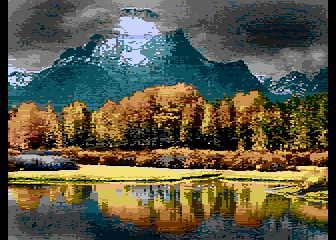](https://github.com/ivop/rc-archive/raw/master/B/BlueMountainPAL.xex)
[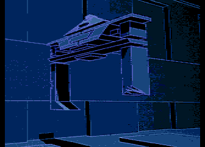](https://github.com/ivop/rc-archive/raw/master/B/BlueRecognizer.xex)
[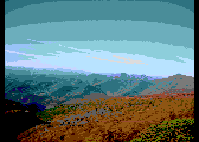](https://github.com/ivop/rc-archive/raw/master/B/BlueRidge2October10th2020.xex)
[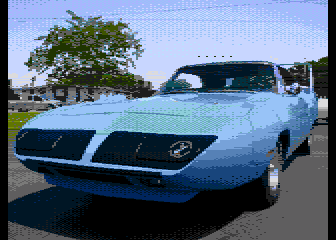](https://github.com/ivop/rc-archive/raw/master/B/BlueSuperbird.xex)
[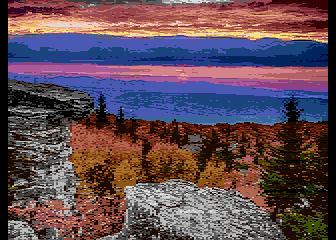](https://github.com/ivop/rc-archive/raw/master/B/BluffView.xex)
[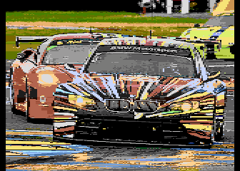](https://github.com/ivop/rc-archive/raw/master/B/BMWmotorsport.xex)
[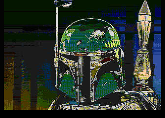](https://github.com/ivop/rc-archive/raw/master/B/BobafetNTSC2.xex)
[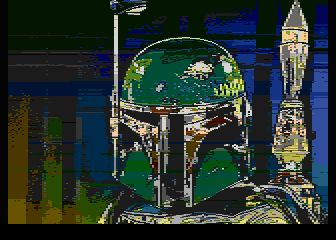](https://github.com/ivop/rc-archive/raw/master/B/BobafetNTSC.xex)
[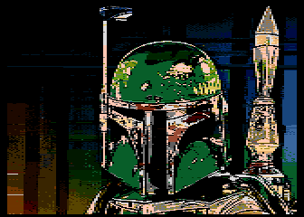](https://github.com/ivop/rc-archive/raw/master/B/BobafetPAL2.xex)
[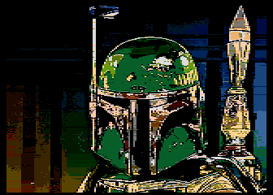](https://github.com/ivop/rc-archive/raw/master/B/BobafetPAL.xex)
[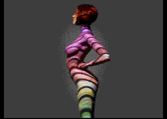](https://github.com/ivop/rc-archive/raw/master/B/BodyLight.xex)
[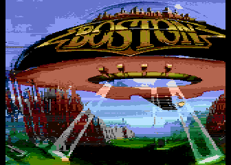](https://github.com/ivop/rc-archive/raw/master/B/Boston.xex)
[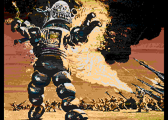](https://github.com/ivop/rc-archive/raw/master/B/BotKong540.xex)
[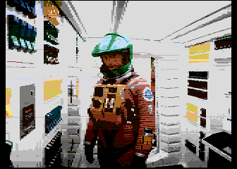](https://github.com/ivop/rc-archive/raw/master/B/Bowman2001d118.xex)
[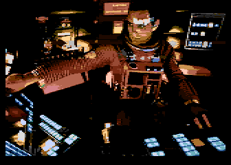](https://github.com/ivop/rc-archive/raw/master/B/BowmanInPod2001a133.xex)
[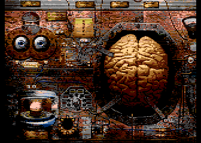](https://github.com/ivop/rc-archive/raw/master/B/BrainInBox.xex)
[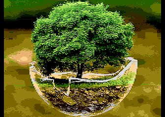](https://github.com/ivop/rc-archive/raw/master/B/BreakingBeyond.xex)
[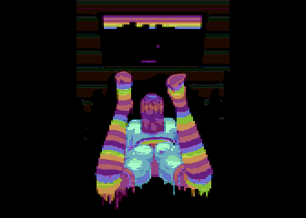](https://github.com/ivop/rc-archive/raw/master/B/breakout.xex)
[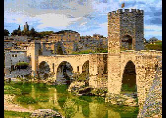](https://github.com/ivop/rc-archive/raw/master/B/BridgeOfBesalú.xex)
[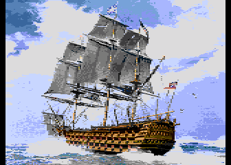](https://github.com/ivop/rc-archive/raw/master/B/BritishFlagship.xex)
[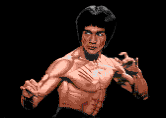](https://github.com/ivop/rc-archive/raw/master/B/Bruce.xex)
[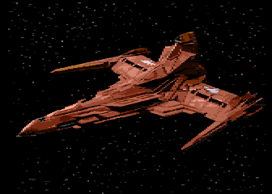](https://github.com/ivop/rc-archive/raw/master/B/BuckRogersMarauder.xex)
[.png)](https://github.com/ivop/rc-archive/raw/master/B/BuckRogersStarfighter%20(2).xex)
[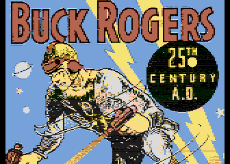](https://github.com/ivop/rc-archive/raw/master/B/BuckRogers.xex)
[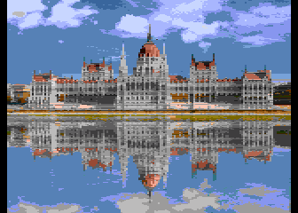](https://github.com/ivop/rc-archive/raw/master/B/budapest.xex)
[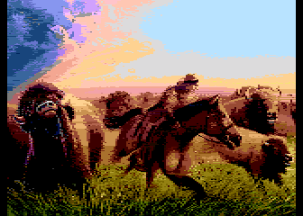](https://github.com/ivop/rc-archive/raw/master/B/Buffalohunter.xex)
[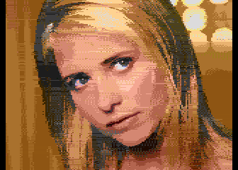](https://github.com/ivop/rc-archive/raw/master/B/buffy.xex)
[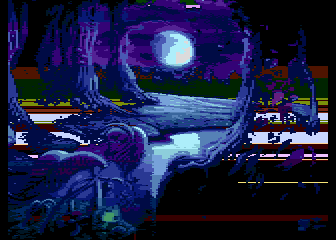](https://github.com/ivop/rc-archive/raw/master/B/bugger.xex)
[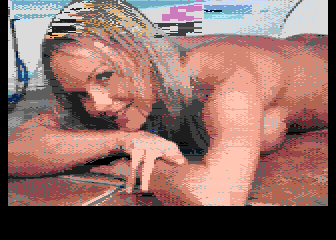](https://github.com/ivop/rc-archive/raw/master/B/bug.xex)
[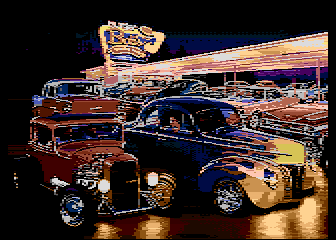](https://github.com/ivop/rc-archive/raw/master/B/BurgerBobs.xex)
[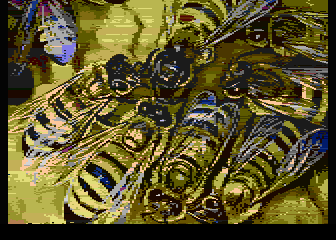](https://github.com/ivop/rc-archive/raw/master/B/BusyBeesNTSC.xex)
[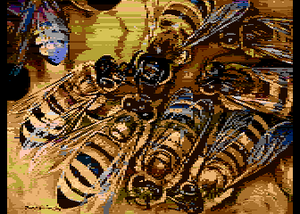](https://github.com/ivop/rc-archive/raw/master/B/BusyBeesPAL.xex)
[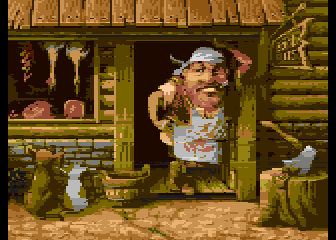](https://github.com/ivop/rc-archive/raw/master/B/butcher.xex)
[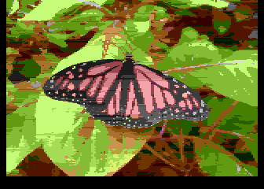](https://github.com/ivop/rc-archive/raw/master/B/Butterfly.xex)
