[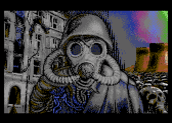](https://github.com/ivop/rc-archive/raw/master/C/C64GasMask.xex)
[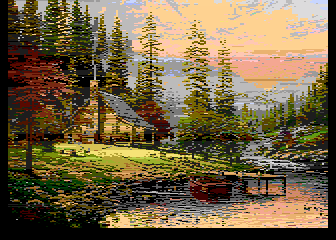](https://github.com/ivop/rc-archive/raw/master/C/CabinOnStream120.xex)
[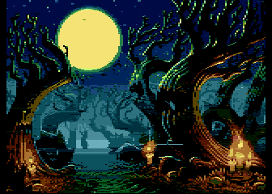](https://github.com/ivop/rc-archive/raw/master/C/CajunMoon.xex)
[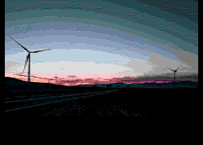](https://github.com/ivop/rc-archive/raw/master/C/calama-1.xex)
[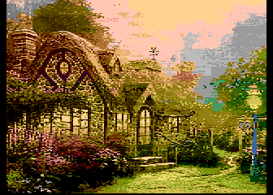](https://github.com/ivop/rc-archive/raw/master/C/CandlelightCottage.xex)
[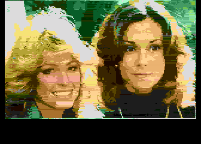](https://github.com/ivop/rc-archive/raw/master/C/C-Angels-02X.xex)
[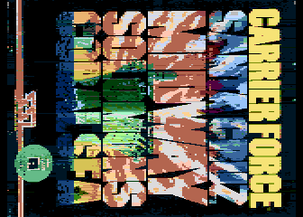](https://github.com/ivop/rc-archive/raw/master/C/CarrierForce.xex)
[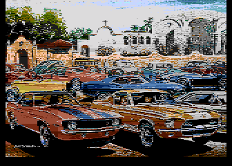](https://github.com/ivop/rc-archive/raw/master/C/CarShow.xex)
[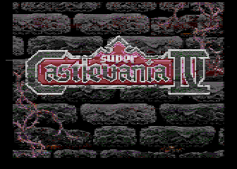](https://github.com/ivop/rc-archive/raw/master/C/castle1.xex)
[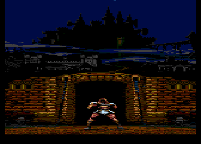](https://github.com/ivop/rc-archive/raw/master/C/Castle2b.pal.xex)
[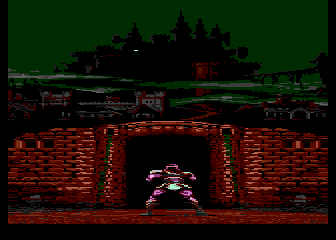](https://github.com/ivop/rc-archive/raw/master/C/Castle2b.xex)
[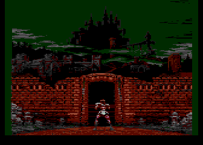](https://github.com/ivop/rc-archive/raw/master/C/castle2.xex)
[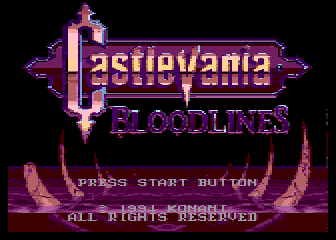](https://github.com/ivop/rc-archive/raw/master/C/castle3.xex)
[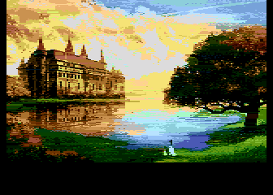](https://github.com/ivop/rc-archive/raw/master/C/castlelake3smincomplete9.xex)
[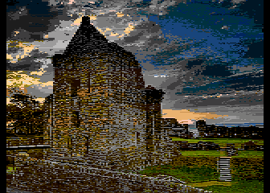](https://github.com/ivop/rc-archive/raw/master/C/CastleRuins2.xex)
[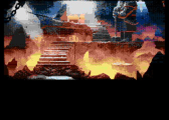](https://github.com/ivop/rc-archive/raw/master/C/cavern.xex)
[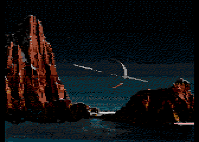](https://github.com/ivop/rc-archive/raw/master/C/CB_Saturn.xex)
[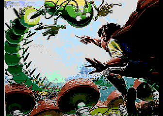](https://github.com/ivop/rc-archive/raw/master/C/Centipede.xex)
[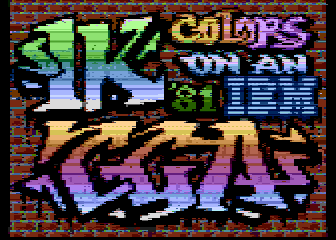](https://github.com/ivop/rc-archive/raw/master/C/CGA1Kcolor.xex)
[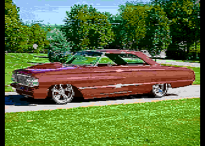](https://github.com/ivop/rc-archive/raw/master/C/CGalaxy500.xex)
[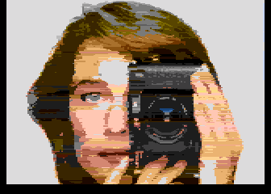](https://github.com/ivop/rc-archive/raw/master/C/Charlotte-R03.xex)
[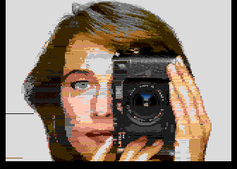](https://github.com/ivop/rc-archive/raw/master/C/CharlotteRampling-01.xex)
[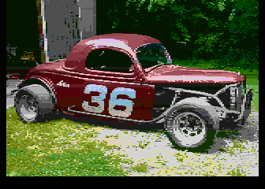](https://github.com/ivop/rc-archive/raw/master/C/CherryCoupeNTSC.xex)
[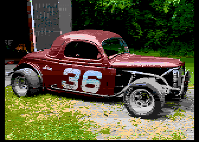](https://github.com/ivop/rc-archive/raw/master/C/CherryCoupePAL.xex)
[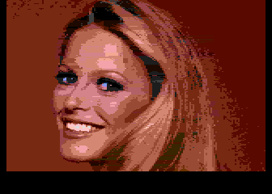](https://github.com/ivop/rc-archive/raw/master/C/CherylLadd-09.xex)
[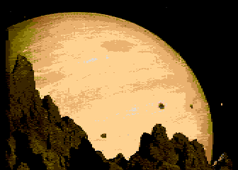](https://github.com/ivop/rc-archive/raw/master/C/ChesleyB1.xex)
[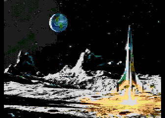](https://github.com/ivop/rc-archive/raw/master/C/ChesleyB2.xex)
[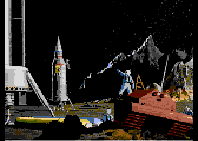](https://github.com/ivop/rc-archive/raw/master/C/ChesleyB3.xex)
[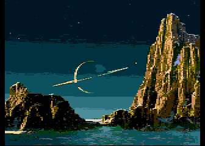](https://github.com/ivop/rc-archive/raw/master/C/ChesleyB4.xex)
[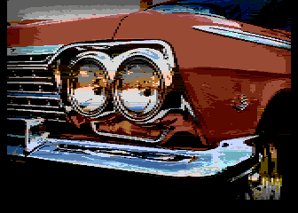](https://github.com/ivop/rc-archive/raw/master/C/ChevyV8.xex)

[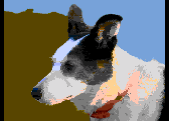](https://github.com/ivop/rc-archive/raw/master/C/ChloeAtSunset.xex)
[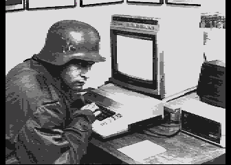](https://github.com/ivop/rc-archive/raw/master/C/ChrisCrawford1941.xex)
[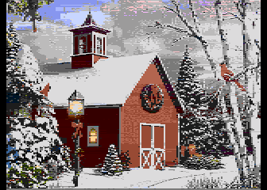](https://github.com/ivop/rc-archive/raw/master/C/ChristmasBarn.xex)
[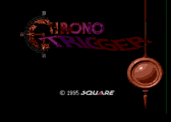](https://github.com/ivop/rc-archive/raw/master/C/chrono1.xex)
[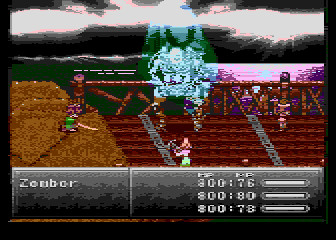](https://github.com/ivop/rc-archive/raw/master/C/chrono2.xex)

[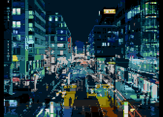](https://github.com/ivop/rc-archive/raw/master/C/city.xex)
[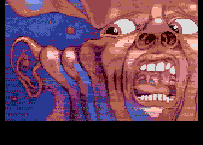](https://github.com/ivop/rc-archive/raw/master/C/ck.xex)
[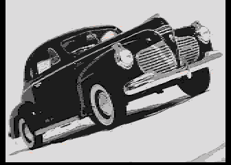](https://github.com/ivop/rc-archive/raw/master/C/Classiclines.xex)
[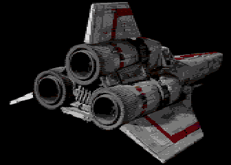](https://github.com/ivop/rc-archive/raw/master/C/Classic-Viper-Jmccorm-Rasta.xex)
[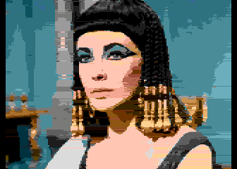](https://github.com/ivop/rc-archive/raw/master/C/Cleopatra-ET.xex)
[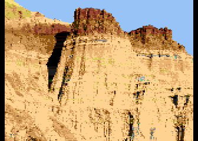](https://github.com/ivop/rc-archive/raw/master/C/cliff.xex)
[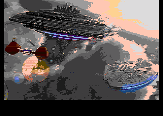](https://github.com/ivop/rc-archive/raw/master/C/CloudCity.xex)
[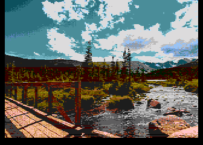](https://github.com/ivop/rc-archive/raw/master/C/Colorado.xex)
[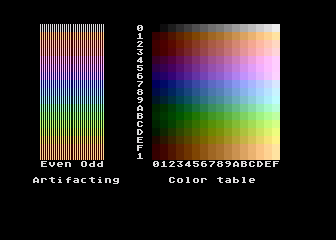](https://github.com/ivop/rc-archive/raw/master/C/colormap.xex)
[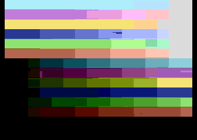](https://github.com/ivop/rc-archive/raw/master/C/Colors_ciede_altirra.xex)
[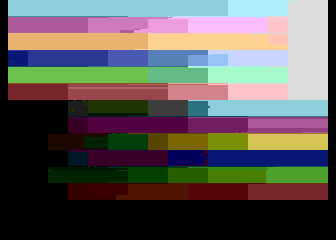](https://github.com/ivop/rc-archive/raw/master/C/Colors_ciede_atari800winplus.xex)
[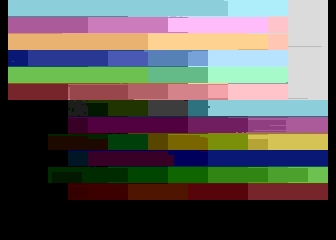](https://github.com/ivop/rc-archive/raw/master/C/Colors_ciede_Default.xex)
[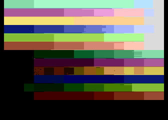](https://github.com/ivop/rc-archive/raw/master/C/Colors_ciede_g2f.xex)
[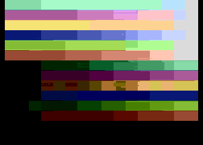](https://github.com/ivop/rc-archive/raw/master/C/Colors_ciede_jakub.xex)
[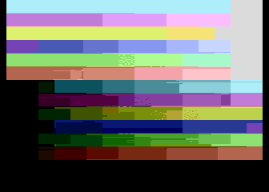](https://github.com/ivop/rc-archive/raw/master/C/Colors_ciede_laoo.xex)
[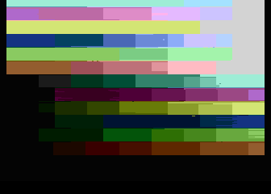](https://github.com/ivop/rc-archive/raw/master/C/Colors_ciede_NTSC30.xex)
[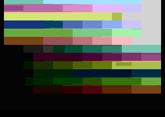](https://github.com/ivop/rc-archive/raw/master/C/Colors_ciede_NTSC40.xex)
[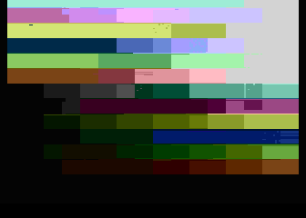](https://github.com/ivop/rc-archive/raw/master/C/Colors_ciede_NTSC50.xex)
[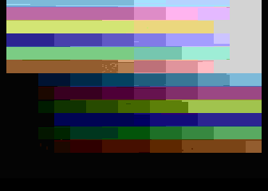](https://github.com/ivop/rc-archive/raw/master/C/Colors_ciede_NTSC.xex)
[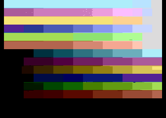](https://github.com/ivop/rc-archive/raw/master/C/Colors_ciede_OlivierP.xex)
[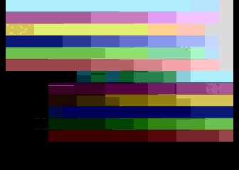](https://github.com/ivop/rc-archive/raw/master/C/Colors_ciede_Real.xex)
[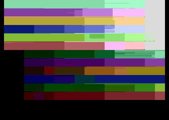](https://github.com/ivop/rc-archive/raw/master/C/Colors_ciede_Xformer.xex)
[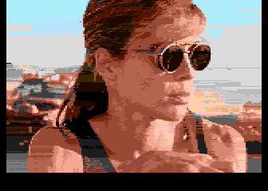](https://github.com/ivop/rc-archive/raw/master/C/connor.xex)
[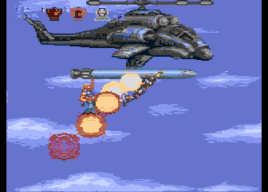](https://github.com/ivop/rc-archive/raw/master/C/Contra3-05D.xex)
[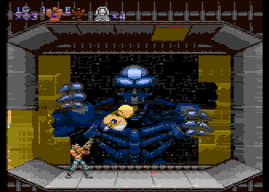](https://github.com/ivop/rc-archive/raw/master/C/Contra3-Snes-01A.xex)
[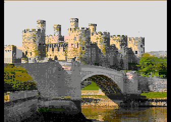](https://github.com/ivop/rc-archive/raw/master/C/ConwyCastle.xex)
[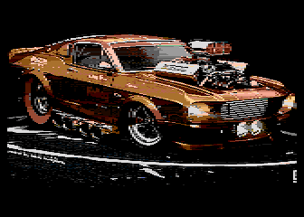](https://github.com/ivop/rc-archive/raw/master/C/CopperRod.xex)
[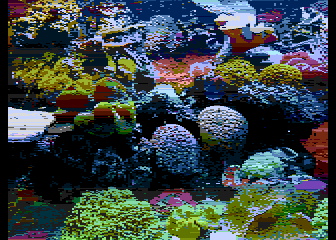](https://github.com/ivop/rc-archive/raw/master/C/Coral.xex)
[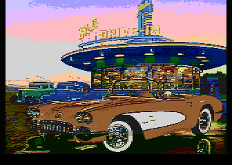](https://github.com/ivop/rc-archive/raw/master/C/CorvetteNTSC.xex)
[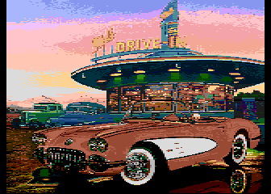](https://github.com/ivop/rc-archive/raw/master/C/Corvette.xex)
[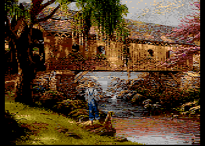](https://github.com/ivop/rc-archive/raw/master/C/CoveredBridge.xex)
[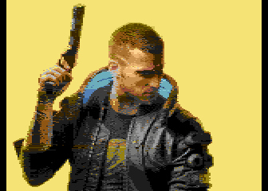](https://github.com/ivop/rc-archive/raw/master/C/cp2077-1.xex)
[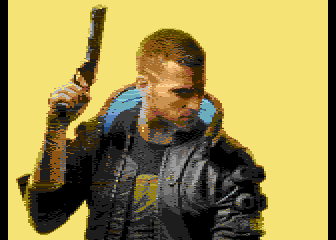](https://github.com/ivop/rc-archive/raw/master/C/cp2077-2.xex)
[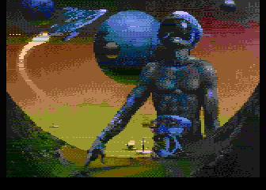](https://github.com/ivop/rc-archive/raw/master/C/Creative_NTSC.xex)
[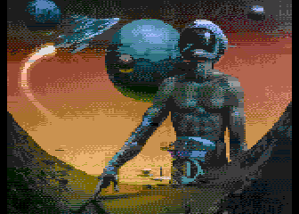](https://github.com/ivop/rc-archive/raw/master/C/Creative.xex)
[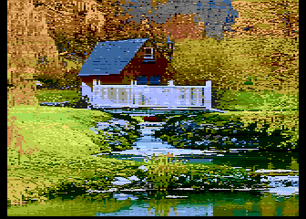](https://github.com/ivop/rc-archive/raw/master/C/Creekcrossing.xex)
[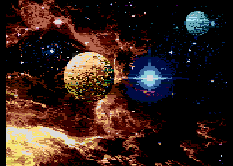](https://github.com/ivop/rc-archive/raw/master/C/CrimsonNebulac133.xex)
[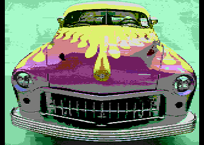](https://github.com/ivop/rc-archive/raw/master/C/Cruiser.xex)
[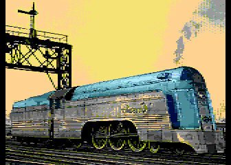](https://github.com/ivop/rc-archive/raw/master/C/Crusader.xex)
[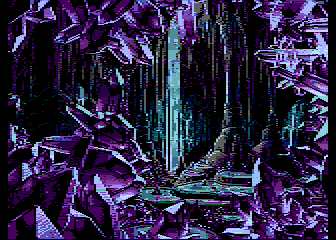](https://github.com/ivop/rc-archive/raw/master/C/CrystalCaves2.xex)
[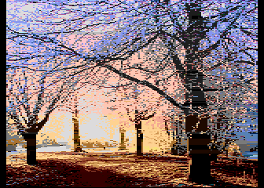](https://github.com/ivop/rc-archive/raw/master/C/CrystalSunset.xex)
[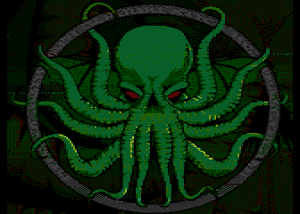](https://github.com/ivop/rc-archive/raw/master/C/cthulhu1.xex)
[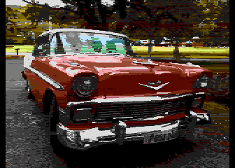](https://github.com/ivop/rc-archive/raw/master/C/cuba_56chevy_PAL.xex)
[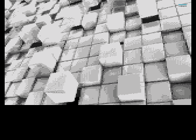](https://github.com/ivop/rc-archive/raw/master/C/cubes.xex)
[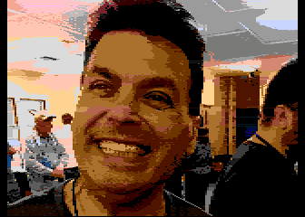](https://github.com/ivop/rc-archive/raw/master/C/CurtVendelRIP.xex)
[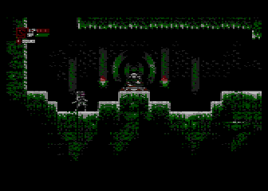](https://github.com/ivop/rc-archive/raw/master/C/CyberShadow_08.xex)
[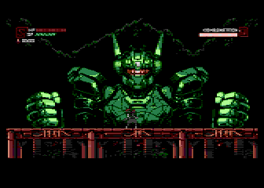](https://github.com/ivop/rc-archive/raw/master/C/CyberShadow_10.xex)
[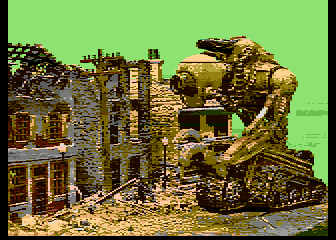](https://github.com/ivop/rc-archive/raw/master/C/Cyclopsbot.xex)
