[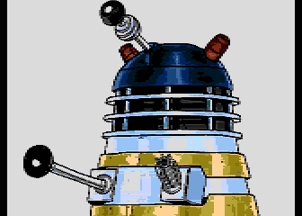](https://github.com/ivop/rc-archive/raw/master/D/Dailektic.xex)
[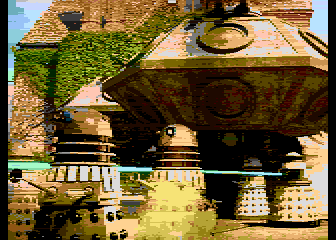](https://github.com/ivop/rc-archive/raw/master/D/DalekAttack!.xex)
[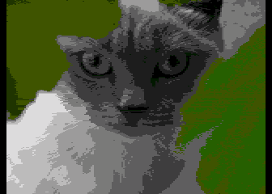](https://github.com/ivop/rc-archive/raw/master/D/Daphna.xex)
[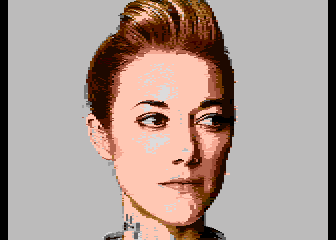](https://github.com/ivop/rc-archive/raw/master/D/DarkMatterAndroid.xex)
[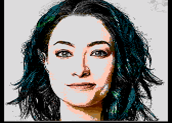](https://github.com/ivop/rc-archive/raw/master/D/DarkMatterFive.xex)
[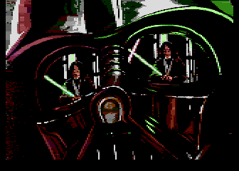](https://github.com/ivop/rc-archive/raw/master/D/DarkReflections.xex)
[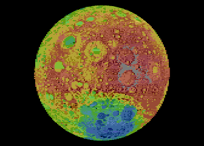](https://github.com/ivop/rc-archive/raw/master/D/DarkSideOfTheMoon.xex)
[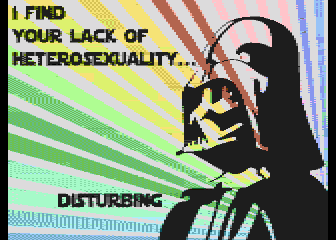](https://github.com/ivop/rc-archive/raw/master/D/DarthRainbow.xex)
[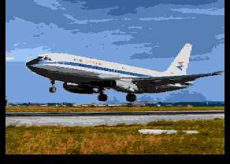](https://github.com/ivop/rc-archive/raw/master/D/Dassault_Mercure_100.xex)
[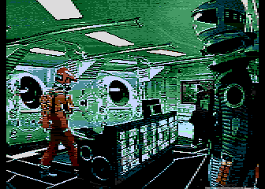](https://github.com/ivop/rc-archive/raw/master/D/Dave2001b152.xex)
[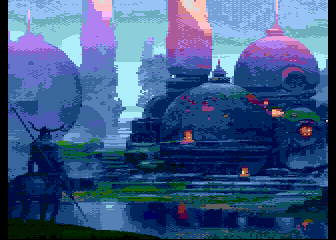](https://github.com/ivop/rc-archive/raw/master/D/DawnBreak.xex)
[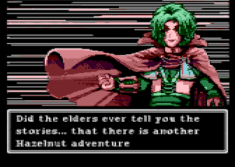](https://github.com/ivop/rc-archive/raw/master/D/Dawnthorn1.xex)
[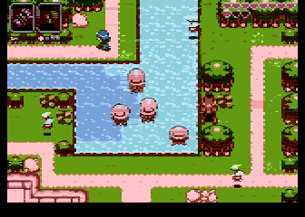](https://github.com/ivop/rc-archive/raw/master/D/Dawnthorn2.xex)
[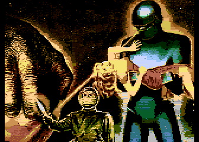](https://github.com/ivop/rc-archive/raw/master/D/DayEarthStoodStill.xex)
[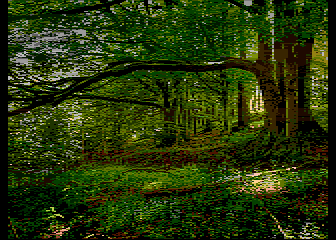](https://github.com/ivop/rc-archive/raw/master/D/DeciduousForest.xex)
[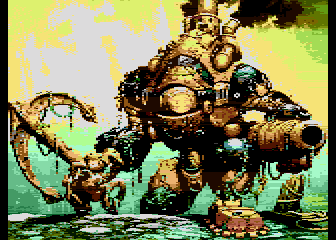](https://github.com/ivop/rc-archive/raw/master/D/DeepDiver.xex)
[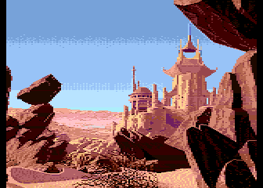](https://github.com/ivop/rc-archive/raw/master/D/Desert2.xex)

[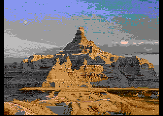](https://github.com/ivop/rc-archive/raw/master/D/DesertTower.xex)
[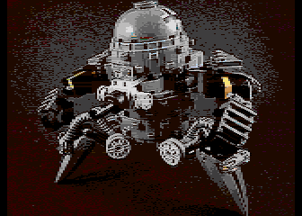](https://github.com/ivop/rc-archive/raw/master/D/DieselPunkDestroyerbot.xex)
[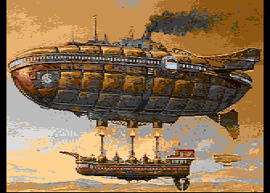](https://github.com/ivop/rc-archive/raw/master/D/DieselPunkDirigible.xex)
[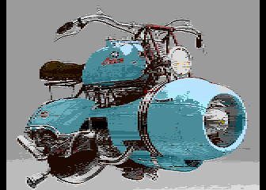](https://github.com/ivop/rc-archive/raw/master/D/DieselPunkJetbike.xex)
[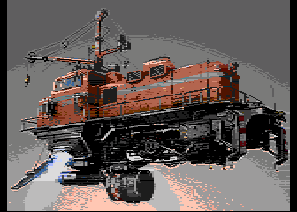](https://github.com/ivop/rc-archive/raw/master/D/DieselPunkLocomotive.xex)
[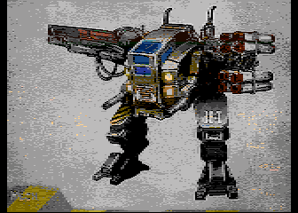](https://github.com/ivop/rc-archive/raw/master/D/DieselPunkMech88-T.xex)
[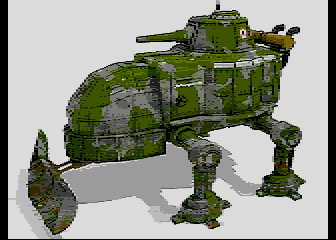](https://github.com/ivop/rc-archive/raw/master/D/DieselPunkMechtank.xex)
[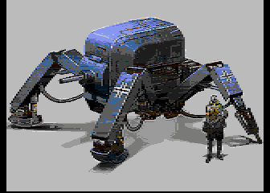](https://github.com/ivop/rc-archive/raw/master/D/DieselPunkSingelTank.xex)
[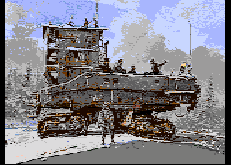](https://github.com/ivop/rc-archive/raw/master/D/DieselPunkTransporter.xex)
[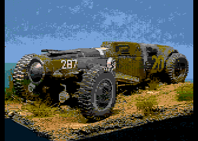](https://github.com/ivop/rc-archive/raw/master/D/DieselPunkTricar.xex)
[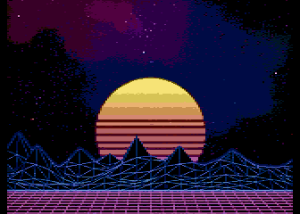](https://github.com/ivop/rc-archive/raw/master/D/DigitalHorizon.xex)
[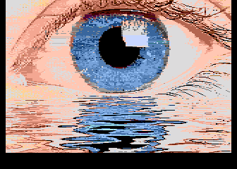](https://github.com/ivop/rc-archive/raw/master/D/DigitalVisine.xex)
[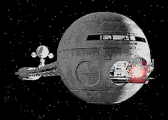](https://github.com/ivop/rc-archive/raw/master/D/Discovery1.xex)
[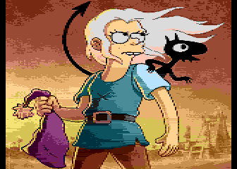](https://github.com/ivop/rc-archive/raw/master/D/Disenchantment1smincomplete11_FIXED.xex)
[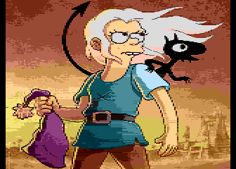](https://github.com/ivop/rc-archive/raw/master/D/Disenchantment1smincomplete6.xex)
[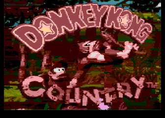](https://github.com/ivop/rc-archive/raw/master/D/dkc1.xex)
[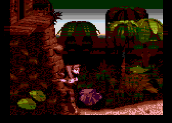](https://github.com/ivop/rc-archive/raw/master/D/dkc2.xex)
[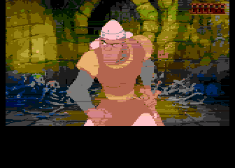](https://github.com/ivop/rc-archive/raw/master/D/Dlair-04.xex)
[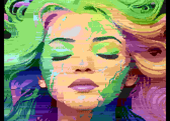](https://github.com/ivop/rc-archive/raw/master/D/dlaw.xex)
[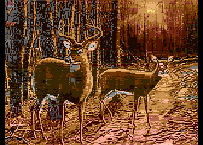](https://github.com/ivop/rc-archive/raw/master/D/Doe&Buck.xex)
[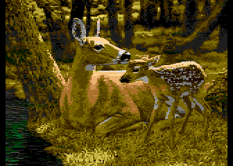](https://github.com/ivop/rc-archive/raw/master/D/Doe&Fawn.xex)
[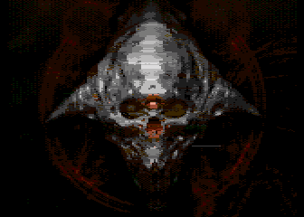](https://github.com/ivop/rc-archive/raw/master/D/Doom1.xex)
[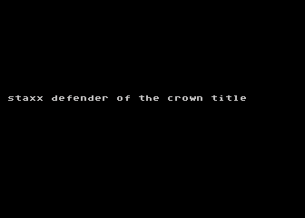](https://github.com/ivop/rc-archive/raw/master/D/DOTC_music.xex)
[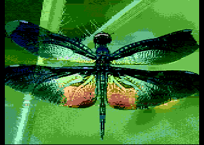](https://github.com/ivop/rc-archive/raw/master/D/DragonFlyA.xex)
[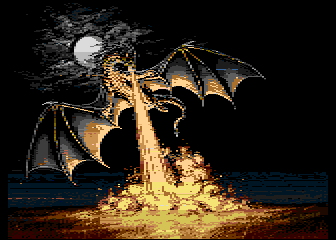](https://github.com/ivop/rc-archive/raw/master/D/DragonsFire.xex)
[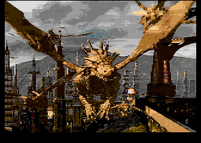](https://github.com/ivop/rc-archive/raw/master/D/DragonSiege.xex)
[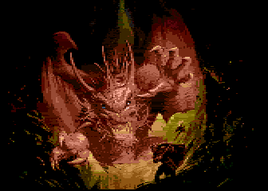](https://github.com/ivop/rc-archive/raw/master/D/DragonSlayer.xex)
[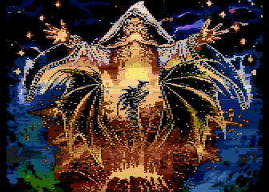](https://github.com/ivop/rc-archive/raw/master/D/DragonSpell.xex)
[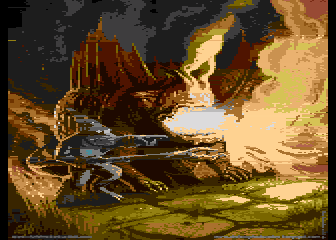](https://github.com/ivop/rc-archive/raw/master/D/dragon.xex)
[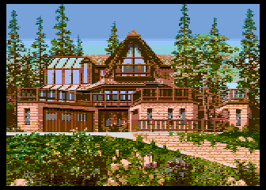](https://github.com/ivop/rc-archive/raw/master/D/DREAMHOUSE.xex)
[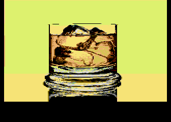](https://github.com/ivop/rc-archive/raw/master/D/DrinkGlas.xex)
[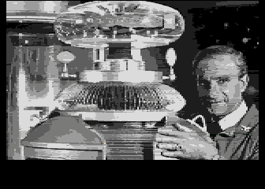](https://github.com/ivop/rc-archive/raw/master/D/DrSmith-Robot2.xex)
[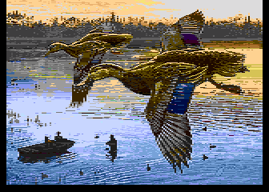](https://github.com/ivop/rc-archive/raw/master/D/DuckSeason.xex)
[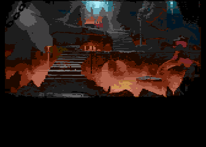](https://github.com/ivop/rc-archive/raw/master/D/dwarfquick.xex)
[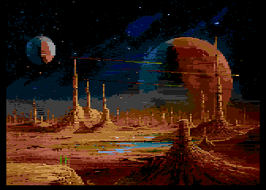](https://github.com/ivop/rc-archive/raw/master/D/DyingWorld.xex)
