[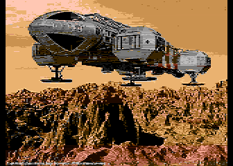](https://github.com/ivop/rc-archive/raw/master/E/EagleTransporter1b.xex)
[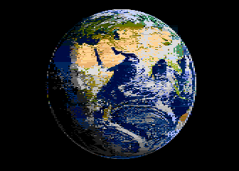](https://github.com/ivop/rc-archive/raw/master/E/Earth.xex)
[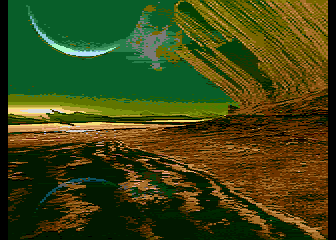](https://github.com/ivop/rc-archive/raw/master/E/EdgeOfForever.xex)
[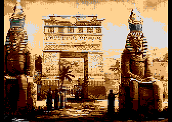](https://github.com/ivop/rc-archive/raw/master/E/Egyptian.xex)
[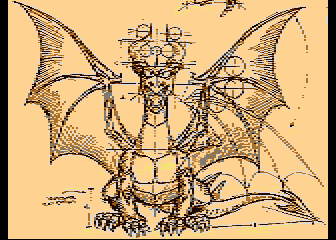](https://github.com/ivop/rc-archive/raw/master/E/EidolonRedDragonSr.xex)
[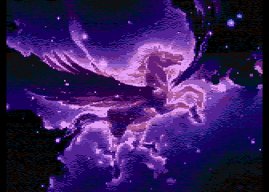](https://github.com/ivop/rc-archive/raw/master/E/Einhorn_emkay.xex)
[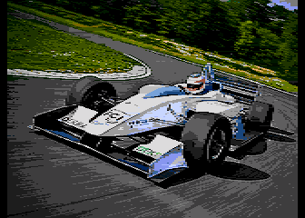](https://github.com/ivop/rc-archive/raw/master/E/ElectricF1.xex)
[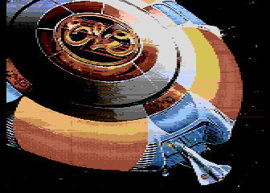](https://github.com/ivop/rc-archive/raw/master/E/ELOD.xex)
[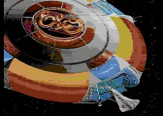](https://github.com/ivop/rc-archive/raw/master/E/ELO.xex)
[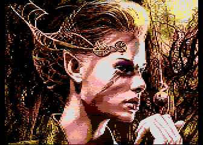](https://github.com/ivop/rc-archive/raw/master/E/ElvenPrincess1.xex)
[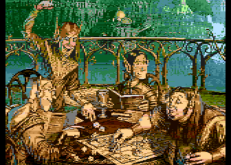](https://github.com/ivop/rc-archive/raw/master/E/ElvinRPGamers.xex)
[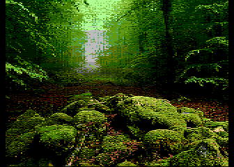](https://github.com/ivop/rc-archive/raw/master/E/EmeraldForest.xex)
[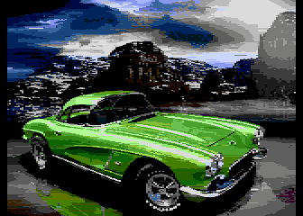](https://github.com/ivop/rc-archive/raw/master/E/EmeraldVette.xex)
[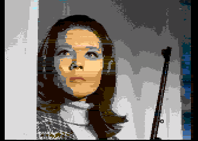](https://github.com/ivop/rc-archive/raw/master/E/EmmaP01.xex)
[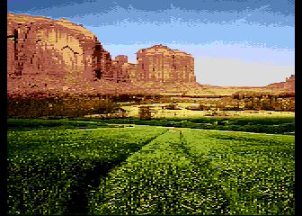](https://github.com/ivop/rc-archive/raw/master/E/EndOfGreen.xex)
[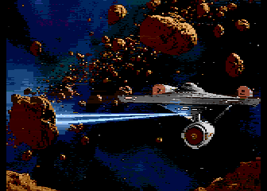](https://github.com/ivop/rc-archive/raw/master/E/Enterprise1701.xex)
[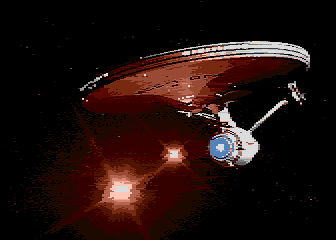](https://github.com/ivop/rc-archive/raw/master/E/Enterprise4a.xex)
[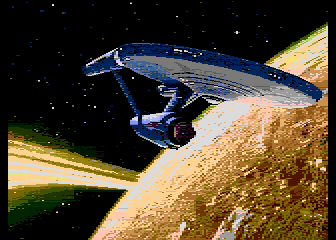](https://github.com/ivop/rc-archive/raw/master/E/EnterpriseInOrbit.xex)
[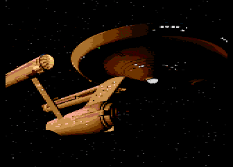](https://github.com/ivop/rc-archive/raw/master/E/EnterpriseNCC1701.xex)
[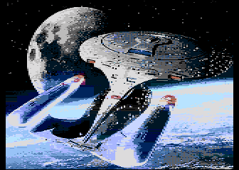](https://github.com/ivop/rc-archive/raw/master/E/EnterpriseNG1.xex)
[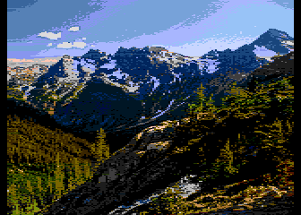](https://github.com/ivop/rc-archive/raw/master/E/EntiatMountains.xex)
[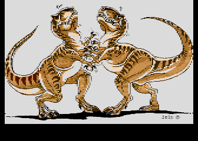](https://github.com/ivop/rc-archive/raw/master/E/EpicDuel.xex)
[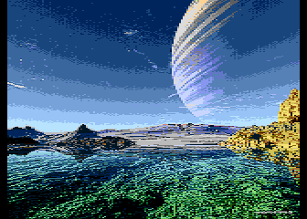](https://github.com/ivop/rc-archive/raw/master/E/ErgoMinor.xex)
[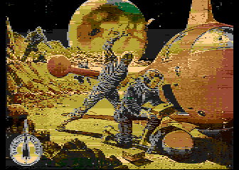](https://github.com/ivop/rc-archive/raw/master/E/exnaut.xex)
[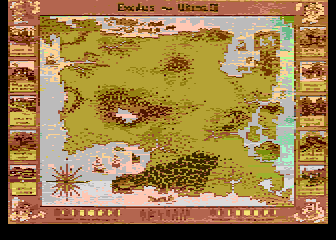](https://github.com/ivop/rc-archive/raw/master/E/ExodusU3map.xex)
[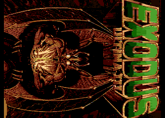](https://github.com/ivop/rc-archive/raw/master/E/ExodusU3.xex)
