[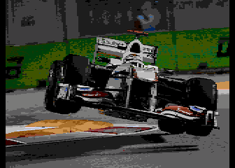](https://github.com/ivop/rc-archive/raw/master/F/F1Air.xex)
[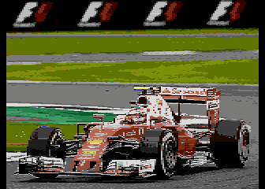](https://github.com/ivop/rc-archive/raw/master/F/F1Ferrari2016.xex)
[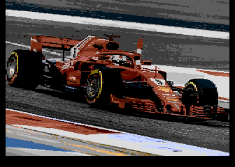](https://github.com/ivop/rc-archive/raw/master/F/F1Number5.xex)
[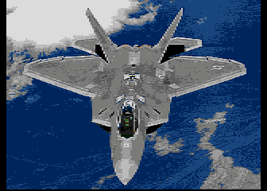](https://github.com/ivop/rc-archive/raw/master/F/F-22Raptor.xex)
[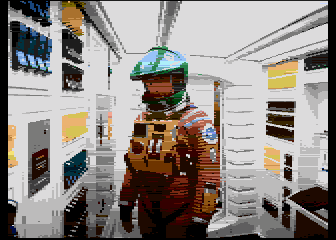](https://github.com/ivop/rc-archive/raw/master/F/FacelessDave.xex)
[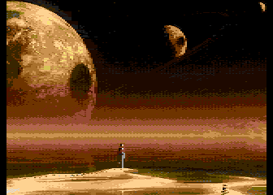](https://github.com/ivop/rc-archive/raw/master/F/FadeToBlack.xex)
[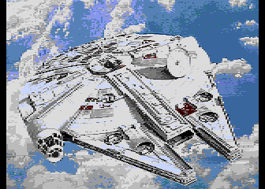](https://github.com/ivop/rc-archive/raw/master/F/Falcon1.xex)
[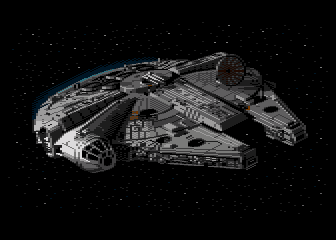](https://github.com/ivop/rc-archive/raw/master/F/Falcon.xex)
[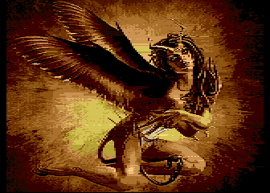](https://github.com/ivop/rc-archive/raw/master/F/fallen.xex)
[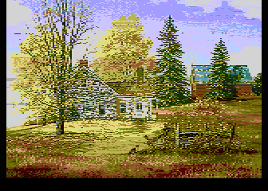](https://github.com/ivop/rc-archive/raw/master/F/FamilyFarmNTSC.xex)
[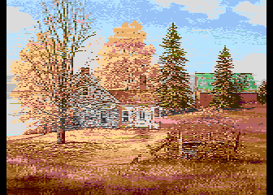](https://github.com/ivop/rc-archive/raw/master/F/FamilyFarmPAL.xex)
[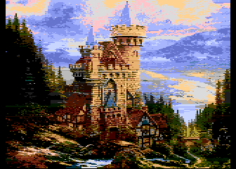](https://github.com/ivop/rc-archive/raw/master/F/FantasyCastle.xex)
[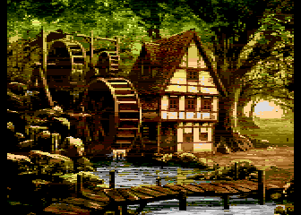](https://github.com/ivop/rc-archive/raw/master/F/fantasyhousesm2ndincomplete8.xex)
[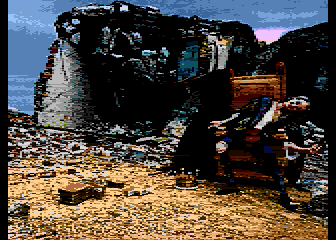](https://github.com/ivop/rc-archive/raw/master/F/FarewellToKings2.xex)
[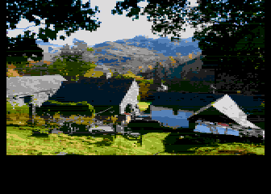](https://github.com/ivop/rc-archive/raw/master/F/Farm9.xex)
[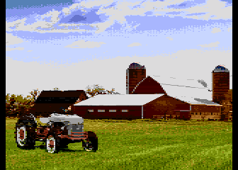](https://github.com/ivop/rc-archive/raw/master/F/FarmTractor.xex)
[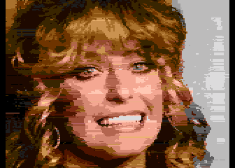](https://github.com/ivop/rc-archive/raw/master/F/Farrah-16S.xex)
[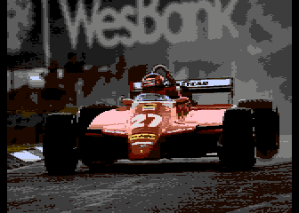](https://github.com/ivop/rc-archive/raw/master/F/FarrariF1a.xex)
[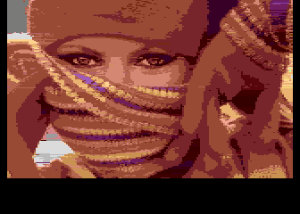](https://github.com/ivop/rc-archive/raw/master/F/Fashion.xex)

[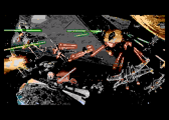](https://github.com/ivop/rc-archive/raw/master/F/FBJc542.xex)
[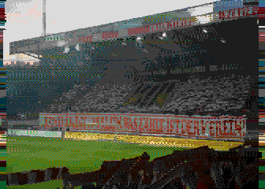](https://github.com/ivop/rc-archive/raw/master/F/FCU15-03-2013.xex)
[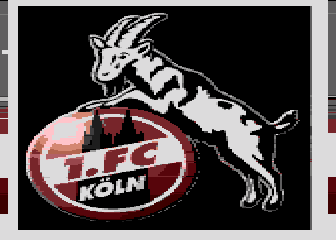](https://github.com/ivop/rc-archive/raw/master/F/fc.xex)
[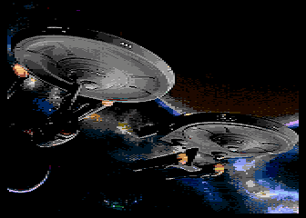](https://github.com/ivop/rc-archive/raw/master/F/FederationDuo.xex)
[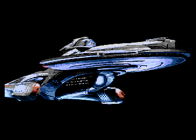](https://github.com/ivop/rc-archive/raw/master/F/Fed_Fs4_Type4.xex)
[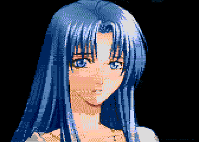](https://github.com/ivop/rc-archive/raw/master/F/feena.xex)
[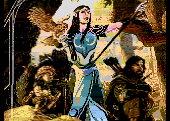](https://github.com/ivop/rc-archive/raw/master/F/FellowshipOfTheCrescentMoons.xex)
[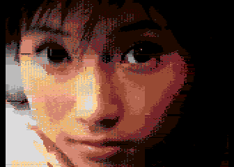](https://github.com/ivop/rc-archive/raw/master/F/Femaleface.xex)
[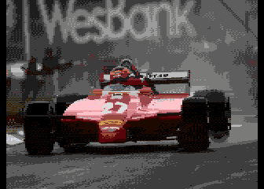](https://github.com/ivop/rc-archive/raw/master/F/ferrari.xex)
[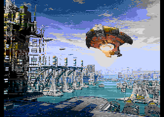](https://github.com/ivop/rc-archive/raw/master/F/FinalDecscent.xex)

[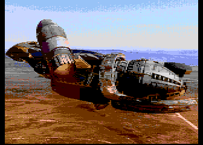](https://github.com/ivop/rc-archive/raw/master/F/FireflySerenity.xex)
[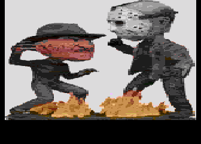](https://github.com/ivop/rc-archive/raw/master/F/fj_scary.xex)
[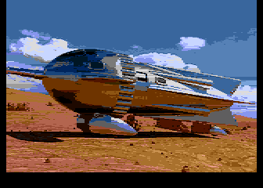](https://github.com/ivop/rc-archive/raw/master/F/FlashGordenRocketCar.xex)
[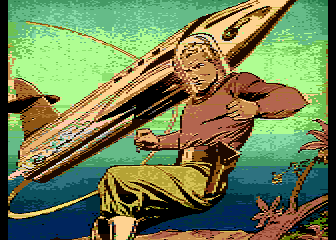](https://github.com/ivop/rc-archive/raw/master/F/FlashGordon4.xex)

[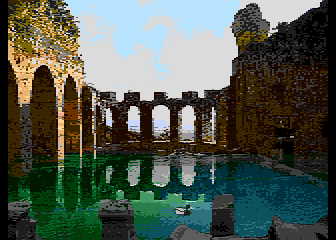](https://github.com/ivop/rc-archive/raw/master/F/FloodedRuins.xex)
[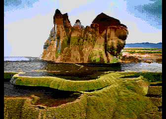](https://github.com/ivop/rc-archive/raw/master/F/FlyGeyser.xex)
[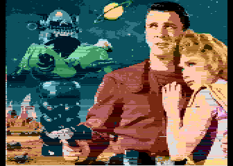](https://github.com/ivop/rc-archive/raw/master/F/ForbiddenPlanet-04.xex)

[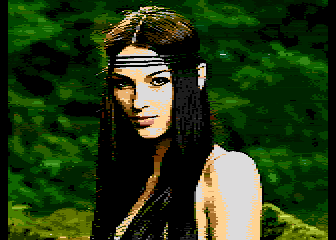](https://github.com/ivop/rc-archive/raw/master/F/forestelfsmincomplete8.xex)
[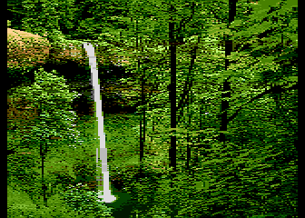](https://github.com/ivop/rc-archive/raw/master/F/ForestFalls.xex)
[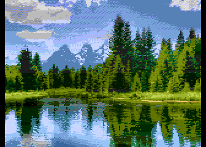](https://github.com/ivop/rc-archive/raw/master/F/Forestlake01.PAL.xex)
[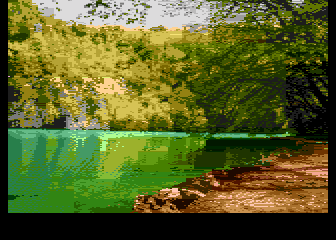](https://github.com/ivop/rc-archive/raw/master/F/Forestlake02.PAL.xex)
[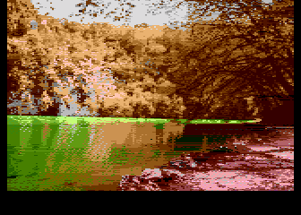](https://github.com/ivop/rc-archive/raw/master/F/ForestLake02.xex)
[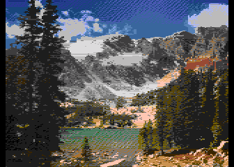](https://github.com/ivop/rc-archive/raw/master/F/Forestlake03.PAL.xex)
[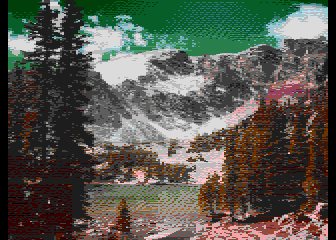](https://github.com/ivop/rc-archive/raw/master/F/ForestLake03.xex)
[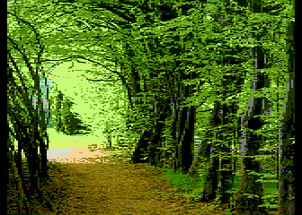](https://github.com/ivop/rc-archive/raw/master/F/ForestPath.xex)
[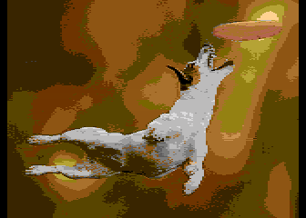](https://github.com/ivop/rc-archive/raw/master/F/FrisbeeTheDog.xex)
[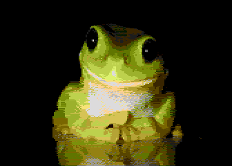](https://github.com/ivop/rc-archive/raw/master/F/frog3.xex)
[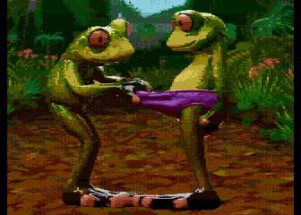](https://github.com/ivop/rc-archive/raw/master/F/Frogs1.xex)
[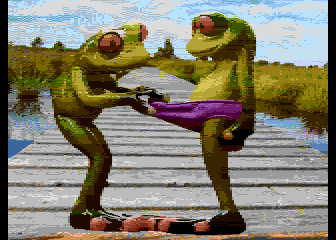](https://github.com/ivop/rc-archive/raw/master/F/Frogs2.xex)
[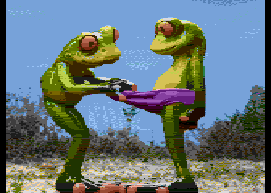](https://github.com/ivop/rc-archive/raw/master/F/Frogs3.xex)
[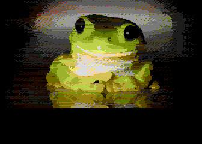](https://github.com/ivop/rc-archive/raw/master/F/frog.xex)
[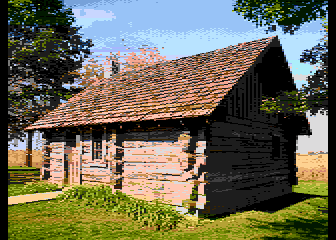](https://github.com/ivop/rc-archive/raw/master/F/FrontierCabin.xex)
[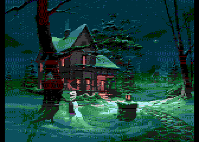](https://github.com/ivop/rc-archive/raw/master/F/Frosty_OLIVIERN.xex)
[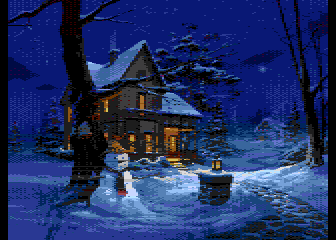](https://github.com/ivop/rc-archive/raw/master/F/Frosty.xex)
[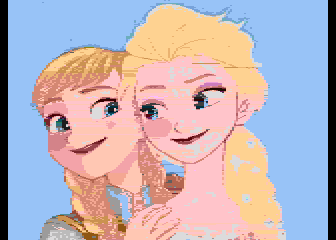](https://github.com/ivop/rc-archive/raw/master/F/Frozen-fanart.xex)
[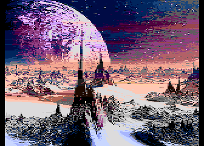](https://github.com/ivop/rc-archive/raw/master/F/FrozenMoon.xex)

[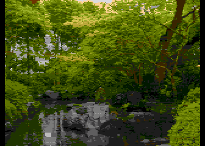](https://github.com/ivop/rc-archive/raw/master/F/FujiGarden.xex)
[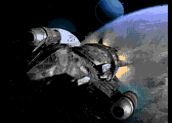](https://github.com/ivop/rc-archive/raw/master/F/FullBurnfromWhitefall.xex)
[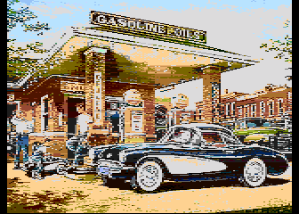](https://github.com/ivop/rc-archive/raw/master/F/FullService.xex)
[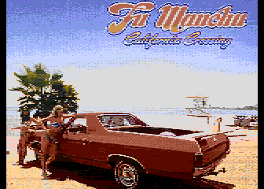](https://github.com/ivop/rc-archive/raw/master/F/FuManchuCA.xex)
[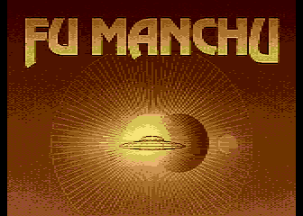](https://github.com/ivop/rc-archive/raw/master/F/FuManchuSOIP.xex)
[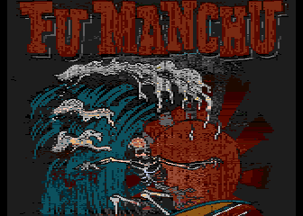](https://github.com/ivop/rc-archive/raw/master/F/FuManchu.xex)
[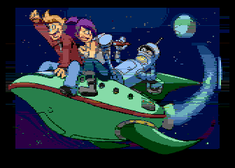](https://github.com/ivop/rc-archive/raw/master/F/Futurama.xex)
[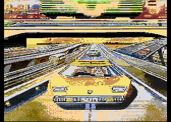](https://github.com/ivop/rc-archive/raw/master/F/FutureFreeway.xex)
