[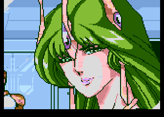](https://github.com/ivop/rc-archive/raw/master/G/Gaiares10.1.xex)
[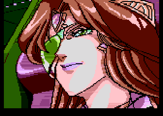](https://github.com/ivop/rc-archive/raw/master/G/Gaiares11.1.xex)
[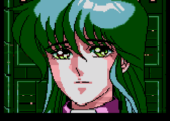](https://github.com/ivop/rc-archive/raw/master/G/Gaiares12.1.xex)
[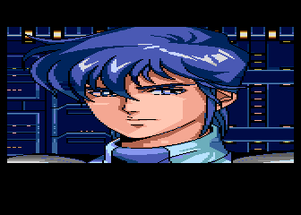](https://github.com/ivop/rc-archive/raw/master/G/Gaiares16.pal.xex)
[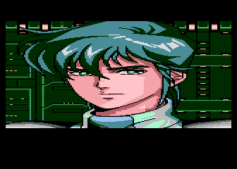](https://github.com/ivop/rc-archive/raw/master/G/Gaiares16.xex)
[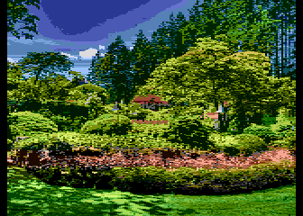](https://github.com/ivop/rc-archive/raw/master/G/Garden.xex)
[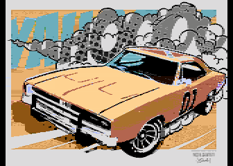](https://github.com/ivop/rc-archive/raw/master/G/GeneralLee.xex)
[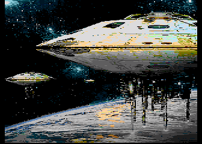](https://github.com/ivop/rc-archive/raw/master/G/geosynchronousorbit.xex)
[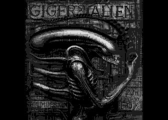](https://github.com/ivop/rc-archive/raw/master/G/gigerbw.xex)
[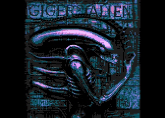](https://github.com/ivop/rc-archive/raw/master/G/gigercol.xex)
[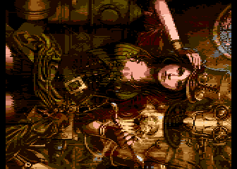](https://github.com/ivop/rc-archive/raw/master/G/GirlInTophatA.xex)
[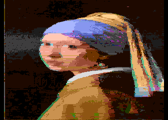](https://github.com/ivop/rc-archive/raw/master/G/GirlPE01.xex)
[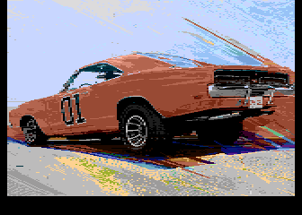](https://github.com/ivop/rc-archive/raw/master/G/GL01.xex)
[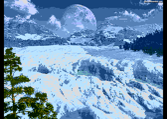](https://github.com/ivop/rc-archive/raw/master/G/GlacialMoon.xex)
[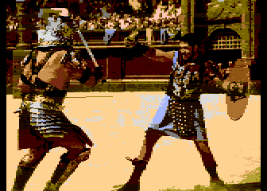](https://github.com/ivop/rc-archive/raw/master/G/Gladiator.xex)
[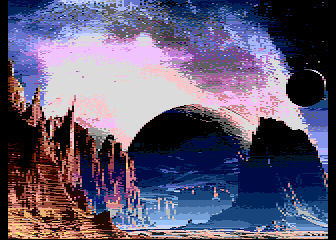](https://github.com/ivop/rc-archive/raw/master/G/Glatos6.xex)

[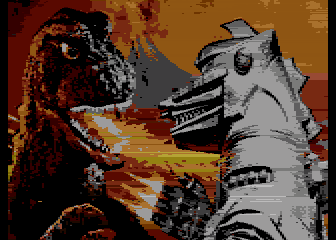](https://github.com/ivop/rc-archive/raw/master/G/Godzilla_vs_Mechagodzilla.xex)
[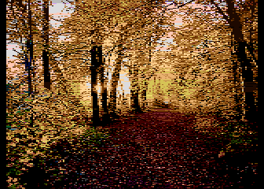](https://github.com/ivop/rc-archive/raw/master/G/GoldenForest.xex)
[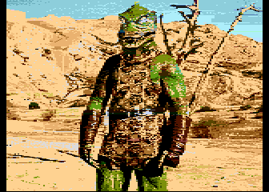](https://github.com/ivop/rc-archive/raw/master/G/GornCommander2.xex)
[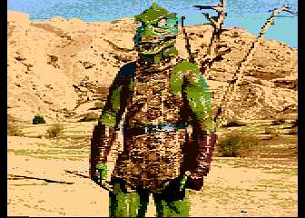](https://github.com/ivop/rc-archive/raw/master/G/GornCommander.xex)
[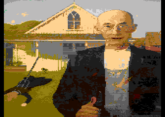](https://github.com/ivop/rc-archive/raw/master/G/gothic.xex)
[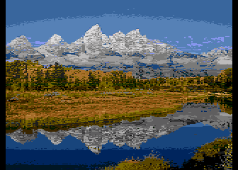](https://github.com/ivop/rc-archive/raw/master/G/GrandTeton1.xex)
[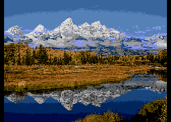](https://github.com/ivop/rc-archive/raw/master/G/GrandTeton.xex)
[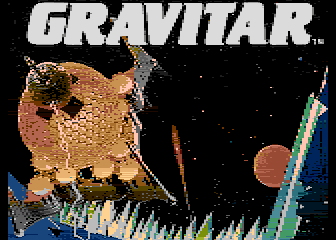](https://github.com/ivop/rc-archive/raw/master/G/Gravitar.xex)
[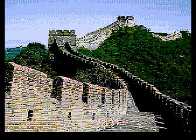](https://github.com/ivop/rc-archive/raw/master/G/GreatWallKDe86.xex)
[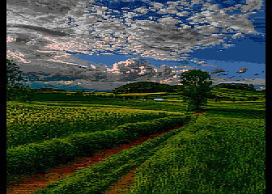](https://github.com/ivop/rc-archive/raw/master/G/GreenAcres2f.xex)
[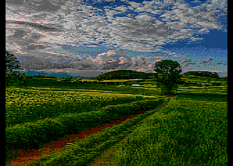](https://github.com/ivop/rc-archive/raw/master/G/green_acres_composite_test1.xex)

[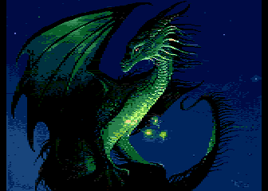](https://github.com/ivop/rc-archive/raw/master/G/GreenDragon.xex)
[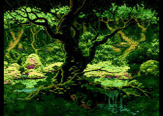](https://github.com/ivop/rc-archive/raw/master/G/GreenPoolGlade.xex)
[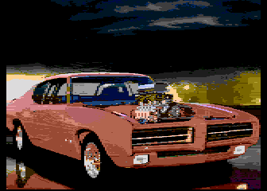](https://github.com/ivop/rc-archive/raw/master/G/GTOMuscle.xex)
[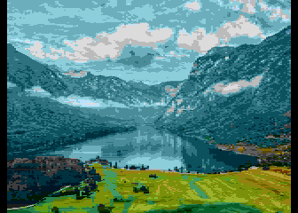](https://github.com/ivop/rc-archive/raw/master/G/gury_lake_bohinj.xex)
