[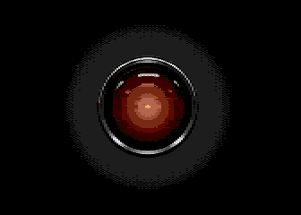](https://github.com/ivop/rc-archive/raw/master/H/HAL9000eyeb108.xex)
[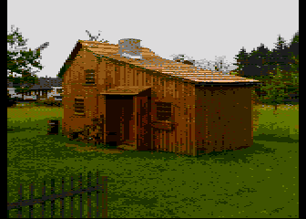](https://github.com/ivop/rc-archive/raw/master/H/HalfPintLittleHouse1.xex)
[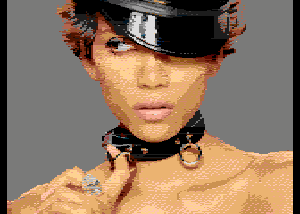](https://github.com/ivop/rc-archive/raw/master/H/Halle.xex)
[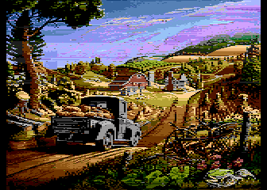](https://github.com/ivop/rc-archive/raw/master/H/HarvestValley208.xex)
[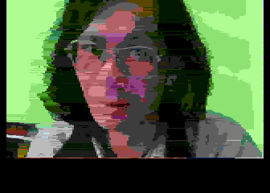](https://github.com/ivop/rc-archive/raw/master/H/Harvey--.xex)
[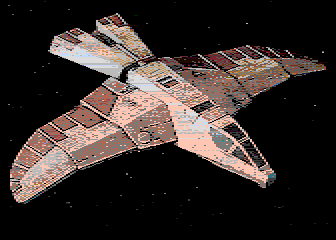](https://github.com/ivop/rc-archive/raw/master/H/HawksFighter2.xex)
[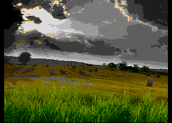](https://github.com/ivop/rc-archive/raw/master/H/HayField.xex)
[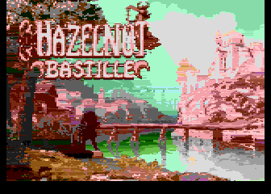](https://github.com/ivop/rc-archive/raw/master/H/Hazelnut.xex)
[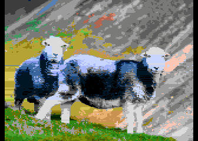](https://github.com/ivop/rc-archive/raw/master/H/Herdwick_4.xex)
[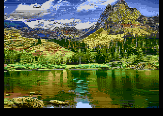](https://github.com/ivop/rc-archive/raw/master/H/HighCountryNTSC.xex)
[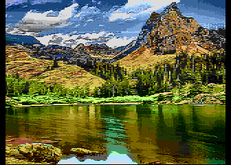](https://github.com/ivop/rc-archive/raw/master/H/HighCountryPAL.xex)
[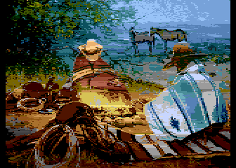](https://github.com/ivop/rc-archive/raw/master/H/HighPlainsDrifters.xex)
[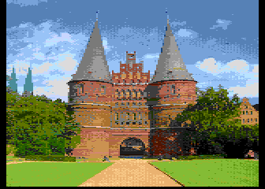](https://github.com/ivop/rc-archive/raw/master/H/Holstentor.xex)
[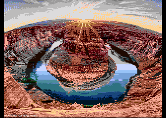](https://github.com/ivop/rc-archive/raw/master/H/HorseshoeBend.xex)

[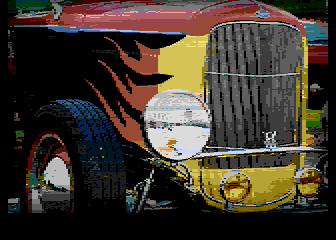](https://github.com/ivop/rc-archive/raw/master/H/HotRod.xex)

[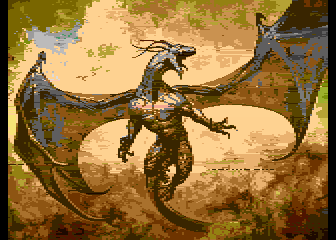](https://github.com/ivop/rc-archive/raw/master/H/HumanoidDragon.xex)
[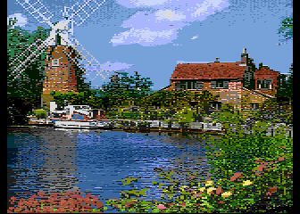](https://github.com/ivop/rc-archive/raw/master/H/HunsettMill.xex)
