[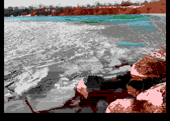](https://github.com/ivop/rc-archive/raw/master/I/icelake01.2.xex)
[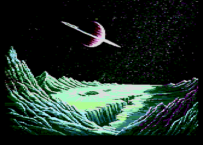](https://github.com/ivop/rc-archive/raw/master/I/IceMoon3.xex)
[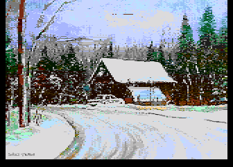](https://github.com/ivop/rc-archive/raw/master/I/IcyRoad120.xex)
[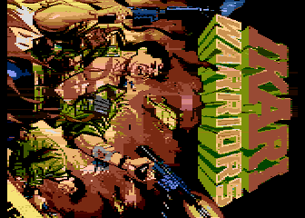](https://github.com/ivop/rc-archive/raw/master/I/IkariWarriors.xex)

[.png)](https://github.com/ivop/rc-archive/raw/master/I/IK%20Capitol%20PAL%20(2).xex)

[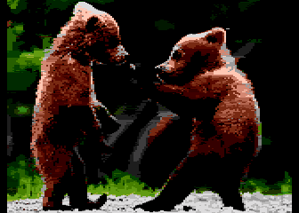](https://github.com/ivop/rc-archive/raw/master/I/IknowKarate.xex)

[.png)](https://github.com/ivop/rc-archive/raw/master/I/IK%20Taj%20PAL%20(2).xex)

[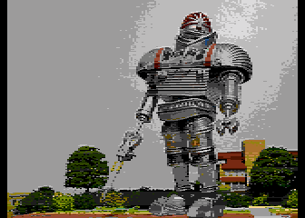](https://github.com/ivop/rc-archive/raw/master/I/i-Loiter57mil.xex)
[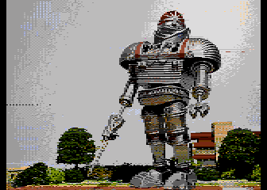](https://github.com/ivop/rc-archive/raw/master/I/i-LoiterD.xex)
[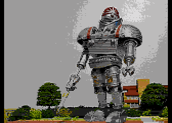](https://github.com/ivop/rc-archive/raw/master/I/i-Loiter.xex)
[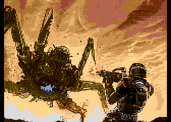](https://github.com/ivop/rc-archive/raw/master/I/InfantrySUCKS!.xex)
[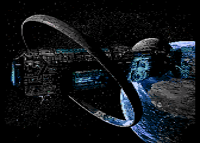](https://github.com/ivop/rc-archive/raw/master/I/InterGalactic.xex)

[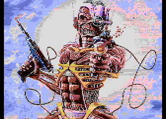](https://github.com/ivop/rc-archive/raw/master/I/IronMaidenCyborg.xex)
[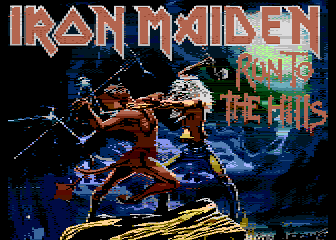](https://github.com/ivop/rc-archive/raw/master/I/IronMaidenRTTH.xex)
[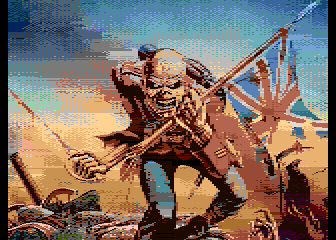](https://github.com/ivop/rc-archive/raw/master/I/IronMaidenTrooperPALd.xex)
[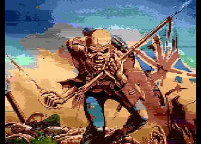](https://github.com/ivop/rc-archive/raw/master/I/IronMaidenTrooperPAL.xex)
[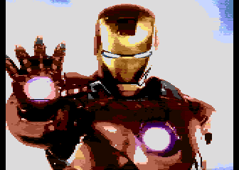](https://github.com/ivop/rc-archive/raw/master/I/Ironmansmincomplete2.xex)
[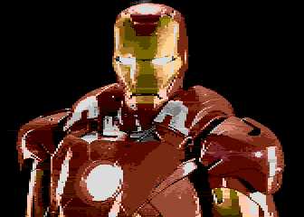](https://github.com/ivop/rc-archive/raw/master/I/ironmantorsocrop1smincomplete6.xex)
[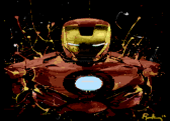](https://github.com/ivop/rc-archive/raw/master/I/Ironmanunleashed.xex)
[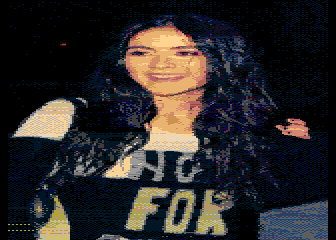](https://github.com/ivop/rc-archive/raw/master/I/isabelle.xex)
