[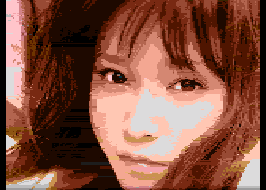](https://github.com/ivop/rc-archive/raw/master/K/Kanojo.xex)
[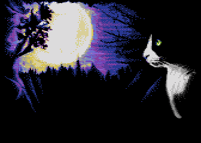](https://github.com/ivop/rc-archive/raw/master/K/Katze.xex)
[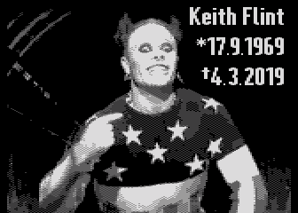](https://github.com/ivop/rc-archive/raw/master/K/Keith.xex)
[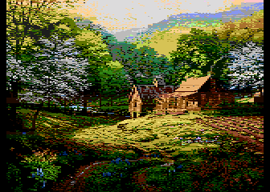](https://github.com/ivop/rc-archive/raw/master/K/KentuckyCountry.xex)
[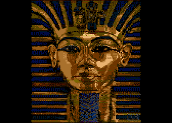](https://github.com/ivop/rc-archive/raw/master/K/KingTut.xex)

[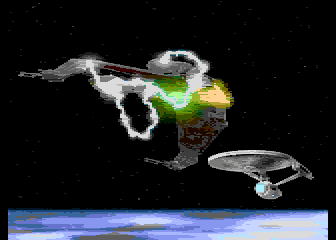](https://github.com/ivop/rc-archive/raw/master/K/KlingonLightshow.xex)
[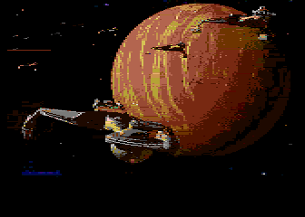](https://github.com/ivop/rc-archive/raw/master/K/KlingonShip.xex)
[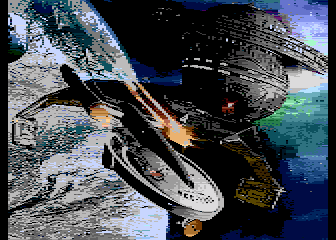](https://github.com/ivop/rc-archive/raw/master/K/Klingons!.xex)
[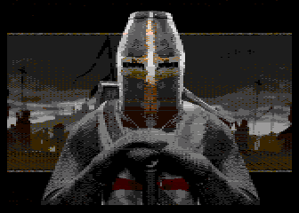](https://github.com/ivop/rc-archive/raw/master/K/KnightTemplar1.xex)
[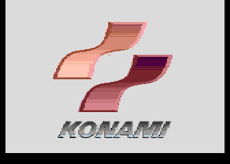](https://github.com/ivop/rc-archive/raw/master/K/Konami.xex)
[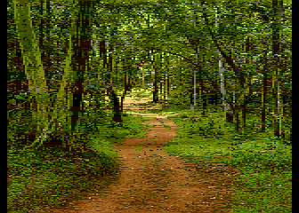](https://github.com/ivop/rc-archive/raw/master/K/KonniForest.xex)
[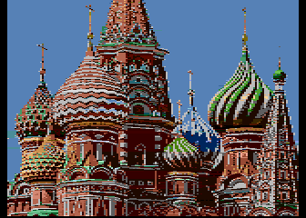](https://github.com/ivop/rc-archive/raw/master/K/Kremlin.xex)
[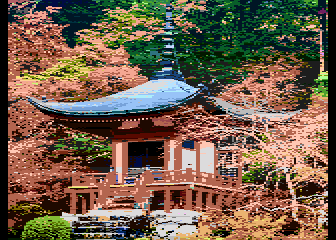](https://github.com/ivop/rc-archive/raw/master/K/Kyoto.xex)
