[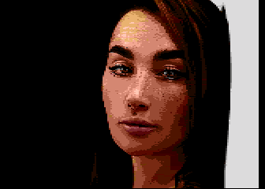](https://github.com/ivop/rc-archive/raw/master/L/Lady1.xex)
[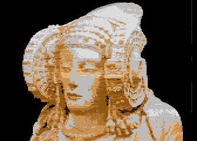](https://github.com/ivop/rc-archive/raw/master/L/LadyElche-09X.xex)
[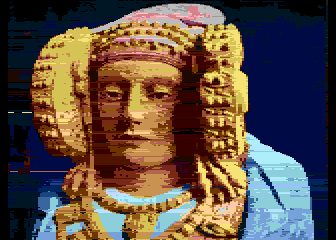](https://github.com/ivop/rc-archive/raw/master/L/Lady-Elche-colour.xex)
[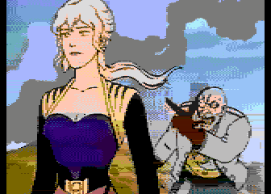](https://github.com/ivop/rc-archive/raw/master/L/lady_frenzy.xex)

[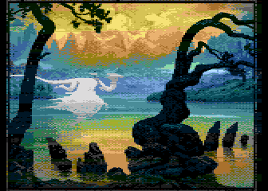](https://github.com/ivop/rc-archive/raw/master/L/lagoon.xex)
[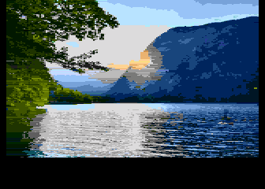](https://github.com/ivop/rc-archive/raw/master/L/lake-bohinj.xex)
[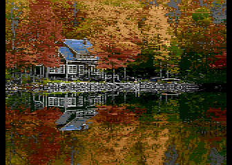](https://github.com/ivop/rc-archive/raw/master/L/LakeHouse.xex)
[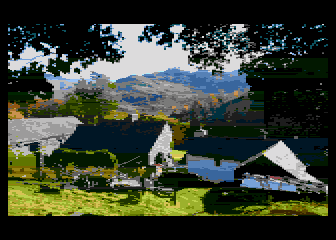](https://github.com/ivop/rc-archive/raw/master/L/Lakeland_farm_new.xex)
[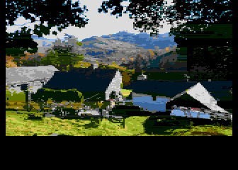](https://github.com/ivop/rc-archive/raw/master/L/Lakeland_farm_old.xex)
[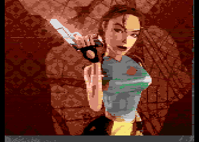](https://github.com/ivop/rc-archive/raw/master/L/LaraCroft.xex)
[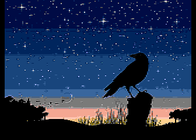](https://github.com/ivop/rc-archive/raw/master/L/LastCaw.xex)
[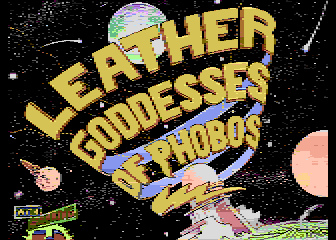](https://github.com/ivop/rc-archive/raw/master/L/LeatherGOP.xex)
[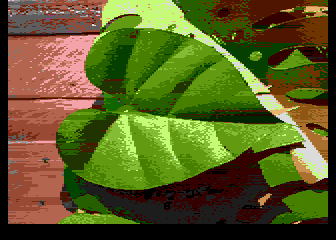](https://github.com/ivop/rc-archive/raw/master/L/leaves01.xex)
[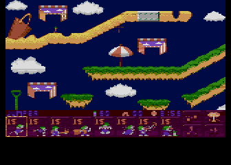](https://github.com/ivop/rc-archive/raw/master/L/Lemmingbeach1.xex)
[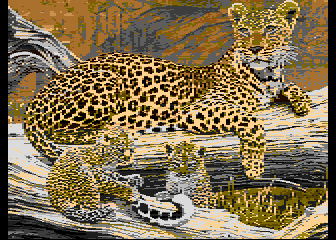](https://github.com/ivop/rc-archive/raw/master/L/Leopard&Cubs.xex)
[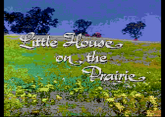](https://github.com/ivop/rc-archive/raw/master/L/LHOPTitle.xex)
[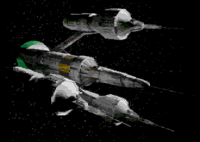](https://github.com/ivop/rc-archive/raw/master/L/Liberator_drpeter.xex)
[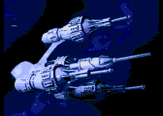](https://github.com/ivop/rc-archive/raw/master/L/Liberator.xex)
[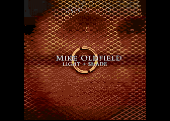](https://github.com/ivop/rc-archive/raw/master/L/LightAndShade.xex)
[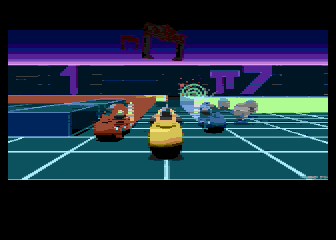](https://github.com/ivop/rc-archive/raw/master/L/LightCycles-AB2600.xex)
[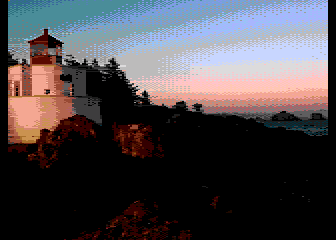](https://github.com/ivop/rc-archive/raw/master/L/LIGHTHOUSE.xex)
[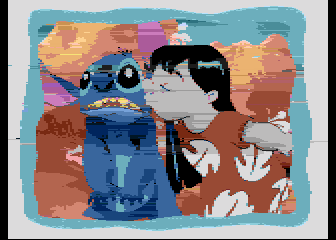](https://github.com/ivop/rc-archive/raw/master/L/Lilo-Stitch--.xex)

[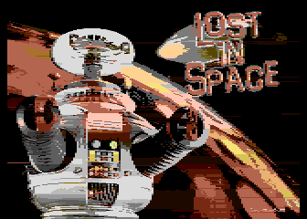](https://github.com/ivop/rc-archive/raw/master/L/LIS_B9.xex)
[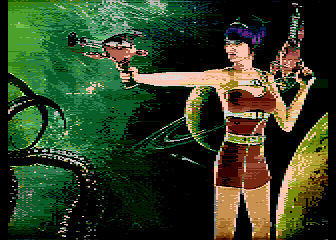](https://github.com/ivop/rc-archive/raw/master/L/LittleRedDress.xex)
[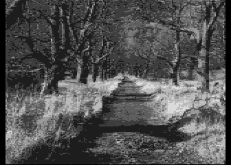](https://github.com/ivop/rc-archive/raw/master/L/LonesomeRoad.xex)

[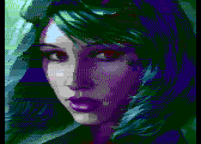](https://github.com/ivop/rc-archive/raw/master/L/lost.xex)
[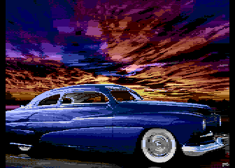](https://github.com/ivop/rc-archive/raw/master/L/LowBluRider.xex)
[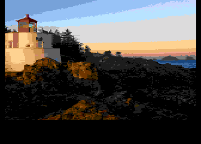](https://github.com/ivop/rc-archive/raw/master/L/lt176.xex)
[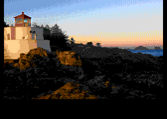](https://github.com/ivop/rc-archive/raw/master/L/lt35M.xex)
[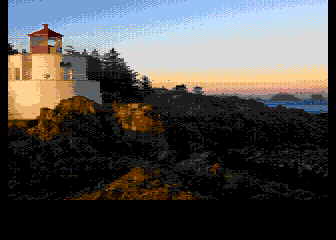](https://github.com/ivop/rc-archive/raw/master/L/lt.xex)
[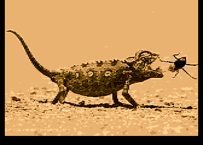](https://github.com/ivop/rc-archive/raw/master/L/Lunch.xex)
[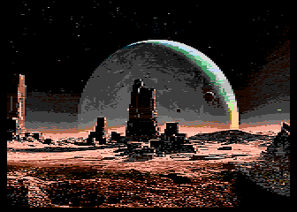](https://github.com/ivop/rc-archive/raw/master/L/Lusion10.xex)
