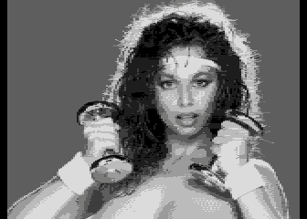
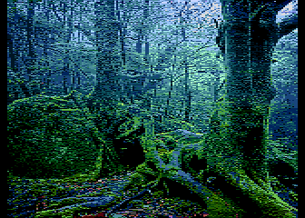

[.png)](https://github.com/ivop/rc-archive/raw/master/M/MAX1%20(1).xex)

[.png)](https://github.com/ivop/rc-archive/raw/master/M/MountainFlowers1a%20(1).xex)

[.png)](https://github.com/ivop/rc-archive/raw/master/M/Mullets%20Rock%20(10%20million).xex)

