[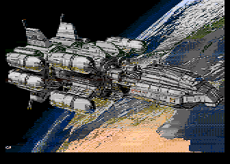](https://github.com/ivop/rc-archive/raw/master/N/NasaConcept2.xex)
[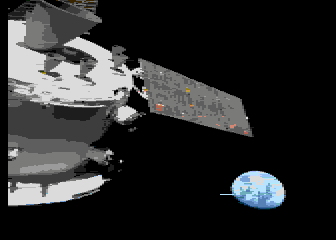](https://github.com/ivop/rc-archive/raw/master/N/nasa-earth-view.xex)
[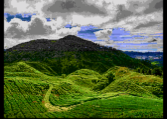](https://github.com/ivop/rc-archive/raw/master/N/Natural.xex)
[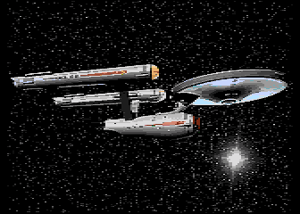](https://github.com/ivop/rc-archive/raw/master/N/NCC-1701.xex)
[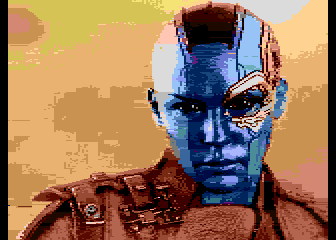](https://github.com/ivop/rc-archive/raw/master/N/nebular2smincomplete4.xex)
[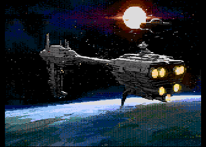](https://github.com/ivop/rc-archive/raw/master/N/NebulonFrigate2d.xex)
[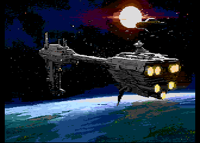](https://github.com/ivop/rc-archive/raw/master/N/NebulonFrigate3.xex)
[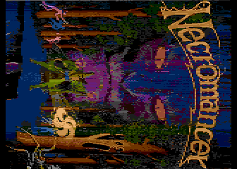](https://github.com/ivop/rc-archive/raw/master/N/Necromancer1.xex)
[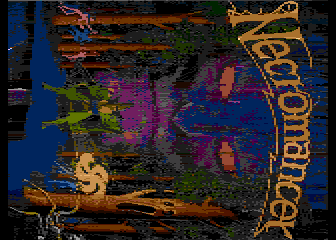](https://github.com/ivop/rc-archive/raw/master/N/NecromancerA.xex)

[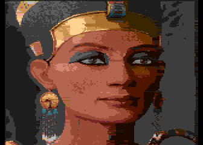](https://github.com/ivop/rc-archive/raw/master/N/Nefertiti-new2.xex)
[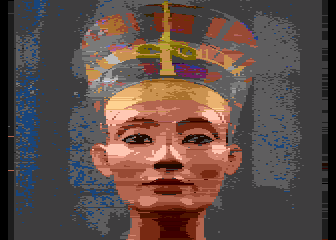](https://github.com/ivop/rc-archive/raw/master/N/Nefertiti-new.xex)

[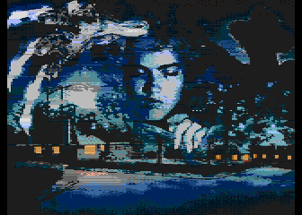](https://github.com/ivop/rc-archive/raw/master/N/nightmareonelmstreet.xex)
[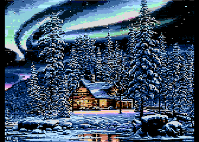](https://github.com/ivop/rc-archive/raw/master/N/NorthernRetreat60d.xex)
[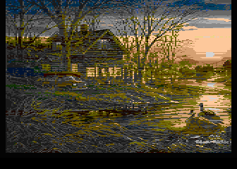](https://github.com/ivop/rc-archive/raw/master/N/NovemberMorningNTSC.xex)
[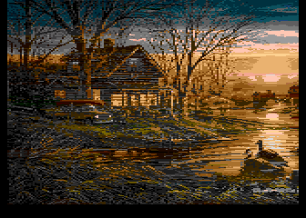](https://github.com/ivop/rc-archive/raw/master/N/NovemberMorningPAL.xex)
[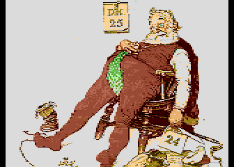](https://github.com/ivop/rc-archive/raw/master/N/NRKringlesDayOff.xex)

[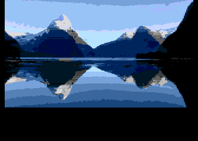](https://github.com/ivop/rc-archive/raw/master/N/NZ-Win28-Mpeak.xex)
