[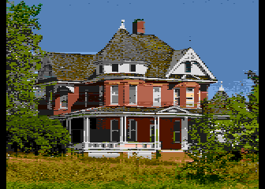](https://github.com/ivop/rc-archive/raw/master/O/OBCPoorFarmhouse.xex)
[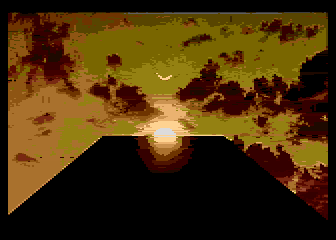](https://github.com/ivop/rc-archive/raw/master/O/Obelisk2001.xex)
[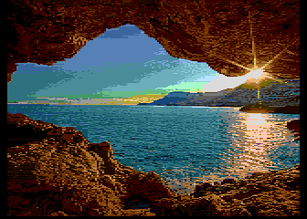](https://github.com/ivop/rc-archive/raw/master/O/OceanCave.xex)
[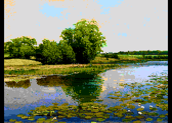](https://github.com/ivop/rc-archive/raw/master/O/OklahomaSummer.xex)
[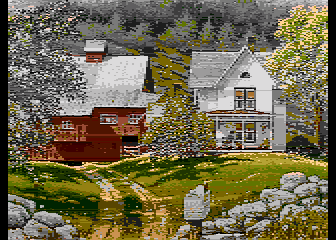](https://github.com/ivop/rc-archive/raw/master/O/OldFarmHouse228.xex)
[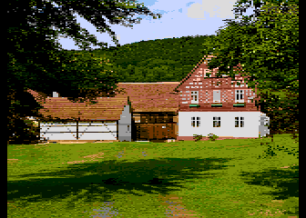](https://github.com/ivop/rc-archive/raw/master/O/OldMilikovFarm.xex)
[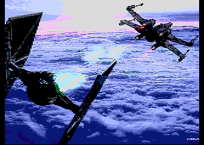](https://github.com/ivop/rc-archive/raw/master/O/OnYour6Red5!.xex)
[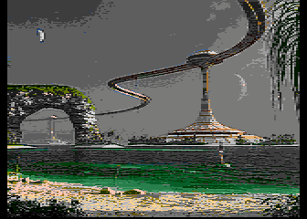](https://github.com/ivop/rc-archive/raw/master/O/Opal970.xex)
[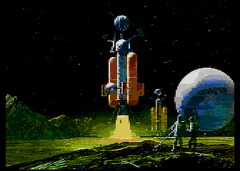](https://github.com/ivop/rc-archive/raw/master/O/OrbsInSpace.xex)
[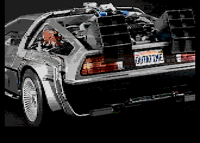](https://github.com/ivop/rc-archive/raw/master/O/OUTATIME-FullControlImage.xex)
[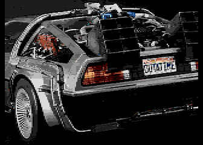](https://github.com/ivop/rc-archive/raw/master/O/OUTATIME.xex)
[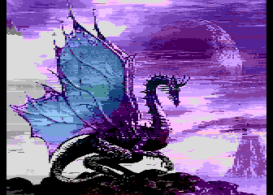](https://github.com/ivop/rc-archive/raw/master/O/OutlandDragon.xex)
[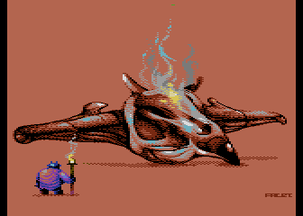](https://github.com/ivop/rc-archive/raw/master/O/output1.xex)
[.png)](https://github.com/ivop/rc-archive/raw/master/O/output(Mario_FF).xex)
[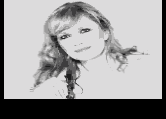](https://github.com/ivop/rc-archive/raw/master/O/output.xex)
