[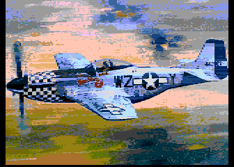](https://github.com/ivop/rc-archive/raw/master/P/P51Mustang.xex)
[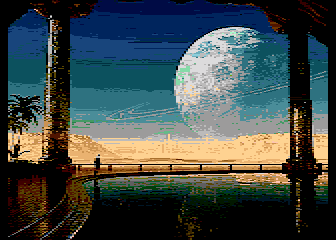](https://github.com/ivop/rc-archive/raw/master/P/PalaceBath.xex)
[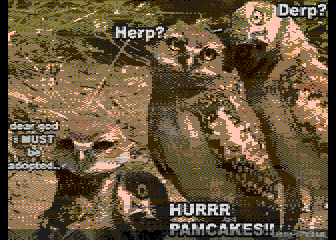](https://github.com/ivop/rc-archive/raw/master/P/pamcakes.xex)
[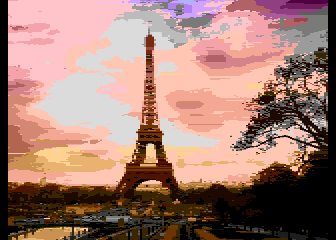](https://github.com/ivop/rc-archive/raw/master/P/paris.xex)
[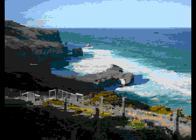](https://github.com/ivop/rc-archive/raw/master/P/Path-2-TunnelBeach-2.xex)
[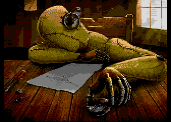](https://github.com/ivop/rc-archive/raw/master/P/Perplexing.xex)
[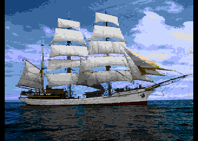](https://github.com/ivop/rc-archive/raw/master/P/PictonCastle.xex)
[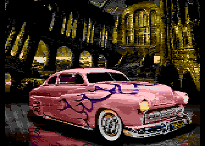](https://github.com/ivop/rc-archive/raw/master/P/PinkMerc.xex)
[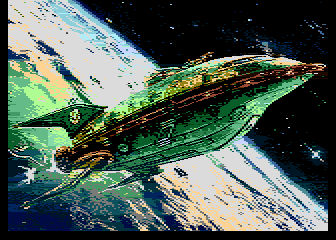](https://github.com/ivop/rc-archive/raw/master/P/PlanetExpress.xex)
[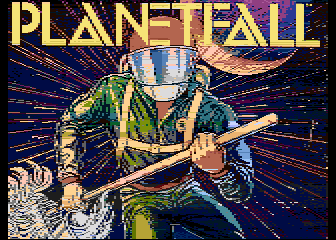](https://github.com/ivop/rc-archive/raw/master/P/Planetfall.xex)
[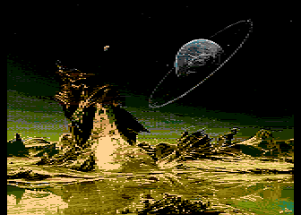](https://github.com/ivop/rc-archive/raw/master/P/PlanetX.xex)
[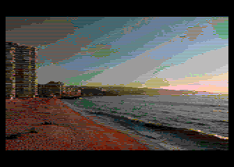](https://github.com/ivop/rc-archive/raw/master/P/playa1.xex)
[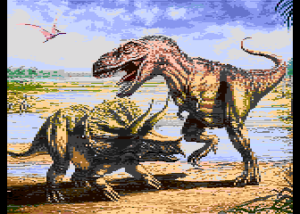](https://github.com/ivop/rc-archive/raw/master/P/Playmates.xex)
[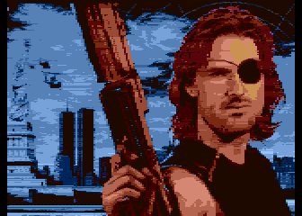](https://github.com/ivop/rc-archive/raw/master/P/plissken.xex)
[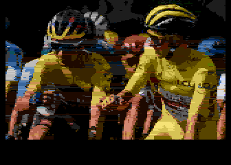](https://github.com/ivop/rc-archive/raw/master/P/pogacar_and_roglic.xex)
[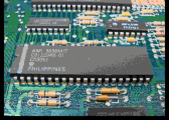](https://github.com/ivop/rc-archive/raw/master/P/pokey.xex)
[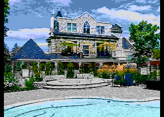](https://github.com/ivop/rc-archive/raw/master/P/Poolside.xex)
[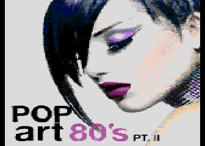](https://github.com/ivop/rc-archive/raw/master/P/PopArt80s.xex)
[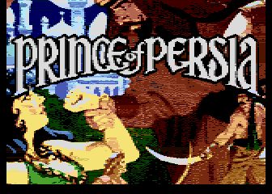](https://github.com/ivop/rc-archive/raw/master/P/POPa.xex)
[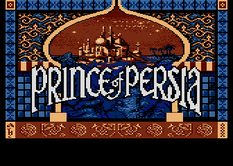](https://github.com/ivop/rc-archive/raw/master/P/POP_Title_RC_V3.xex)
[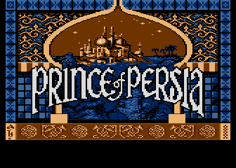](https://github.com/ivop/rc-archive/raw/master/P/POP_Title_RC.xex)
[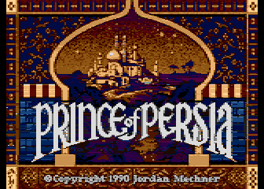](https://github.com/ivop/rc-archive/raw/master/P/pop.xex)
[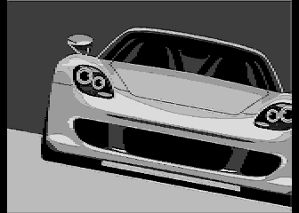](https://github.com/ivop/rc-archive/raw/master/P/PorscheCarrera.xex)
[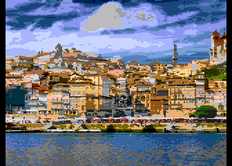](https://github.com/ivop/rc-archive/raw/master/P/porto.xex)
[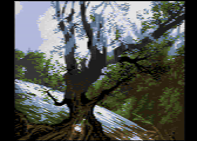](https://github.com/ivop/rc-archive/raw/master/P/post-18200-0-21321900-1421290116.xex)
[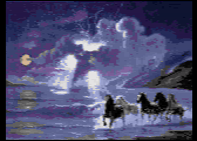](https://github.com/ivop/rc-archive/raw/master/P/post-4727-0-41753800-1447702711.xex)
[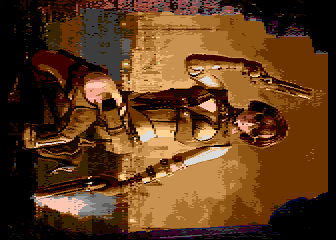](https://github.com/ivop/rc-archive/raw/master/P/PrettyDeadlyIIb.xex)
[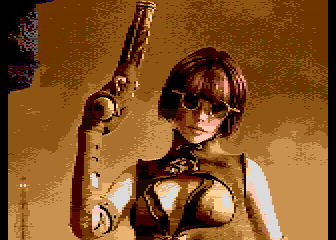](https://github.com/ivop/rc-archive/raw/master/P/PrettyDeadly.xex)
[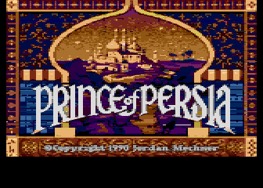](https://github.com/ivop/rc-archive/raw/master/P/princeofpersiascreen2incomplete8.xex)
[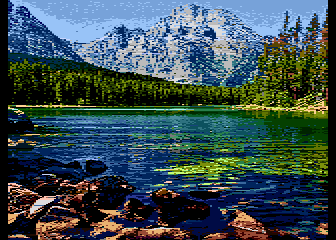](https://github.com/ivop/rc-archive/raw/master/P/Pristine.xex)
[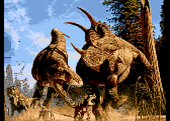](https://github.com/ivop/rc-archive/raw/master/P/ProtectiveMother.xex)
[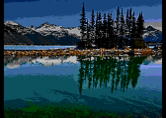](https://github.com/ivop/rc-archive/raw/master/P/PureNorth.xex)
[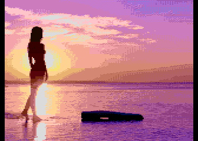](https://github.com/ivop/rc-archive/raw/master/P/PurpleBeach.xex)
[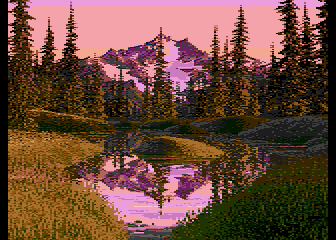](https://github.com/ivop/rc-archive/raw/master/P/PurpleMountainMajesty.xex)

