[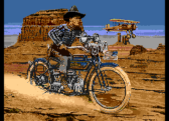](https://github.com/ivop/rc-archive/raw/master/R/RacingWest1928.xex)
[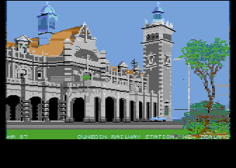](https://github.com/ivop/rc-archive/raw/master/R/RailwayStation.xex)
[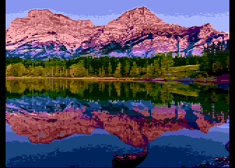](https://github.com/ivop/rc-archive/raw/master/R/RainbowLake.xex)
[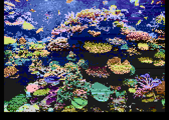](https://github.com/ivop/rc-archive/raw/master/R/RainbowReefNTSC.xex)
[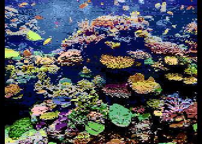](https://github.com/ivop/rc-archive/raw/master/R/RainbowReef.xex)
[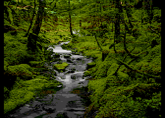](https://github.com/ivop/rc-archive/raw/master/R/RainforestCreek.xex)
[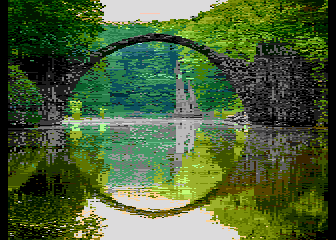](https://github.com/ivop/rc-archive/raw/master/R/Rakotzbrucke.xex)
[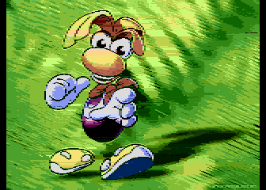](https://github.com/ivop/rc-archive/raw/master/R/Rayman.xex)
[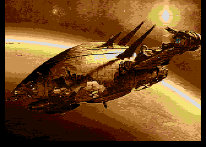](https://github.com/ivop/rc-archive/raw/master/R/Reavership.xex)
[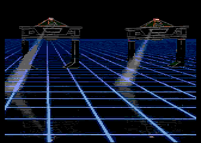](https://github.com/ivop/rc-archive/raw/master/R/Recognizers.xex)
[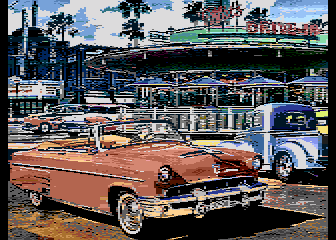](https://github.com/ivop/rc-archive/raw/master/R/RedConvertible.xex)
[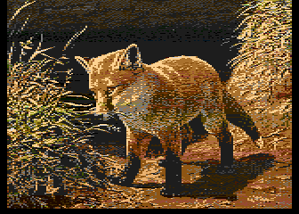](https://github.com/ivop/rc-archive/raw/master/R/redfoxpup3.xex)
[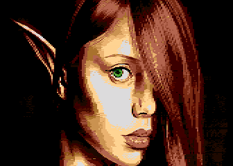](https://github.com/ivop/rc-archive/raw/master/R/redheadelfedit2smincomplete5.xex)
[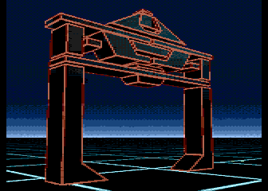](https://github.com/ivop/rc-archive/raw/master/R/RedRecognizer.xex)
[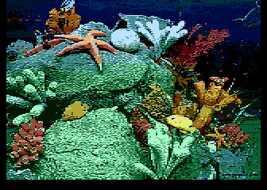](https://github.com/ivop/rc-archive/raw/master/R/ReefsEnd.xex)
[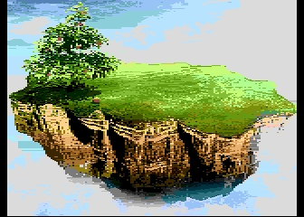](https://github.com/ivop/rc-archive/raw/master/R/RelativityOfGravity.xex)
[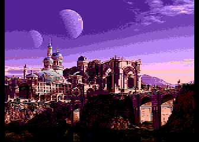](https://github.com/ivop/rc-archive/raw/master/R/RequiemforMethuselah.xex)
[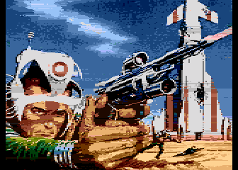](https://github.com/ivop/rc-archive/raw/master/R/ReturningFire.xex)
[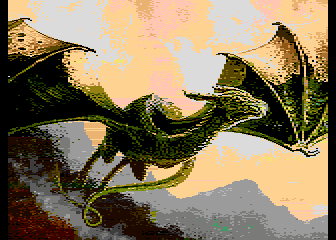](https://github.com/ivop/rc-archive/raw/master/R/Rhaegal.xex)
[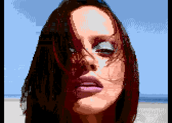](https://github.com/ivop/rc-archive/raw/master/R/RicciFace.xex)
[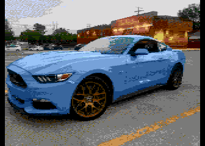](https://github.com/ivop/rc-archive/raw/master/R/rickscarsm1_05_fixed.xex)
[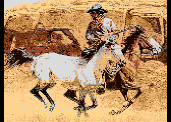](https://github.com/ivop/rc-archive/raw/master/R/RidingShotgun.xex)
[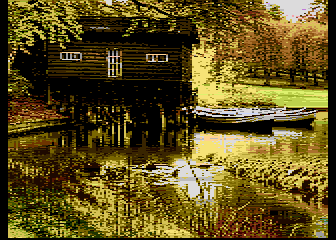](https://github.com/ivop/rc-archive/raw/master/R/RifleCreekDocks.xex)
[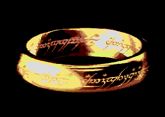](https://github.com/ivop/rc-archive/raw/master/R/ring.xex)
[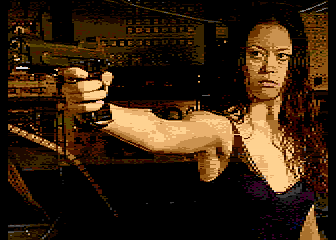](https://github.com/ivop/rc-archive/raw/master/R/RiverGotGun.xex)
[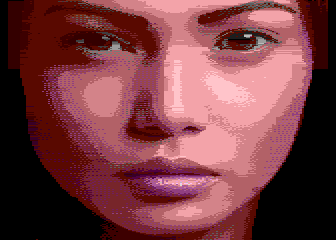](https://github.com/ivop/rc-archive/raw/master/R/rl_face.xex)
[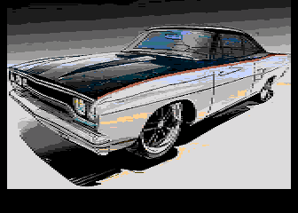](https://github.com/ivop/rc-archive/raw/master/R/RoadRunnerConcept.xex)
[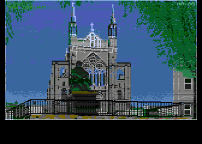](https://github.com/ivop/rc-archive/raw/master/R/RobbieBurns.xex)
[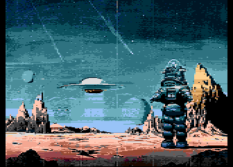](https://github.com/ivop/rc-archive/raw/master/R/Robbie.xex)
[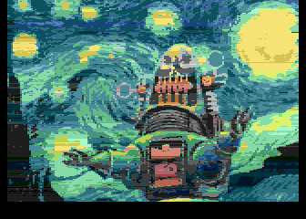](https://github.com/ivop/rc-archive/raw/master/R/Robby-StarryNight.xex)
[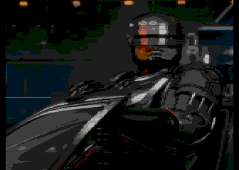](https://github.com/ivop/rc-archive/raw/master/R/Robo1.xex)
[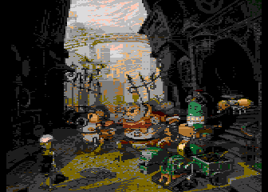](https://github.com/ivop/rc-archive/raw/master/R/robots.xex)
[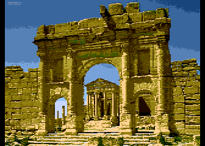](https://github.com/ivop/rc-archive/raw/master/R/RomanRuins.xex)
[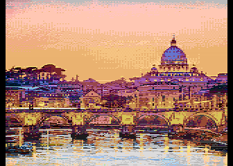](https://github.com/ivop/rc-archive/raw/master/R/RomeDe96.xex)
[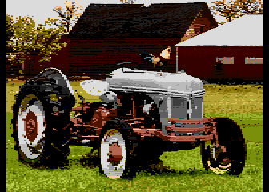](https://github.com/ivop/rc-archive/raw/master/R/RoosterOnTractorZ1.xex)
[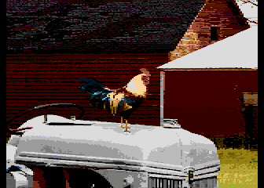](https://github.com/ivop/rc-archive/raw/master/R/RoosterOnTractorZ2.xex)
[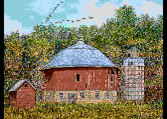](https://github.com/ivop/rc-archive/raw/master/R/Roundbarn.xex)
[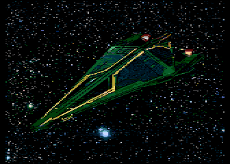](https://github.com/ivop/rc-archive/raw/master/R/RoyalCruiser.xex)
[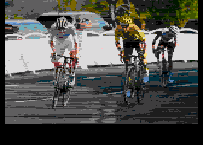](https://github.com/ivop/rc-archive/raw/master/R/rp_ttf.xex)
[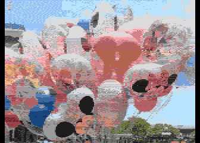](https://github.com/ivop/rc-archive/raw/master/R/rra_disney_balloons.xex)
[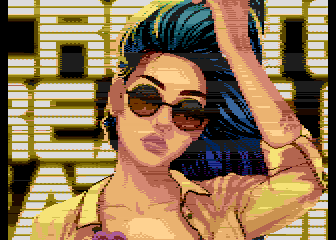](https://github.com/ivop/rc-archive/raw/master/R/rtrogirl.xex)
[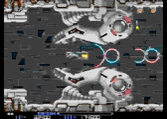](https://github.com/ivop/rc-archive/raw/master/R/R-Type-03B.xex)
[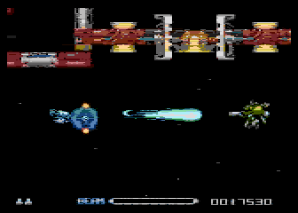](https://github.com/ivop/rc-archive/raw/master/R/R-Type3-SNES-01.xex)
[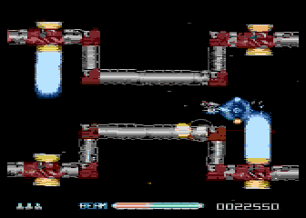](https://github.com/ivop/rc-archive/raw/master/R/R-type3-SNES-03C.xex)
[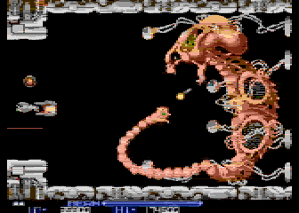](https://github.com/ivop/rc-archive/raw/master/R/rtype-game.xex)
[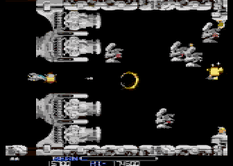](https://github.com/ivop/rc-archive/raw/master/R/R-Type-game.xex)
[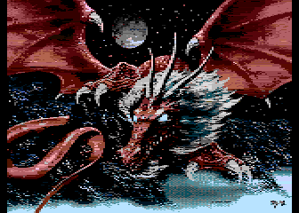](https://github.com/ivop/rc-archive/raw/master/R/RubyDragon.xex)
[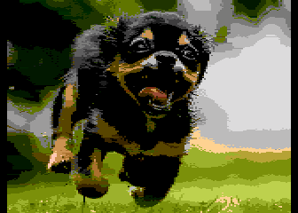](https://github.com/ivop/rc-archive/raw/master/R/RunningPuppy.xex)
[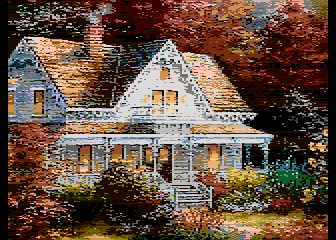](https://github.com/ivop/rc-archive/raw/master/R/RuralHome.xex)
[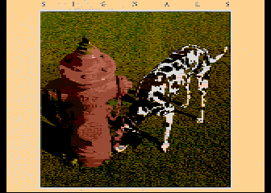](https://github.com/ivop/rc-archive/raw/master/R/RushSignals.xex)
