[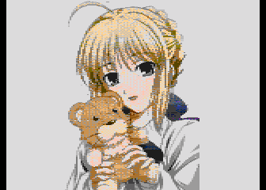](https://github.com/ivop/rc-archive/raw/master/S/saber.xex)
[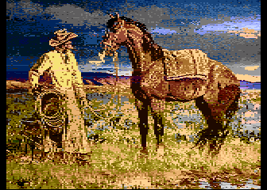](https://github.com/ivop/rc-archive/raw/master/S/SaddleUp.xex)
[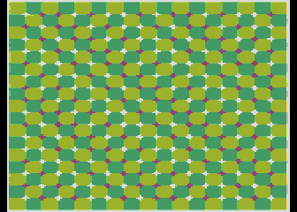](https://github.com/ivop/rc-archive/raw/master/S/sakuras2b.xex)
[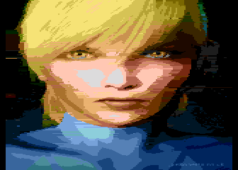](https://github.com/ivop/rc-archive/raw/master/S/Samus-02.xex)
[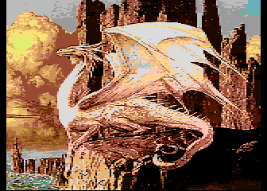](https://github.com/ivop/rc-archive/raw/master/S/SandDragon.xex)
[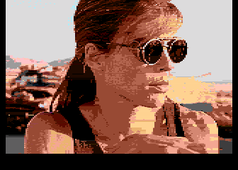](https://github.com/ivop/rc-archive/raw/master/S/SaraConner.xex)
[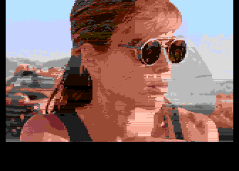](https://github.com/ivop/rc-archive/raw/master/S/Sarah-Connor-.xex)
[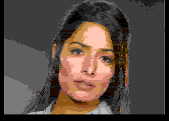](https://github.com/ivop/rc-archive/raw/master/S/Sarah-Shahi.xex)
[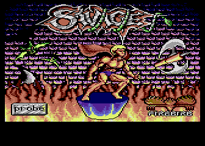](https://github.com/ivop/rc-archive/raw/master/S/Savage.xex)
[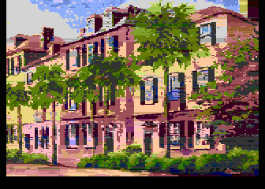](https://github.com/ivop/rc-archive/raw/master/S/SavannaNTSC.xex)
[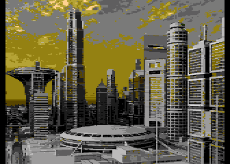](https://github.com/ivop/rc-archive/raw/master/S/SciFiCity.xex)
[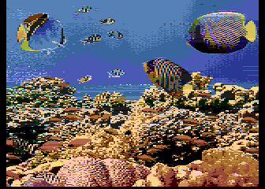](https://github.com/ivop/rc-archive/raw/master/S/Sealife.xex)
[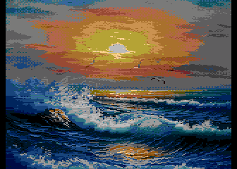](https://github.com/ivop/rc-archive/raw/master/S/SeasideSunset.xex)
[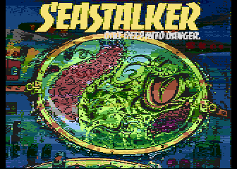](https://github.com/ivop/rc-archive/raw/master/S/Seastalker.xex)
[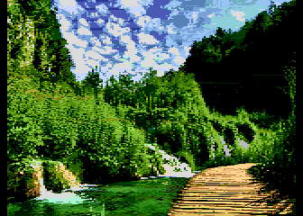](https://github.com/ivop/rc-archive/raw/master/S/SecretCroatia.xex)

[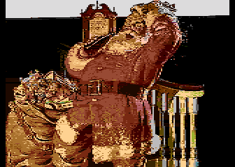](https://github.com/ivop/rc-archive/raw/master/S/SelloutSanta.xex)
[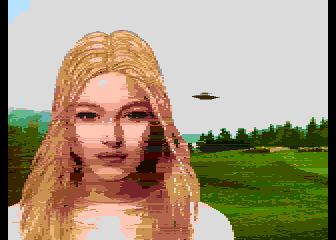](https://github.com/ivop/rc-archive/raw/master/S/Semjase-UFO.xex)
[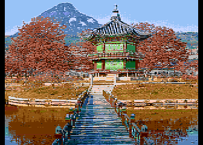](https://github.com/ivop/rc-archive/raw/master/S/Seoul.xex)
[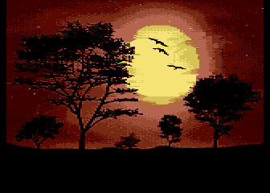](https://github.com/ivop/rc-archive/raw/master/S/SerengetiEvening.xex)
[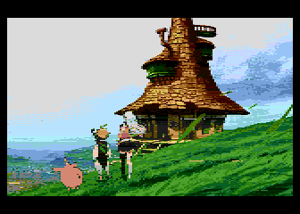](https://github.com/ivop/rc-archive/raw/master/S/sevensinshousesm1_06_FIXED_Centered.xex)
[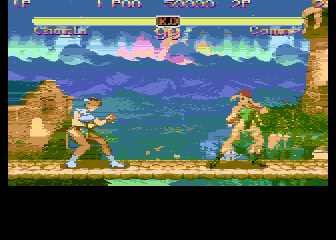](https://github.com/ivop/rc-archive/raw/master/S/SF2-ChunLi-01.xex)
[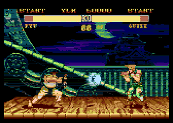](https://github.com/ivop/rc-archive/raw/master/S/SF2-Ryu-vs-Guile.xex)
[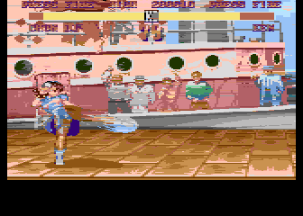](https://github.com/ivop/rc-archive/raw/master/S/SF2-SNES.xex)
[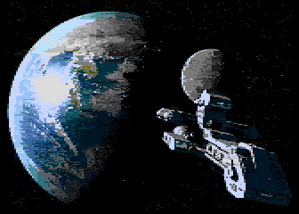](https://github.com/ivop/rc-archive/raw/master/S/SG-1Prometheus.xex)
[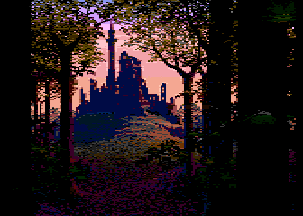](https://github.com/ivop/rc-archive/raw/master/S/ShadowsOfTwilight.xex)
[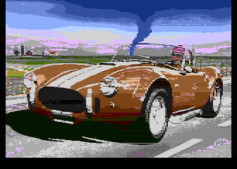](https://github.com/ivop/rc-archive/raw/master/S/ShelbyCobraNTSC.xex)
[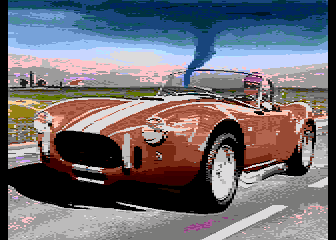](https://github.com/ivop/rc-archive/raw/master/S/ShelbyCobraPAL.xex)
[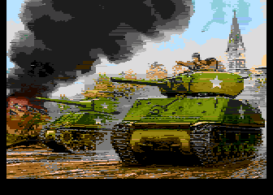](https://github.com/ivop/rc-archive/raw/master/S/ShermanTanks3.xex)
[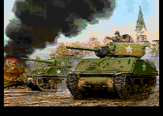](https://github.com/ivop/rc-archive/raw/master/S/ShermanTanksD.xex)
[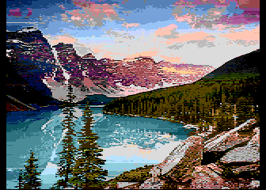](https://github.com/ivop/rc-archive/raw/master/S/Sierra.xex)
[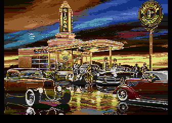](https://github.com/ivop/rc-archive/raw/master/S/SignalGasNTSC.xex)
[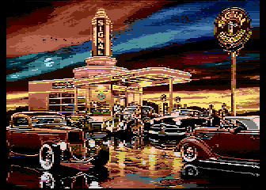](https://github.com/ivop/rc-archive/raw/master/S/SignalGas.xex)
[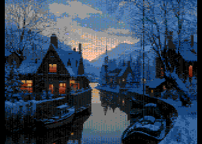](https://github.com/ivop/rc-archive/raw/master/S/Silence.xex)
[.png)](https://github.com/ivop/rc-archive/raw/master/S/Silent%20Service%20(Title).xex)
[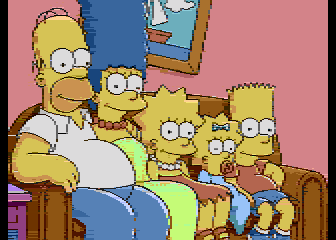](https://github.com/ivop/rc-archive/raw/master/S/simpsonscouchsmincomplete9.xex)
[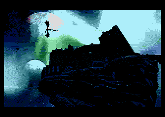](https://github.com/ivop/rc-archive/raw/master/S/SkyrimMoondragonsm1_01_FIXED_CENTERED.xex)
[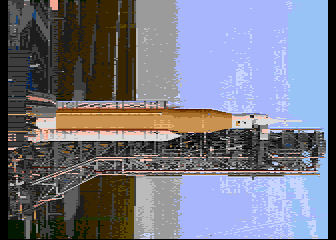](https://github.com/ivop/rc-archive/raw/master/S/SLSlaunchpad.xex)
[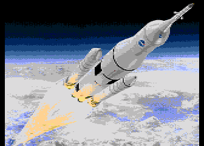](https://github.com/ivop/rc-archive/raw/master/S/SLSRocket.xex)
[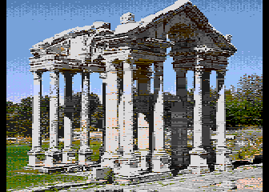](https://github.com/ivop/rc-archive/raw/master/S/SmallTemple.xex)
[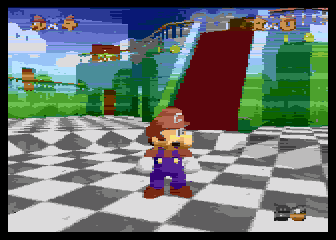](https://github.com/ivop/rc-archive/raw/master/S/SMario-64-2.xex)
[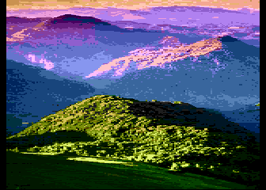](https://github.com/ivop/rc-archive/raw/master/S/SmokeyMountians.xex)
[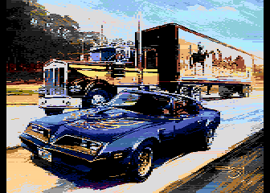](https://github.com/ivop/rc-archive/raw/master/S/Smokey_n_Bandit.xex)
[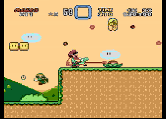](https://github.com/ivop/rc-archive/raw/master/S/SMW-00.xex)
[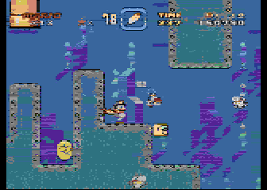](https://github.com/ivop/rc-archive/raw/master/S/SMW-07.xex)
[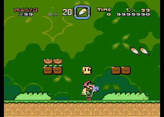](https://github.com/ivop/rc-archive/raw/master/S/SMWorld-01.xex)
[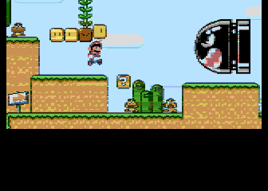](https://github.com/ivop/rc-archive/raw/master/S/SMWorld-02.xex)
[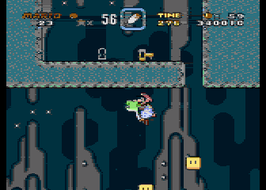](https://github.com/ivop/rc-archive/raw/master/S/SMWorld-03.xex)
[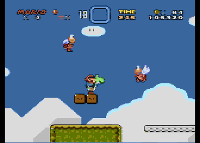](https://github.com/ivop/rc-archive/raw/master/S/SMWorld-04.xex)
[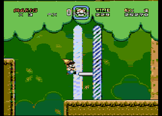](https://github.com/ivop/rc-archive/raw/master/S/SMWorld-06.xex)
[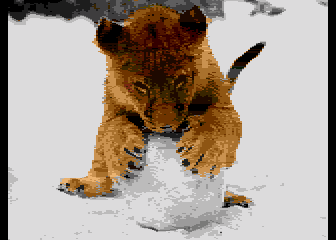](https://github.com/ivop/rc-archive/raw/master/S/Snoball.xex)
[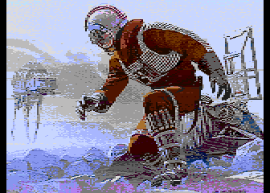](https://github.com/ivop/rc-archive/raw/master/S/SnowCrash_BattleOfHoth.xex)
[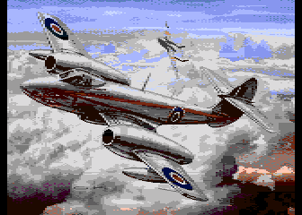](https://github.com/ivop/rc-archive/raw/master/S/Soaring.xex)
[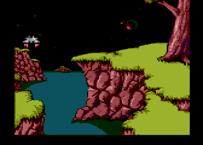](https://github.com/ivop/rc-archive/raw/master/S/solar01.xex)
[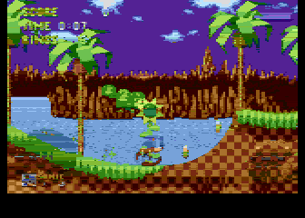](https://github.com/ivop/rc-archive/raw/master/S/Sonic-01B.xex)
[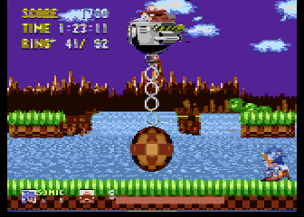](https://github.com/ivop/rc-archive/raw/master/S/Sonic-02B.xex)
[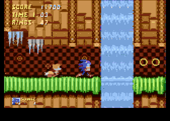](https://github.com/ivop/rc-archive/raw/master/S/Sonic-03D.xex)
[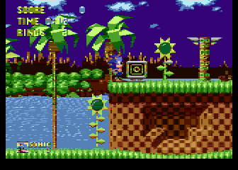](https://github.com/ivop/rc-archive/raw/master/S/Sonic-08Z.xex)
[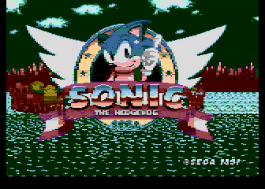](https://github.com/ivop/rc-archive/raw/master/S/Sonic1.xex)
[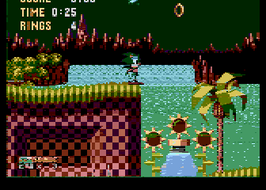](https://github.com/ivop/rc-archive/raw/master/S/Sonic2.xex)
[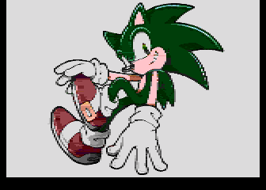](https://github.com/ivop/rc-archive/raw/master/S/Sonic3.xex)
[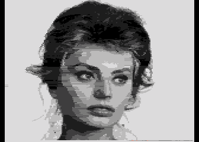](https://github.com/ivop/rc-archive/raw/master/S/SophiaLoren.xex)
[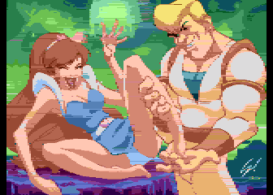](https://github.com/ivop/rc-archive/raw/master/S/SpaceAce--Fanart.xex)
[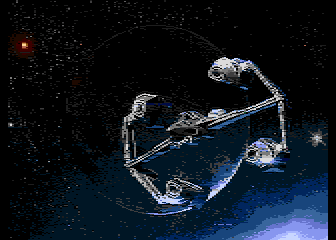](https://github.com/ivop/rc-archive/raw/master/S/SpaceFighter.xex)
[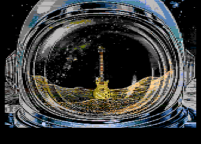](https://github.com/ivop/rc-archive/raw/master/S/SpaceFunk.xex)
[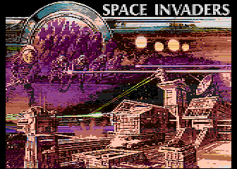](https://github.com/ivop/rc-archive/raw/master/S/SpaceInvaders.xex)
[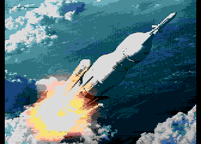](https://github.com/ivop/rc-archive/raw/master/S/SpaceLaunchSystem.xex)
[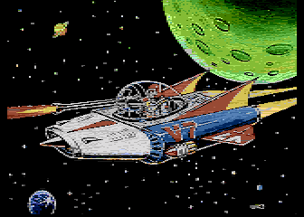](https://github.com/ivop/rc-archive/raw/master/S/SpaceRangerV7.xex)
[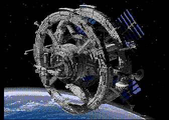](https://github.com/ivop/rc-archive/raw/master/S/SpaceStation.xex)
[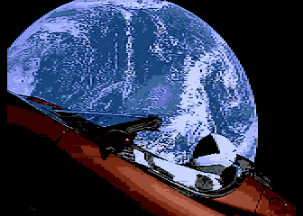](https://github.com/ivop/rc-archive/raw/master/S/Space-X_Starman.xex)
[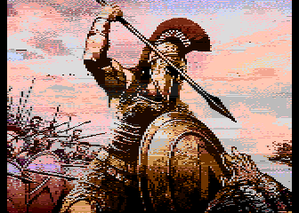](https://github.com/ivop/rc-archive/raw/master/S/Spartan.xex)
[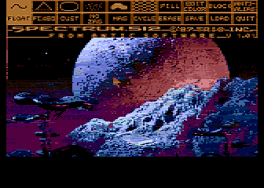](https://github.com/ivop/rc-archive/raw/master/S/Spectrum512.xex)
[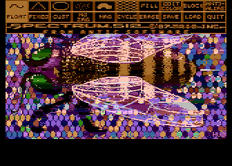](https://github.com/ivop/rc-archive/raw/master/S/SpectrumBee1.xex)
[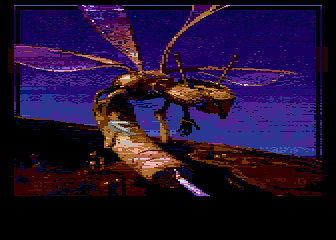](https://github.com/ivop/rc-archive/raw/master/S/SpectrumLaserBee.xex)
[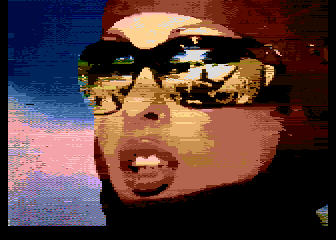](https://github.com/ivop/rc-archive/raw/master/S/SpectrumShades.xex)
[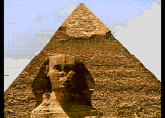](https://github.com/ivop/rc-archive/raw/master/S/SphinxPyramid.xex)
[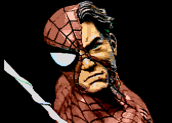](https://github.com/ivop/rc-archive/raw/master/S/spidermantornsmincomplete4.xex)
[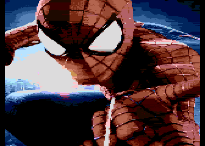](https://github.com/ivop/rc-archive/raw/master/S/Spidey1smincomplete16.xex)
[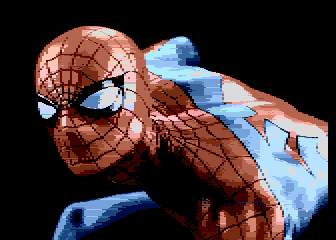](https://github.com/ivop/rc-archive/raw/master/S/spideystatue1croppedsmincomplete9.xex)
[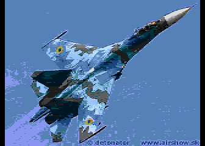](https://github.com/ivop/rc-archive/raw/master/S/Splinter5.xex)
[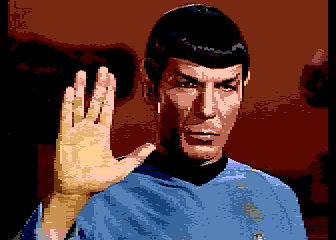](https://github.com/ivop/rc-archive/raw/master/S/SpockLLAP.xex)
[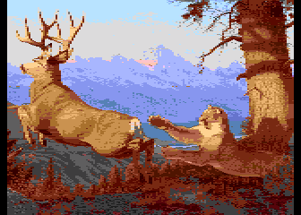](https://github.com/ivop/rc-archive/raw/master/S/SpringLoaded!.xex)
[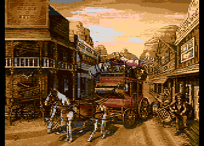](https://github.com/ivop/rc-archive/raw/master/S/Stagecoach.xex)
[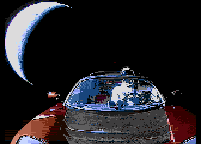](https://github.com/ivop/rc-archive/raw/master/S/StarmanTesla.xex)
[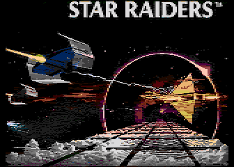](https://github.com/ivop/rc-archive/raw/master/S/StarRaiders.xex)
[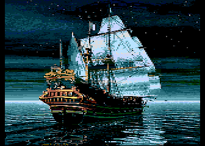](https://github.com/ivop/rc-archive/raw/master/S/Startreader.xex)
[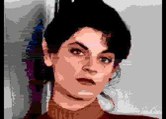](https://github.com/ivop/rc-archive/raw/master/S/StarTrek-02.xex)
[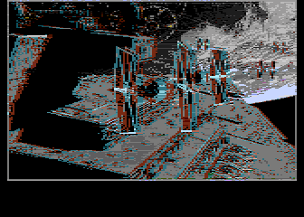](https://github.com/ivop/rc-archive/raw/master/S/StarWars3D4.xex)
[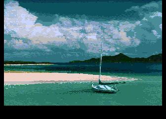](https://github.com/ivop/rc-archive/raw/master/S/st_croix_138M.xex)
[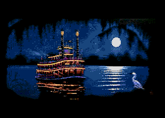](https://github.com/ivop/rc-archive/raw/master/S/Steamer.xex)
[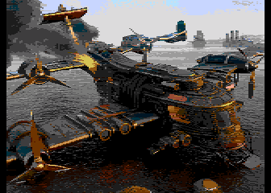](https://github.com/ivop/rc-archive/raw/master/S/SteamHawkDown.xex)
[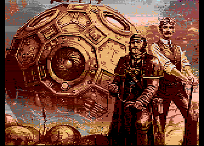](https://github.com/ivop/rc-archive/raw/master/S/SteamPunkAstronauts.xex)
[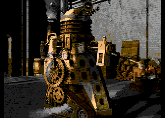](https://github.com/ivop/rc-archive/raw/master/S/SteampunkDalek.xex)
[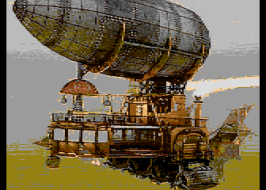](https://github.com/ivop/rc-archive/raw/master/S/SteamPunkDirigible.xex)
[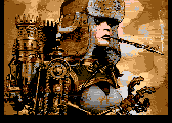](https://github.com/ivop/rc-archive/raw/master/S/SteamPunkGirl.xex)
[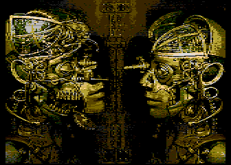](https://github.com/ivop/rc-archive/raw/master/S/SteamPunkoids.xex)
[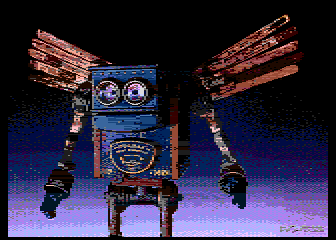](https://github.com/ivop/rc-archive/raw/master/S/SteamPunkSpritebot.xex)
[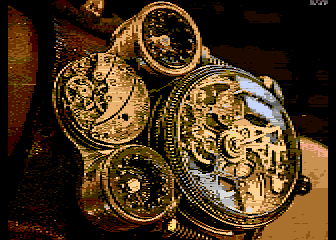](https://github.com/ivop/rc-archive/raw/master/S/SteampunkWatch.xex)
[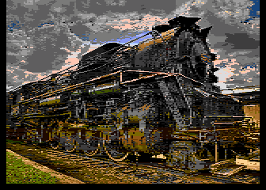](https://github.com/ivop/rc-archive/raw/master/S/SteamTrain226.xex)
[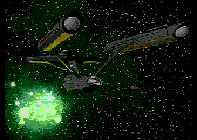](https://github.com/ivop/rc-archive/raw/master/S/STE_Galileo7.xex)
[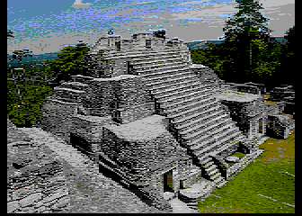](https://github.com/ivop/rc-archive/raw/master/S/StepPyramid.xex)
[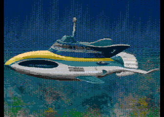](https://github.com/ivop/rc-archive/raw/master/S/Stingray-12.226nd-PAL.xex)
[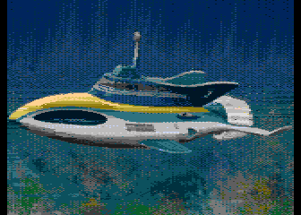](https://github.com/ivop/rc-archive/raw/master/S/Stingray-PAL.xex)
[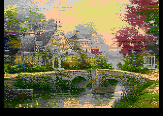](https://github.com/ivop/rc-archive/raw/master/S/StoneBridgeNTSC.xex)
[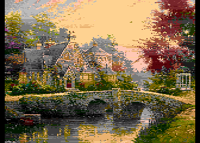](https://github.com/ivop/rc-archive/raw/master/S/StoneBridgePAL.xex)
[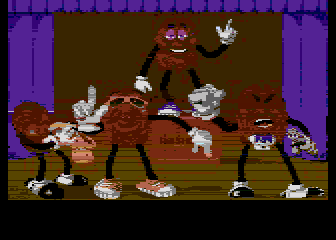](https://github.com/ivop/rc-archive/raw/master/S/ST-Raisins--.xex)
[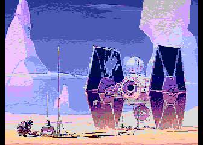](https://github.com/ivop/rc-archive/raw/master/S/Stranded_Imperial.xex)
[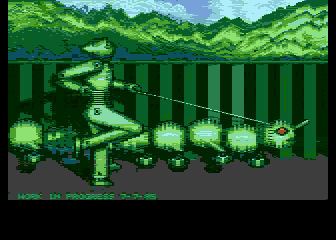](https://github.com/ivop/rc-archive/raw/master/S/ST-Worm--.xex)
[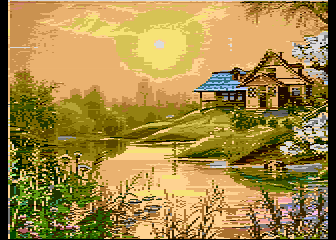](https://github.com/ivop/rc-archive/raw/master/S/SummerCottage.xex)
[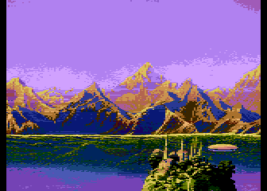](https://github.com/ivop/rc-archive/raw/master/S/SummerPalaceRuvageXIVOrion4a65.xex)
[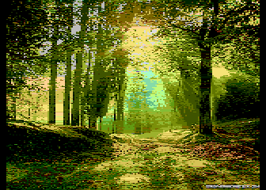](https://github.com/ivop/rc-archive/raw/master/S/SummersEve.xex)
[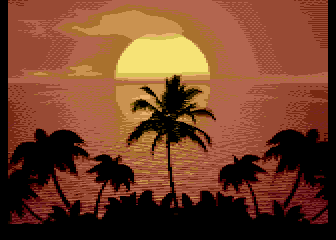](https://github.com/ivop/rc-archive/raw/master/S/Sunset01.PAL.xex)
[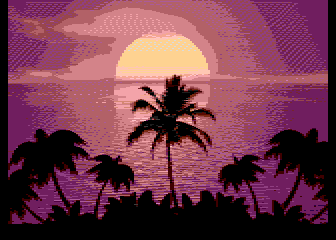](https://github.com/ivop/rc-archive/raw/master/S/sunset01.xex)
[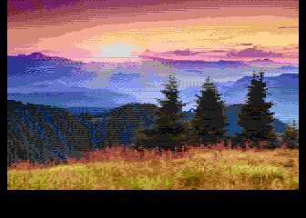](https://github.com/ivop/rc-archive/raw/master/S/Sunset1.xex)
[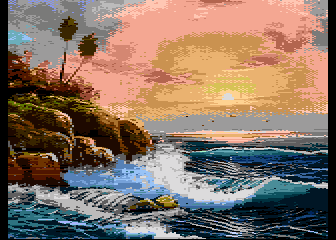](https://github.com/ivop/rc-archive/raw/master/S/SunsetBluff.xex)
[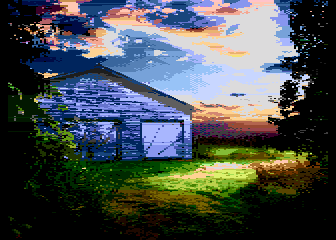](https://github.com/ivop/rc-archive/raw/master/S/SunsetRise.xex)
[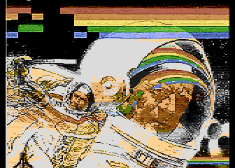](https://github.com/ivop/rc-archive/raw/master/S/SuperBreakout.xex)
[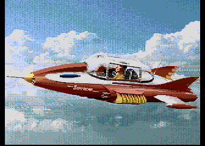](https://github.com/ivop/rc-archive/raw/master/S/SupercarKDf685.xex)
[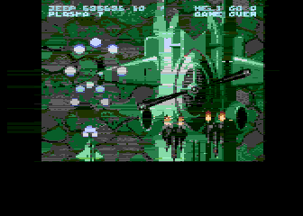](https://github.com/ivop/rc-archive/raw/master/S/SuperSW-02.xex)
[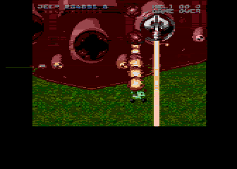](https://github.com/ivop/rc-archive/raw/master/S/SuperSWIV-01.xex)
[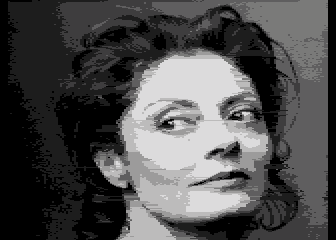](https://github.com/ivop/rc-archive/raw/master/S/SusanSarandon.xex)
[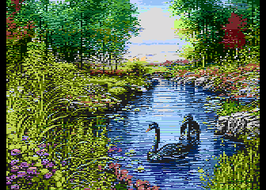](https://github.com/ivop/rc-archive/raw/master/S/SwanCanal.xex)
[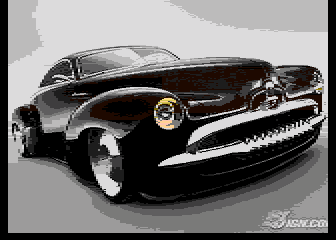](https://github.com/ivop/rc-archive/raw/master/S/Sweetness.xex)
[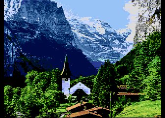](https://github.com/ivop/rc-archive/raw/master/S/Switzerland.xex)
[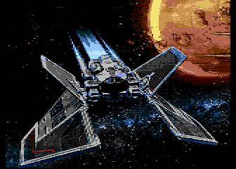](https://github.com/ivop/rc-archive/raw/master/S/SWtorScout.xex)
[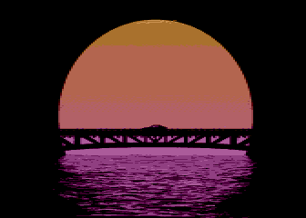](https://github.com/ivop/rc-archive/raw/master/S/Synth02.PAL.xex)
[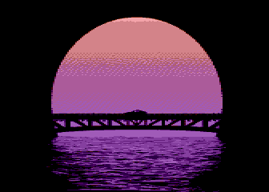](https://github.com/ivop/rc-archive/raw/master/S/synth02.xex)
