
[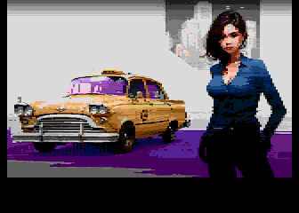](https://github.com/ivop/rc-archive/raw/master/T/Taxiladysm1_08.xex)
[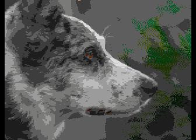](https://github.com/ivop/rc-archive/raw/master/T/Teddy.xex)
[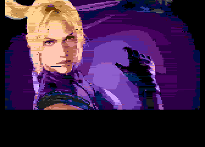](https://github.com/ivop/rc-archive/raw/master/T/Tekken6-NinaW.xex)
[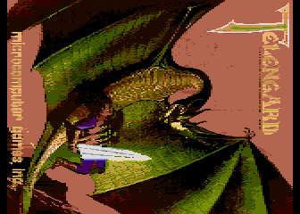](https://github.com/ivop/rc-archive/raw/master/T/Telengard.xex)
[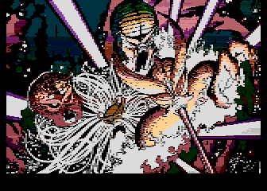](https://github.com/ivop/rc-archive/raw/master/T/TempestSideArt.xex)
[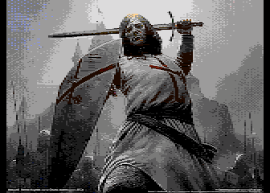](https://github.com/ivop/rc-archive/raw/master/T/TemplarLeadingCharge1db.xex)
[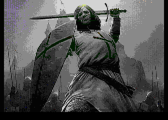](https://github.com/ivop/rc-archive/raw/master/T/TemplarLeadingChargeDNTSC.xex)
[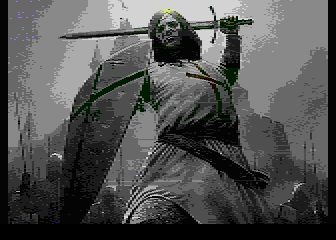](https://github.com/ivop/rc-archive/raw/master/T/TemplarleadingChargeNTSC.xex)
[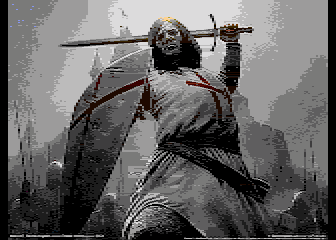](https://github.com/ivop/rc-archive/raw/master/T/TemplarLeadingcharge.xex)
[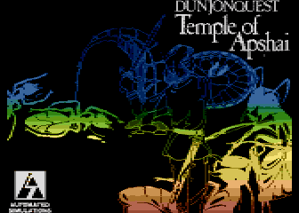](https://github.com/ivop/rc-archive/raw/master/T/TempleApshai.xex)
[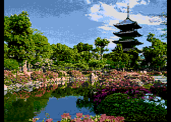](https://github.com/ivop/rc-archive/raw/master/T/TempleGarden.xex)
[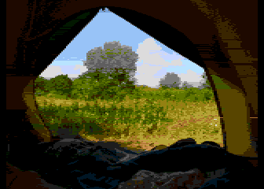](https://github.com/ivop/rc-archive/raw/master/T/Tent.xex)
[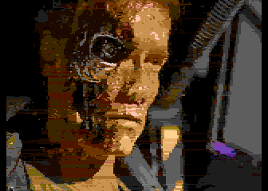](https://github.com/ivop/rc-archive/raw/master/T/terminator.xex)
[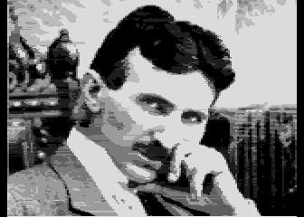](https://github.com/ivop/rc-archive/raw/master/T/Tesla-01.xex)
[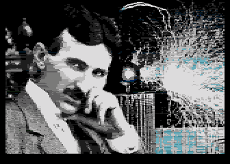](https://github.com/ivop/rc-archive/raw/master/T/Tesla-pic.xex)
[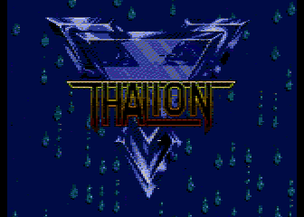](https://github.com/ivop/rc-archive/raw/master/T/thalion_intro.xex)
[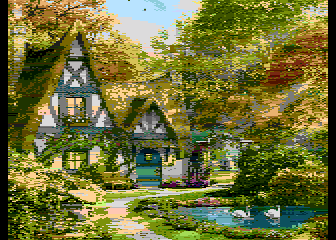](https://github.com/ivop/rc-archive/raw/master/T/ThatchedCottage.xex)

[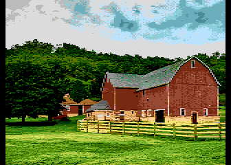](https://github.com/ivop/rc-archive/raw/master/T/TheFarm.xex)

[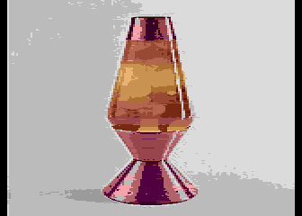](https://github.com/ivop/rc-archive/raw/master/T/The_Mr_Video_LavaLamp.xex)
[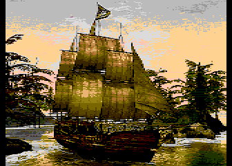](https://github.com/ivop/rc-archive/raw/master/T/TheNeptune.xex)
[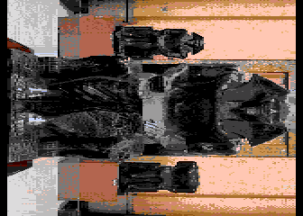](https://github.com/ivop/rc-archive/raw/master/T/ThePharaoh.xex)
[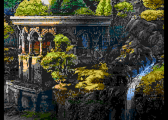](https://github.com/ivop/rc-archive/raw/master/T/TheRepository.xex)
[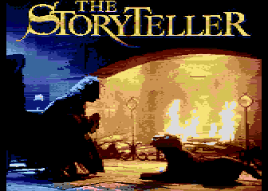](https://github.com/ivop/rc-archive/raw/master/T/thestoryteller2smincomplete6.xex)
[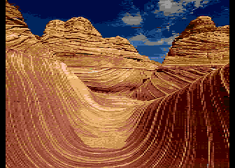](https://github.com/ivop/rc-archive/raw/master/T/TheWave.xex)
[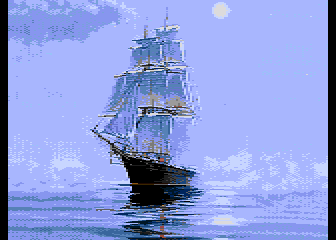](https://github.com/ivop/rc-archive/raw/master/T/ThroughTheMist.xex)
[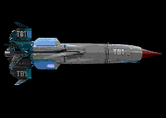](https://github.com/ivop/rc-archive/raw/master/T/Thunderbird1.xex)
[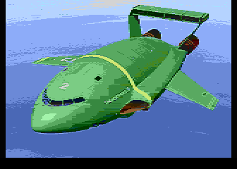](https://github.com/ivop/rc-archive/raw/master/T/Thunderbird2NTSC.xex)
[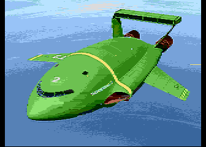](https://github.com/ivop/rc-archive/raw/master/T/Thunderbird2PAL.xex)
[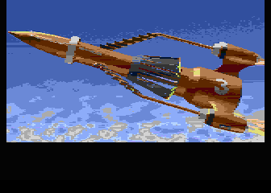](https://github.com/ivop/rc-archive/raw/master/T/Thunderbird3NTSC.xex)
[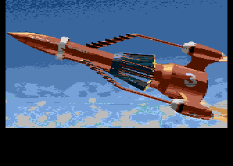](https://github.com/ivop/rc-archive/raw/master/T/Thunderbird3PAL.xex)
[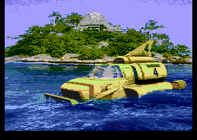](https://github.com/ivop/rc-archive/raw/master/T/Thunderbird4NTSC.xex)
[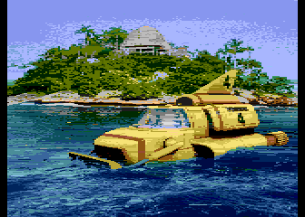](https://github.com/ivop/rc-archive/raw/master/T/Thunderbird4PAL.xex)
[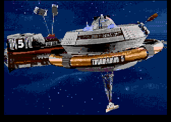](https://github.com/ivop/rc-archive/raw/master/T/Thunderbird5D83.xex)
[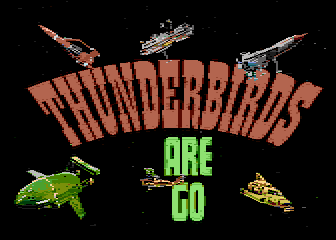](https://github.com/ivop/rc-archive/raw/master/T/ThunderbirdsAreGo.xex)
[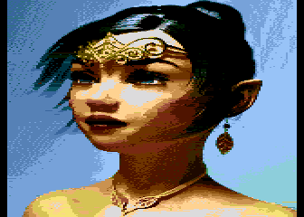](https://github.com/ivop/rc-archive/raw/master/T/tiaraeleditfsmincomplete14.xex)
[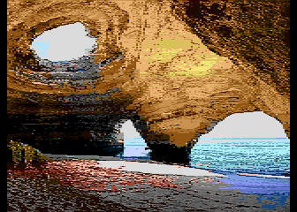](https://github.com/ivop/rc-archive/raw/master/T/TidalCave.xex)
[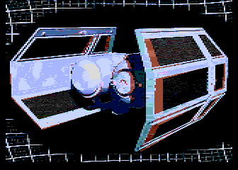](https://github.com/ivop/rc-archive/raw/master/T/TieBomber3Dc.xex)
[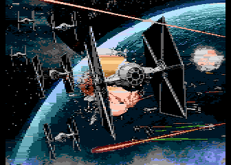](https://github.com/ivop/rc-archive/raw/master/T/TieSquadron1.xex)
[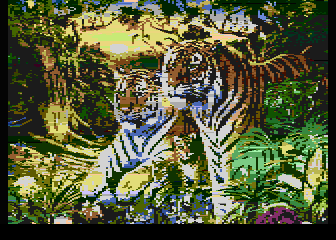](https://github.com/ivop/rc-archive/raw/master/T/TigerFamilyNTSC.xex)
[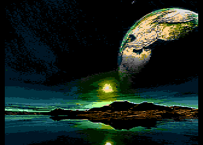](https://github.com/ivop/rc-archive/raw/master/T/TilehBinaryPlanets.xex)
[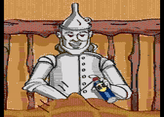](https://github.com/ivop/rc-archive/raw/master/T/TinMan.xex)
[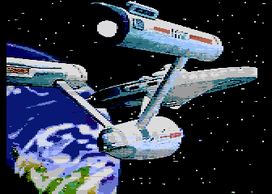](https://github.com/ivop/rc-archive/raw/master/T/ToBoldlyGo2.xex)
[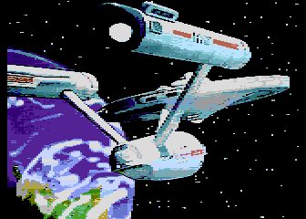](https://github.com/ivop/rc-archive/raw/master/T/ToBoldlyGo.xex)
[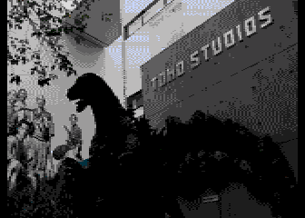](https://github.com/ivop/rc-archive/raw/master/T/toho_Godzilla.xex)
[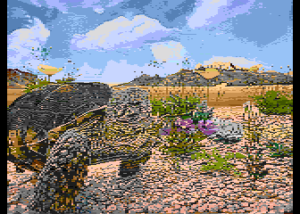](https://github.com/ivop/rc-archive/raw/master/T/Tortoise.xex)
[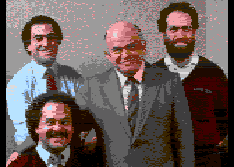](https://github.com/ivop/rc-archive/raw/master/T/tramiels.xex)
[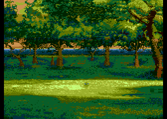](https://github.com/ivop/rc-archive/raw/master/T/trees.xex)
[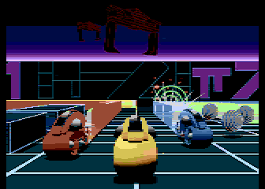](https://github.com/ivop/rc-archive/raw/master/T/TronCycles.xex)
[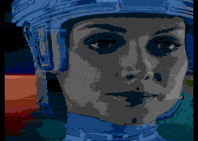](https://github.com/ivop/rc-archive/raw/master/T/Tron-girl.xex)
[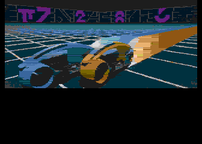](https://github.com/ivop/rc-archive/raw/master/T/Tron-LightCycles.xex)

