[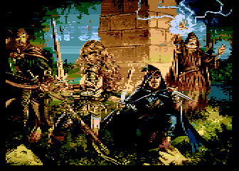](https://github.com/ivop/rc-archive/raw/master/V/ValiantHeroes.xex)
[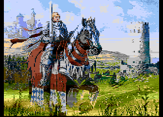](https://github.com/ivop/rc-archive/raw/master/V/ValiantKnight.xex)
[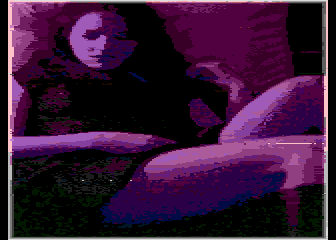](https://github.com/ivop/rc-archive/raw/master/V/vanilla.xex)
[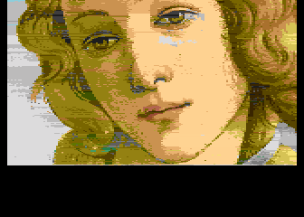](https://github.com/ivop/rc-archive/raw/master/V/Venus2-CU.xex)
[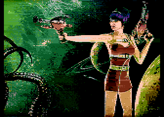](https://github.com/ivop/rc-archive/raw/master/V/VenusGotAGun.xex)
[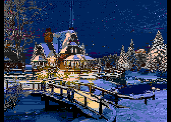](https://github.com/ivop/rc-archive/raw/master/V/VermontWinter.xex)
[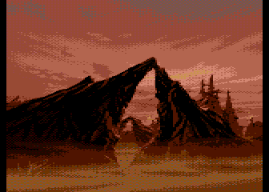](https://github.com/ivop/rc-archive/raw/master/V/Version1.xex)
[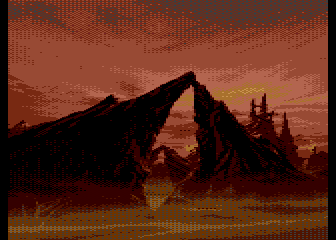](https://github.com/ivop/rc-archive/raw/master/V/Version2.xex)
[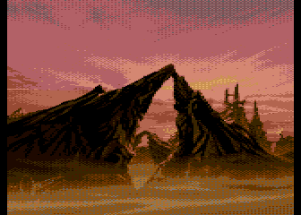](https://github.com/ivop/rc-archive/raw/master/V/Version3.xex)

[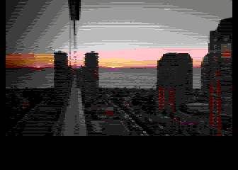](https://github.com/ivop/rc-archive/raw/master/V/vina-1.xex)
[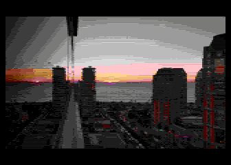](https://github.com/ivop/rc-archive/raw/master/V/vina-2.xex)
[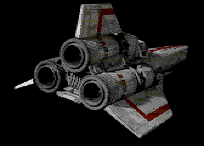](https://github.com/ivop/rc-archive/raw/master/V/Viper.xex)
[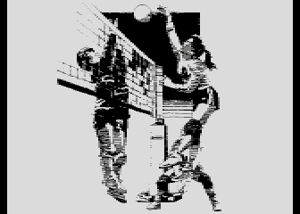](https://github.com/ivop/rc-archive/raw/master/V/Volleyball--.xex)
[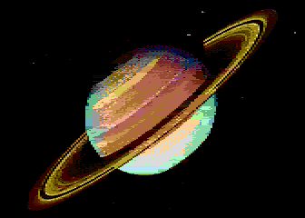](https://github.com/ivop/rc-archive/raw/master/V/Voyager2Saturn.xex)
