[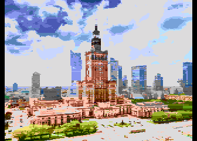](https://github.com/ivop/rc-archive/raw/master/W/warsaw.xex)
[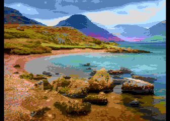](https://github.com/ivop/rc-archive/raw/master/W/Wastwater.xex)
[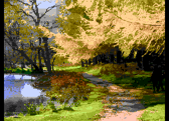](https://github.com/ivop/rc-archive/raw/master/W/Watchers.xex)
[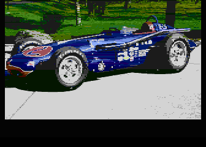](https://github.com/ivop/rc-archive/raw/master/W/WatsonBuiltNTSC.xex)
[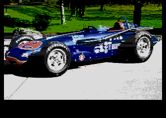](https://github.com/ivop/rc-archive/raw/master/W/WatsonBuiltPAL.xex)

[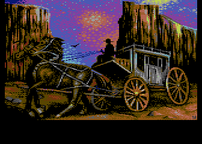](https://github.com/ivop/rc-archive/raw/master/W/west.xex)
[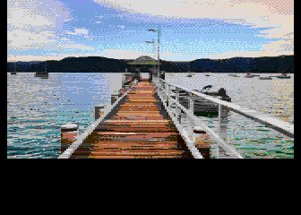](https://github.com/ivop/rc-archive/raw/master/W/Wharf1.xex)
[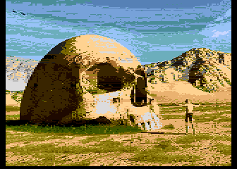](https://github.com/ivop/rc-archive/raw/master/W/WhatbutGods2b76.xex)
[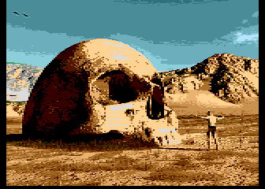](https://github.com/ivop/rc-archive/raw/master/W/WhatButGodsg149.xex)
[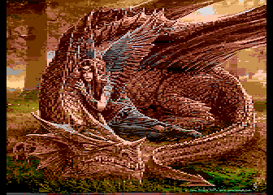](https://github.com/ivop/rc-archive/raw/master/W/WhereIsYourDragon.xex)
[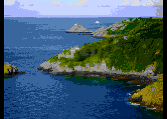](https://github.com/ivop/rc-archive/raw/master/W/WhiteRock.xex)
[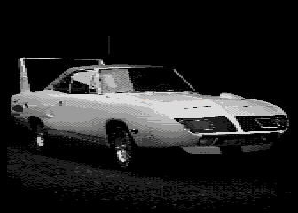](https://github.com/ivop/rc-archive/raw/master/W/WhiteSuperbird.xex)
[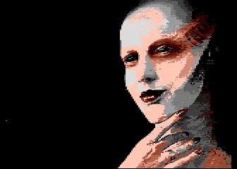](https://github.com/ivop/rc-archive/raw/master/W/WickedPleasures.xex)
[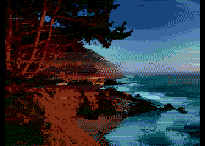](https://github.com/ivop/rc-archive/raw/master/W/widok8.xex)
[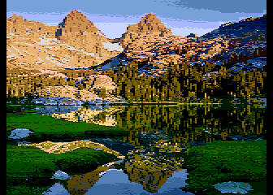](https://github.com/ivop/rc-archive/raw/master/W/Wild.xex)
[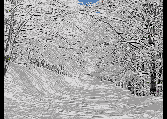](https://github.com/ivop/rc-archive/raw/master/W/WinterCanopy.xex)
[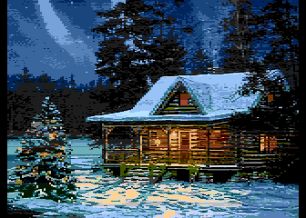](https://github.com/ivop/rc-archive/raw/master/W/Winterlodge.xex)
[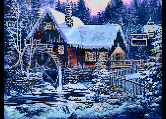](https://github.com/ivop/rc-archive/raw/master/W/Wintermill218.xex)
[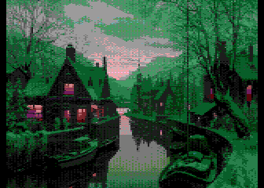](https://github.com/ivop/rc-archive/raw/master/W/Winter_OLIVIERN.xex)
[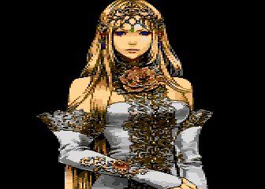](https://github.com/ivop/rc-archive/raw/master/W/wizardryladyeditsmincomplete3.xex)
[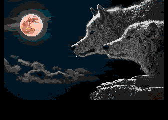](https://github.com/ivop/rc-archive/raw/master/W/wolf-dither-emkay.xex)
[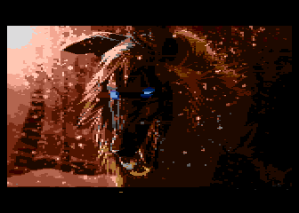](https://github.com/ivop/rc-archive/raw/master/W/wolf.xex)
[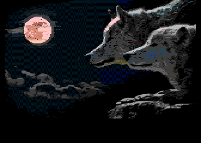](https://github.com/ivop/rc-archive/raw/master/W/wolves.xex)
[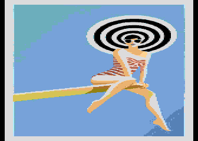](https://github.com/ivop/rc-archive/raw/master/W/woman.xex)
[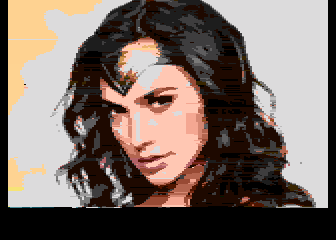](https://github.com/ivop/rc-archive/raw/master/W/WonderW-02.xex)
[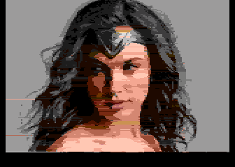](https://github.com/ivop/rc-archive/raw/master/W/WonderW-03.xex)
[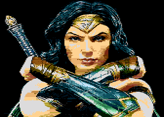](https://github.com/ivop/rc-archive/raw/master/W/wonderwomanarms3smincomlete7.xex)
[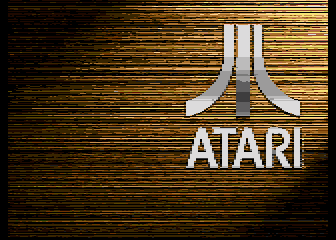](https://github.com/ivop/rc-archive/raw/master/W/WoodgrainAtariFuji56.xex)
[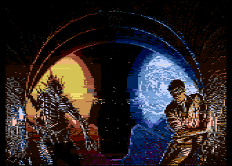](https://github.com/ivop/rc-archive/raw/master/W/WorldsCollide.xex)
[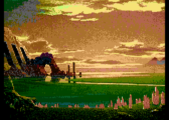](https://github.com/ivop/rc-archive/raw/master/W/WWCNewWorld.xex)
[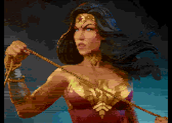](https://github.com/ivop/rc-archive/raw/master/W/ww.xex)
